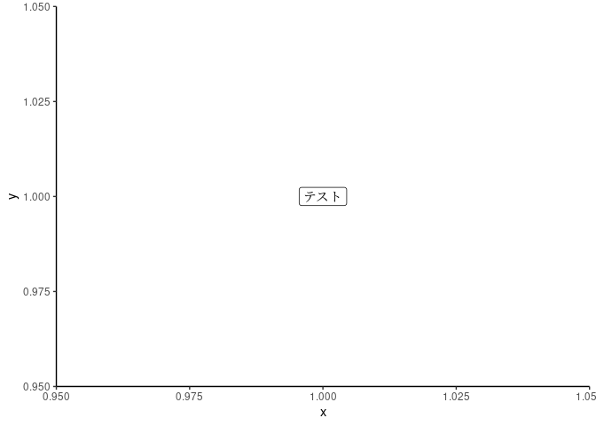
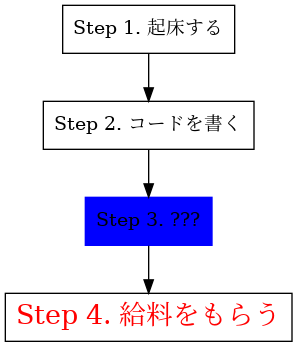
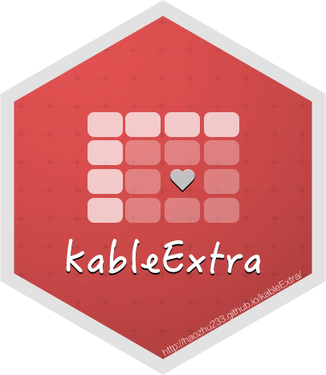

# (PART) イントロダクション {-}

# 序文 {-}

[](https://creativecommons.org/licenses/by-nc/4.0/deed.ja)

**注意: 絶賛作りかけ**

<!--chapter:end:index.Rmd-->

長大な技術文書や良質な技術文書を作成するには手間がかかる. しかし時間をかければ良い文書になるわけではない. 無駄な手間を省き, 効率よく快適に文書を作成するべきである.

たとえばこういう経験はないだろうか.

* プログラムの解説のため, 外部サービスでシンタックスハイライトしてもらったテキストを**コピーペーストで貼り付ける**
* グラフや図解を専用アプリケーションで作成し貼り付ける. **修正のたびに貼り付け直す**
* 図表に言及する際に「図 1」「表 2」と**番号をタイプし, 参照先へハイパーリンクを指定する**
* 本文中で引用した参考文献のリストを巻末に**コピーペーストし, 過不足がないか目視で確認**
* $\sum_{k=1}^K\int_0^\infty f_k(x) dx$ などといった複雑な数式はプレーンテキストや HTML では表現できないため, **画像を生成して貼り付ける**
* 冒頭にかっこいいエピグラフを掲載したいので, **1時間かけて特別に枠やフォントを作成した**
* 市販のワードプロセッサで作成した文書を渡したら, **レイアウトが崩れて読めない**と言われた

本稿は文書作成者をこのような数え切れないブルシットから解放するのが目的である.

R Markdown (`rmarkdown`) は, R プログラムを埋め込んだ動的なドキュメントから pandoc を利用して PDF や HTML 形式の文書を作成するパッケージであり, 数式, 図表の挿入, シンタックスハイライトされたプログラムなどを簡単な記述で掲載できる. 名前の通り, その基本構文は Markdown である. よって, Markdown と R の知識が最低限あれば (R プログラムが必要ないなら Markdown だけでも) 文書を作成することができる.

`bookdown` パッケージは `rmarkdown` をもとに, ページ数の多い文書を作成し, 配布するための機能を拡張したものである. しかし, PDF の出力に関しては欧文を前提としたフォーマットを使用しているため, 日本語の適切な表示 (組版やフォントの埋め込みなど)   のできる文書を作成するには高いハードルが存在した.

本稿では, `rmarkdown` および `bookdown` で日本語文書を作成する際の設定を容易にしたパッケージ `rmdja` を利用した日本語技術文書の作成方法を解説する. 現在, 書籍, 論文, プレゼンテーションの体裁での文書を作成するテンプレートが用意されており, この**ドキュメント自体も `rmdja` を利用して作成されている**.

# 本稿の目的 {-}

## R Markdown の現状と問題意識 {-}

R Markdown を利用した文書作成方法について, すでにそれなりの数と質の日本語資料が存在する. R Markdown でHTMLファイルのみを作成する場合, 日本語であるか欧文であるかはあまり気にする必要はない. HTMLであれば既存の資料でも十分に役に立つ.

* kazutan 『[R Markdown再入門](https://kazutan.github.io/fukuokaR11/intro_rmarkdown_d.html)』
* kazutan 『[R Markdownによるスライド生成](https://kazutan.github.io/SappoRoR6/rmd_slide.html#/)』

しかし, PDF を出力する, あるいは HTML と PDF を同時に出力したい, となると, 組版に関して細かな設定が必要になるため難易度は一気に上昇する.

実のところPDFでも日本語を表示する最低限の設定は, YAML フロントマターだけで行える. 例えば Atusy氏が『[R Markdown + XeLaTeX で日本語含め好きなフォントを使って PDF を出力する](https://blog.atusy.net/2019/05/14/rmd2pdf-any-font/)』で紹介しているが,  よりシンプルな書き方もできる.

```yaml
output: pdf_document:
    latex_engine: xelatex
documentclass: bxjsarticle
classoption:
  - xelatex
  - ja=standard
  - jafont=noto
```

このままでも, とりあえず文字化けすることなく日本語を表示できる. しかし実際に作ってみると, いろいろな障害が立ちはだかり, 文書として整ったものにするのは難しい. このままでは参考文献リストの表示も不自然なままである. だがこれ以上のカスタマイズは Atusy 氏がやっているようにテンプレートを修正でしか対処できず,  LaTeX に対するそれなりの知識が必要となる.

さらに, 同じソースファイルから HTML と PDF を同時に生成すると, また別種の問題が発生する. HTML と PDF は根本的に規格が違うため, 様々な場合分け処理が必要であり, それは pandoc だけでは対応しきれない.

HTML出力に限らない R Markdown の全般的な情報は, 既に充実した英語の (公式) ドキュメントが多く存在する[^major-docs].

* "[Dynamic Documents for R・rmarkdown](https://rmarkdown.rstudio.com/docs/index.html)"
* "[bookdown demo](https://github.com/rstudio/bookdown-demo)"
* "[_bookdown: Authoring Books and Technical Documents with R Markdown_](https://bookdown.org/yihui/bookdown/)"
* "[_R Markdown Definiteive Guide_](https://bookdown.org/yihui/rmarkdown/)"
* "[_R Markdown Cookbook_](https://bookdown.org/yihui/rmarkdown-cookbook)"[^rmd-cookbook-publish]

[^major-docs]: 基本的なことがらの多くは上記を読めば分かるのでここでは基本機能をダイジェストで伝えた上で, これらの資料に書いてない応用技を紹介する. YAML のオプションの意味についてはソースコードにコメントを書いた. 以下, 単に, **BKD**  と書けば "_`bookdown`: Authoring Books and Technical Documents with R Markdown_" [@R-bookdown] を, RDG と書けば "_R Markdown: The Definitive GUide_" [@rmarkdown2018] を, RCB と書けば "_R Markdown Cookbook_" [@xie2020Markdown] を指すことにする.

しかしながらこれらを元に1からいろいろな調整を施すのはとても骨が折れるため, `rmdja` パッケージは日本語文書でHTMLやPDFを同時に生成する場合の定番の処理をフォーマットに内蔵することにした.

## `rmdja` の利点 {-}

従来LaTeXやWord, あるいは他の媒体で文書を作成していたユーザにとっても, 文書の内容から面倒な設定を分離するため, 効率的に執筆できる.

Wordユーザにとっては, 以下のような利点がある[^word-out-of-date].

* 数十, 数百ページの文書を書いてもクラッシュすることがあまりない
* 輪郭のはっきりしたベクタ画像を簡単に貼り付けられる
* 図表の配置や相互参照を手動で書く必要がない
* 読み手の環境に依存してレイアウトが崩れにくいPDFファイルを出力できる

ただし, `.docx` ファイルの出力はできない. 私が Word を持っておらず, R Markdown や pandoc がサポートしていても動作確認のしようがないため.

`jupyter` は Python のコードチャンクとその結果を簡単に表示できる文書作成ツールである. 出力オプションの少なさ (たとえば長大なコードもそのまま掲載されてしまう) や,  IDE として見ても機能が少ないことからあまり使い勝手がよくなかったが, `rmdja` では **Python スクリプトの埋め込みにもある程度対応**している.

LaTeX のユーザー (シンプルなテキストエディタで書いているユーザも, Overleaf や LyX といった強力なエディタを使用しているユーザー) にとっては, LaTeX とほぼ同じ構文で数式を入力でき, かつ操作を大きく簡略化でき, 実験結果などをソースに埋め込むことができ, 外部プログラムからいちいちコピペする必要がなくなる. ただし, なるべく選択肢は広げておきたいが, なんでもありではかえって余計なことをしがちである. よって既に作成した beamer フォーマットと同様に, XeLaTeX および LuaLaTeX のみの対応を想定している. pLaTeX や upLaTeX には対応していない.

これまでも R Markdown を使用してきたユーザにとっては, YAML フロントマターに数十行に渡っていた書いていた日本語表示のための設定の多くがフォーマットのデフォルト値になったため, かなり楽になると思われる.

たとえば,

```yaml
bookdown::pdf_book:
  toc_depth: 3
  toc_appendix: true
  toc_bib: true
  latex_engine: xelatex
  keep_tex: true
  keep_md: true
  citation_package: natbib
  pandoc_args:
    - '--top-level-division=chapter'
    - '--extract-media'
    - '.'
  template: XXXXX.tex.template'
  dev: "cairo_pdf"
  out_width: "100%"
  out_height: "100%"
  quote_footer: ["\\VA{", "}{}"]
  extra_dependencies: gentombow
```

のように書いていたものがこうなる.

```yaml
rmdja::pdf_book_ja:
  keep_tex: true
  keep_md: true
  tombow: true
```

さらにチャンクオプションを書いたり場合によっては .tex ファイルのテンプレートすら調整する必要もあった. それらも `rmdja` 内で調整している.

さらに, 作成した文書は PDF 形式で出力することはもちろん, HTML 形式で様々なサイトで掲載でき[^blogdown]たり, 電子書籍ファイルとしても出力可能である. このような多様な出力形式への対応しているソフトウェアはあまり例を見ない.


## R使用経験のないユーザへ {-}

Rを使わない, あるいはそもそもプログラミングに詳しくない, という人間にもある使用機会がある. たとえばR を普段使わない人間でも `bookdown` で同人技術書を執筆したという事例がある[^bookdown-example]. この事例は主に数式と画像の貼付けのみだから, 数式出力に必要な LaTeX の知識があればほとんどのことはできてしまう. そして `rmdja` ではこの事例で言及されている LaTeX の設定の多くは自動で制御される. また, 小説などはほぼテキストであり, 最低限のレイアウトさえ用意すれば数式も, あるいは画像の挿入すらいらないことが多い. `rmdja` では縦書き文書をPDFで出力する方法も用意している.

<div class="rmdimportant">
<p>印刷用フォーマットおよび縦書き文書フォーマットは現在実験的な導入段階であり, 表示の一部に不具合が存在する.</p>
</div>

[^word-out-of-date]: ただし筆者は数年来 Word を使っていないため, これらのいくつかは既に改善されているかもしれない.
[^blogdown]: `bookdown` 同様に R Markdown で作成した文書をブログ風のフォーマットで出力する `blogdown` パッケージというものも存在する.
[^rmd-cookbook-publish]: 2020/10/19 に書籍としても発売されるらしい.
[^bookdown-example]: https://teastat.blogspot.com/2019/01/bookdown.html

<!--chapter:end:chapters/introduction.Rmd-->

# (PART) 最低限のチュートリアル {-}

# クイックスタート {#quick-start}

`rmdja` パッケージをインストールする. 依存している `rmarkdown`, `bookdown`, `knitr` なども同時にインストールされる.


```{.r .numberLines .lineAnchors}
install.packages("remotes")
remotes::install_github("Gedevan-Aleksizde/my_latex_template", 
  repos = NULL, type = "source")
```

まだ RStudio を使っていないのなら, RStudio 上で作業することを強く推奨する. さらに, もしもRの操作自体にあまり慣れていないのなら, 森知晴 『[卒業論文のためのR入門](https://tomoecon.github.io/R_for_graduate_thesis/)』などを読むことを薦める. 

加えて, 以下のパッケージが役に立つので気に入ったらインストールしていただきたい.


```{.r .numberLines .lineAnchors}
install.packages(c("tidyverse", "ggthemes", "citr", "clipr", 
  "kableExtra"))
```

RStudio を起動し, 左上から新規作成を選び, "R Markdown" を選ぶ (図 \@ref(fig:new-file)).

<div class="figure" style="text-align: center">

<p class="caption">(\#fig:new-file)新規作成</p>
</div>

"From Template" からテンプレートを選択する (\@ref(fig:rmdja-templates)).

<div class="figure" style="text-align: center">

<p class="caption">(\#fig:rmdja-templates)R Markdown のテンプレート</p>
</div>

現在 (Ver. 0.4.3) 用意されているのは以下の4つである.

* プレゼンテーション用スライド形式のテンプレート - `Beamer in Japanese`
* 論文形式のテンプレート - `pdf article in Japanese`
* 書籍形式のテンプレート - `pdf book in Japanese`
* 縦書き文書のテンプレート - `pdf vertical writing in Japanese`

動作確認として, 今回はシンプルな論文形式を選ぶ. ファイルを開いたら, 適当な名称で保存し, "knit" ボタンを押すと PDF が作成される.

# 下準備

以降は順を追って細かい解説をする.

## より丁寧なインストール解説

文書を生成するのに必要なものをインストールする.

このドキュメントは `rmdja` パッケージに含まれている. よってまずはこれをダウンロードしてほしい.


3種類のテンプレートのうち, `pdf book in Japanese` のみ, 文書のビルドのための下準備が追加で必要になるため, その方法を解説する. それ以外は第 \@ref(quick-start) 節で書いたように "knit" ボタンを押すだけで良い.

最低限のファイルやパッケージで動くほうのデモ用ディレクトリをコピーする. ただし, `tidyverse` と `kableExtra` のインストールも必要である.


```{.r .numberLines .lineAnchors}
file.copy(system.file("resources/examples/bookdown-minimal", 
  package = "rmdja"), "./", recursive = T)
```

## 書籍形式のビルド操作

書籍形式のテンプレートである `pdf book in Japanese` を選択した場合, 論文形式やスライド形式とは違いフォルダが作られ, その中に `_bookdown.yml`, `_output.yml` というファイルが作られる. これらは書籍の細かいフォーマットを設定するためのファイルである. 新規作成ファイルも同じフォルダに `index.Rmd` という名前で保存する. この名前は最初に読み込むファイル名のデフォルト名として決まっているため, 他の名前で保存すると正しく動作しないことがある. さらにbookdown の文書生成は従来の R Markdown と違い, RStudio の `knit` ボタンでは**できない**. 代わりに, 以下の2通りの方法がある.

1. `bookdown::render_book('index.Rmd', format = "bookdown::gitbook")` などを呼び出す
2. RStudio の Build ペーンを使う

前者の場合は, Rmd ファイルのあるディレクトリに移動して以下の関数を実行する. 順にHTML, PDF, epub を出力している


```{.r .numberLines .lineAnchors}
bookdown::render_book("index.Rmd", "rmdja::gitbook_ja")
bookdown::render_book("index.Rmd", "rmdja::pdf_book_ja")
bookdown::render_book("index.Rmd", "bookdown::epub_book")
```

コピーしたディレクトリ `bookdown-minimal` を設定する (図 \@ref(fig:build-pane1-1), \@ref(fig:build-pane1-2)).

Build ペーンの "Build Book" の三角形を押すと, 使用できるフォーマット一覧が表示される. これはスライド, 縦書き文書, 書籍などといった文書の種類と1対1で対応しているわけではなく, フォーマット関数に対応している.

* HTML形式 - `rmdja::gitbook_ja`
* PDF形式 - `rmdja::pdf_book_ja`
* 電子書籍 (EPUB) 形式 - `bookdown::epub_book`

デフォルトでは "All Formats" にチェックが入っているため, これら3種類のファイル形式を一度に生成する. 

<div class="figure" style="text-align: center">

<p class="caption">(\#fig:build-pane1-1)Build ペーンの手動設定</p>
</div><div class="figure" style="text-align: center">

<p class="caption">(\#fig:build-pane1-2)Build ペーンの手動設定</p>
</div>

これで `_book` フォルダに出力がされる.


<!--chapter:end:chapters/minimal.Rmd-->

# (PART) R Markdown と Bookdown の基本機能 {-}

# このパートの概要 {-}

ここではまず, R Markdown の基本的な機能を紹介する. つまり `bookdown` 特有のものではなく, R Markdown 全般で使用できる機能も含めて紹介する. これ以降は自己言及的な説明が多いため, この文書を生成しているソースコードと比較しながら確認することをおすすめする. ここで紹介する機能は BKD, RDG, RCB での記述に基づく.
これら3つのドキュメントを読めば, ほとんどのことは可能になる --- `rmdja` を作る理由になった LaTeX テンプレートの修正以外は --- のだが, 本稿の重要な目的の1つは**複数のファイル形式をなるべく簡単に両立すること**であるので, それができない書き方には触れないし, 技術文書の作成にあまり使わないような機能の動作確認はおこなわず, 技術文書作成で頻繁に使われ, 便利と思える機能のみ紹介する.

どちらにしろそのうちこれらを翻訳してくれる人が現れることだろう...たぶん.

# 静的なコンテンツの作成

まずは, 単なるマークアップ, つまりプログラミングの複雑な処理を考えなくても良いタイプの, 簡単な構文を紹介する. それらの多くは一般的な Markdown のものと同じである.

日本語で書かれた資料でごく基本的なことについて, 『[R Markdown入門](https://kazutan.github.io/kazutanR/Rmd_intro.html)』で一通り紹介されている. やや応用的なことも 『R Markdown ユーザーののための Pandoc's Markdown』に書かれている.

## Markdown の基本構文

一応基本の Markdown の構文も挙げておく. 詳細は(ref:BKDB)"[Ch. 2.2 Markdown Syntax](https://bookdown.org/yihui/bookdown/markdown-syntax.html)" を参照.

### インラインでの書式変更

テキストの一部のみ書式を変える

アンダースコアで強調 (イタリック)

```markdown
_underscore_
```

_underscore_

`**` 2つで太字強調

```markdown
**太字強調**
```

**太字強調**

等幅フォント

```markdown
`bookdown` と `rmdja`
```

`bookdown` と `rmdja`

本文中に入力した URL は自動判別され, ハイパーリンクが付けられる. また, `[テキスト](URL)` という書式で, テキストに対してハイパーリンクを付けることができる.   

```markdown

URL は自動判別される: https://github.com/Gedevan-Aleksizde/my_latex_templates/tree/master/rmdja

[`rmdja` の github リポジトリ](https://github.com/Gedevan-Aleksizde/my_latex_templates/tree/master/rmdja)
```

URL は自動判別される: https://github.com/Gedevan-Aleksizde/my_latex_templates/tree/master/rmdja

[`rmdja` の github リポジトリ](https://github.com/Gedevan-Aleksizde/my_latex_templates/tree/master/rmdja)


### ブロック要素

以降は行内では使えず, **適切に表示するには前後に改行を挟む必要**のあるタイプの構文である.

まず, 引用ブロックを使えばかっこいいエピグラフを書き放題である.

```markdown
> Нужны новые формы. Новые формы нужны, а если их нет, то лучше ничего не нужно.
>
> 新しいフォーマットが必要なんですよ. 新しいフォーマットが. それがないというなら, いっそ何もないほうがいい. 
>
> `\r tufte::quote_footer('--- A. チェーホフ『かもめ』')`
```

> Нужны новые формы. Новые формы нужны, а если их нет, то лучше ничего не нужно.
>
> 新しいフォーマットが必要なんですよ. 新しいフォーマットが. それがないというなら, いっそ何もないほうがいい. 
>
> <footer>--- A. チェーホフ『かもめ』</footer>

`rmdja` では, HTML と PDF 両方で同様のデザインの枠で表示するようにしている.

Markdown では `#` は見出しを意味するが, `bookdown` にはさらにオプションが用意されている.

`# 見出し名 {-}` で, セクション番号のつかない見出しを用意できる. 序文, 章末の参考文献, 付録のセクションに使えるだろう. さらに, `bookdown` では `# (PART) 見出し名` で「部」の見出しを作ることができる. この見出しは セクションの合間に挟まるが, 選択することはできない. 文書が長くなったときに, より大きな区切りを付けるのに役に立つだろう. さらに, `# (APPENDIX) 見出し名 {-}` で, 以降の見出しの頭に 「補遺 A, B, C, ...」と付番できる.

箇条書きは以下のように書ける.

```markdown
* iris setosa
* iris versicolor
* iris virginica
```

* iris setosa
* iris versicolor
* iris virginica

```markdown
1. iris setosa
2. iris versicolor
3. iris virginica
```

1. iris setosa
2. iris versicolor
3. iris virginica

インデントを使えばネストできる.

* 課長
  + 課長補佐
    - 課長補佐代理
      + 課長補佐代理心得

## Markdown を使った図表の挿入

markdown は表を記入することもできる.

```markdown
Table: Markdown 記法の表

 Sepal.Length   Sepal.Width   Petal.Length   Petal.Width
-------------  ------------  -------------  ------------
          5.1           3.5            1.4           0.2
          4.9           3.0            1.4           0.2
          4.7           3.2            1.3           0.2
          4.6           3.1            1.5           0.2
          5.0           3.6            1.4           0.2
          5.4           3.9            1.7           0.4
```


Table:Markdown 記法の表

 Sepal.Length   Sepal.Width   Petal.Length   Petal.Width
-------------  ------------  -------------  ------------
          5.1           3.5            1.4           0.2
          4.9           3.0            1.4           0.2
          4.7           3.2            1.3           0.2
          4.6           3.1            1.5           0.2
          5.0           3.6            1.4           0.2
          5.4           3.9            1.7           0.4

画像ファイルも貼り付けられる.

{ width=50% }


しかし, キャプションを付けたり, 表示位置やサイズを細かく調整したり, 注釈を付けたりするためには, 後述するように**Rプログラムを経由して出力**したほうが良い.

TODO: md 記法で画像貼り付けたときのサイズ統一

### コメントアウト

HTML 式の `<!-- -->` でコメントアウトできる. コメントアウトされた箇所は生成ファイルでもコメントアウトされるのではなく, そもそも出力されなくなる.

## 数式

LaTeX 記法で数式を記述できる. HTML ならば Mathjax によってレンダリングされる. 数式の記述ルールは少々ややこしい. これは現在の `pandoc` の仕様で HTML および LaTeX の規格で矛盾なく出力するためやむをえない措置である.

1. 改行をしない**行内数式**は `$` で囲む, または `\(`, `\)` で囲む.
2. 改行を伴う**数式ブロック**は `$$` で囲む, または `\[`, `\]` で囲む.
3. `align`, `equation` 環境等を使う場合は, 上記の記号を**使わず**, 直接 LaTeX コマンド `\begin{align}...` を打ち込む.

```markdown
\@ref(eq:binom) は二項分布の確率関数である
\begin{align}
f(k) &= {n \choose k} p^{k} (1-p)^{n-k} (\#eq:binom)
\end{align}
```

その出力は, 以下のようになる.

\@ref(eq:binom) は二項分布の確率関数である

\begin{align}
f(k) &= {n \choose k} p^{k} (1-p)^{n-k} (\#eq:binom)
\end{align}


Bookdown では**従来の R Markdown でできなかった数式への付番と, 本文中での参照アンカーリンクの自動作成が可能**となっている (詳細は \@ref(crossref) 章で). LaTeX にすでに慣れている読者に注意が必要だが, Bookdown 特有の制約として,  付番したい場合は `\label{ID}` ではなく `(\#eq:ID)` を使う. また,  PDF (LaTeX) と HTML (Mathjax) の仕様には

1. PDF では `align` は常に数式が付番され, `align*` 等はどうやっても付番されない
2. HTML では `align` でも `align*` であってもラベルを書かなければ付番されず, 書けば付番される.

という違いがある. 両者で同じ表示にこだわるのなら, 付番を取り消す `\notag` を多用することになるだろう.

さらに, bookdown の機能として, LaTeX の「定理」「定義」「証明」などの環境に対応するものが提供されている (参考: BKD [Ch. 2.2 Markdown extensions by bookdown](https://bookdown.org/yihui/bookdown/markdown-extensions-by-bookdown.html)). これらの相互参照も可能である.

例: 以下に補題 \@ref(lem:borelcantelli), 定理 \@ref(thm:theorem1) を示す.

\BeginKnitrBlock{lemma}\iffalse{-91-12508-12524-12523-45-12459-12531-12486-12522-12398-35036-38988-93-}\fi{}<div class="lemma"><span class="lemma" id="lem:borelcantelli"><strong>(\#lem:borelcantelli)  \iffalse (ボレル-カンテリの補題) \fi{} </strong></span>${E_1,E_2,\cdots}$をある確率空間の事象とする. これらの事象の確率の和が有限であるなら, それらが無限に多く起こる確率はゼロである. つまり,

\begin{align*}
& \sum_{n=1}^\infty \mathrm{P}(X_n) <\infty \Rightarrow \mathrm{P}\left(\lim_{n\to\infty}\sup X_n\right) = 0,\\
& \lim_{n\to\infty}\sup X_n = \bigcap_{n=1}^\infty\bigcup_{k\leq n}^\infty E_k
\end{align*}

である.</div>\EndKnitrBlock{lemma}

\BeginKnitrBlock{proof}<div class="proof">\iffalse{} <span class="proof"><em>証明. </em></span>  \fi{}証明は読者の課題とする.</div>\EndKnitrBlock{proof}


\BeginKnitrBlock{theorem}\iffalse{-91-28961-38480-12398-29503-23450-29702-93-}\fi{}<div class="theorem"><span class="theorem" id="thm:theorem1"><strong>(\#thm:theorem1)  \iffalse (無限の猿定理) \fi{} </strong></span>猿がほとんど確実にタイプライタの全てのキーを無限回叩くならば, ほとんど確実にテキストには任意の作品が含まれる.</div>\EndKnitrBlock{theorem}

\BeginKnitrBlock{proof}<div class="proof">\iffalse{} <span class="proof"><em>証明. </em></span>  \fi{}補題 \@ref(lem:borelcantelli) より自明.</div>\EndKnitrBlock{proof}

## カスタムブロック

数式のセクションの定理ブロックの応用で, 独自のブロックセクションを定義することができる. `rmdja` では BKD [Ch. 2.7 Custom blocks](https://bookdown.org/yihui/bookdown/custom-blocks.html) で紹介されている例を予め使えるようにしている. それらは `type="..."` で指定できて, 以下の5種類がある.

* `rmdcaution`
* `rmdimportant`
* `rmdnote`
* `rmdtip`
* `rmdwarning`


である.

<div class="rmdcaution">
<p>技術書によくある注意を喚起するブロック (<code>rmdcaution</code>).</p>
</div>

<div class="rmdimportant">
<p>技術書によくある注意を喚起するブロック (<code>rmdimportant</code>).</p>
</div>

<div class="rmdnote">
<p>技術書によくある注意を喚起するブロック (<code>rmdcnote</code>).</p>
</div>

<div class="rmdtip">
<p>技術書によくある注意を喚起するブロック (<code>rmdtip</code>).</p>
</div>

<div class="rmdwarning">
<p>技術書によくある注意を喚起するブロック (<code>rmdwarning</code>).</p>
</div>

このブロック内では Markdown の基本構文しか使えず, 引用や相互参照などは使えない. これらをブロック内で使いたい場合は `block` の代わりに `block2`  と書く. ただしこちらは pandoc の機能のハックであるため, 将来使えなくなる可能性もある.


## 脚注

脚注はインラインと, 巻末に書く2通りがある.

```markdown
ここにインラインで脚注^[脚注の本文]
```

ここにインラインで脚注^[脚注の本文]

```markdown
本文は巻末に書く[^example-1][^example-2].

[^example-1]: 脚注の本文その2
[^example-2]: 脚注の本文その2
```

本文は巻末に書く[^example-1][^example-2].


ここにインラインで脚注[^脚注の本文]

インラインで書くほうがシンプルに見えるが, この記法では間を空けずに連続して脚注を書くことができない.

```markdown
このように書くと^[脚注その1]^[脚注その2]上付きとして認識される
```

[^example-1]: 脚注の本文その2
[^example-2]: 脚注の本文その2


# 動的なコンテンツの作成

## プログラムチャンク

プログラムチャンクは, R Markdown 最大の特徴であり, R のソースコードや, その実行結果を Markdown に挿入できる. さらには **R 以外の言語の動作も可能**である. 順番が前後してしまったが, 定理などのカスタムブロックは本来はプログラムを入力するためのチャンクブロックであり, それを静的なテキストコンテンツの挿入に流用しているだけである.

以降は R で多くのユーザが頻繁に使うパッケージと, いくつかの技術文書作成に役に立つパッケージをインポートしている前提の説明とする. なお, `rmarkdown`, `bookdown` はチャンク内で特に読み込む必要がない.


```{.r .numberLines .lineAnchors}
pkgs <- installed.packages()
for (p in c("tidyverse", "ggthemes", "equatiomatic", "tufte", 
  "kableExtra")) {
  if (!p %in% pkgs) 
    install.packages(p)
}
if (!"rmarkdown" %in% pkgs) remotes::install_github("rstudio/rmarkdown")
if (!"bookdown" %in% pkgs) remotes::install_github("rstudio/bookdown")
require(tidyverse)
```

```
 要求されたパッケージ tidyverse をロード中です 
```

```
─ Attaching packages ──────────────────── tidyverse 1.3.0 ─
```

```
✓ ggplot2 3.3.2     ✓ purrr   0.3.4
✓ tibble  3.0.4     ✓ dplyr   1.0.2
✓ tidyr   1.1.2     ✓ stringr 1.4.0
✓ readr   1.4.0     ✓ forcats 0.5.0
```

```
─ Conflicts ───────────────────── tidyverse_conflicts() ─
x dplyr::filter()     masks stats::filter()
x dplyr::group_rows() masks kableExtra::group_rows()
x dplyr::lag()        masks stats::lag()
```

```{.r .numberLines .lineAnchors}
require(ggthemes)
```

```
 要求されたパッケージ ggthemes をロード中です 
```

```{.r .numberLines .lineAnchors}
require(equatiomatic)
```

```
 要求されたパッケージ equatiomatic をロード中です 
```

```{.r .numberLines .lineAnchors}
require(kableExtra)
```

このように, ログを掲載することもできる. これは再現性を重視する際に重宝するが, 一方で単に画像などの出力だけを掲載したい場合もあるだろう. あるいは, プログラムを解説するために**プログラムは掲載するが実行しない**, ということも必要になるかもしれない. **プログラムと結果の表示/非表示はどちらも簡単に切り替え可能**である. そのためには, チャンクオプションを指定する.

* `echo`: プログラムを掲載するかどうか
* `message`: プログラム実行結果の標準出力を掲載するかどうか
* `warning`: プログラム実行結果の警告を掲載するかどうか
* `error`: プログラム実行結果のエラーを掲載するかどうか
* `eval`: 文書作成時にプログラムを実行するかどうか
* `include`: 文書作成時にプログラムを実行し, **かつ掲載しない**かどうか
* `results`: 出力をいつもの R の出力風にするか (`markup`), 隠すか (`"hide"`), 出力を区切らずまとめるか (`"hold"`), テキストをそのまま出力するか (`"asis"`). 最後は R Markdown のソースコードを動的に生成したい場合などに使う.


<div class="rmdnote">
<p>R の論理値は <code>TRUE</code>/<code>FALSE</code> または <code>T</code>/<code>F</code> と書く.</p>
</div>

チャンクごとに個別に設定することも, デフォルト値を一括設定することもできる. 前者の場合, チャンクオプションは `{}` 内部にカンマ `,` で区切って書く. `r` は R で実行するという意味である. チャンクの一般的な記法は以下のようになる.

````
```{r [<label>], [<options>]}
data(cars)
summary(cars)
```
````

`r` の直後の `<label>` は**ラベル**と呼ばれ, チャンクのIDとしての機能を持つ (省略された場合は自動で適当な名前がつけられる). ラベルは主に後述の図表の相互参照に使われる. ラベルは英数字とハイフンを使って重複しない範囲で自由に命名できる.

一括設定の場合, 以下のようなプログラムでデフォルト値を上書きできる.


```{.r .numberLines .lineAnchors}
knitr::opts_chunk$set(echo = F, message = T, warnings = F, error = F)
```

なおこのチャンクは `eval=F` を設定することで, 実行されることなくプログラムのみ掲載している. ただし, プログラムのみを掲載するなら, 以下のように Markdown の機能でも可能である. こちらの記法は `{}` がなくなっていることに注意する.

````
```sh
echo Hello, Bookdown
```
````

`{}` ブロック内の値にはさらに R プログラムで与えることができる. この使い方は後の章で解説する.

これらのオプションがあるおかげでプログラムとその結果の再現を説明したい場合はソースコードも表示させたり, 回帰分析やシミュレーションの結果だけを掲載したい時は結果のみ表示したりできる. これが R Markdown のチャンクの強みである. 例えば Jupyter notebook/lab などは従来, コードセルと出力セルを自由に隠すことができなかった.

チャンクに使用できる言語は R だけではない. **つまり Python なども使用できる**(詳細は \@ref(python) 章を参照). 以下で対応しているエンジンの一覧を表示できる.


```{.r .numberLines .lineAnchors}
names(knitr::knit_engines$get())
```

```
 [1] "awk"         "bash"        "coffee"      "gawk"        "groovy"     
 [6] "haskell"     "lein"        "mysql"       "node"        "octave"     
[11] "perl"        "psql"        "Rscript"     "ruby"        "sas"        
[16] "scala"       "sed"         "sh"          "stata"       "zsh"        
[21] "highlight"   "Rcpp"        "tikz"        "dot"         "c"          
[26] "cc"          "fortran"     "fortran95"   "asy"         "cat"        
[31] "asis"        "stan"        "block"       "block2"      "js"         
[36] "css"         "sql"         "go"          "python"      "julia"      
[41] "sass"        "scss"        "theorem"     "lemma"       "corollary"  
[46] "proposition" "conjecture"  "definition"  "example"     "exercise"   
[51] "proof"       "remark"      "solution"   
```

また, 新たにプログラムを追加することもできる. 詳細は RDG [Ch. 2.7 Other language engines](https://bookdown.org/yihui/rmarkdown/language-engines.html) を参考に.

TODO: 他の言語のプログラムを実行する際の注意点

## プログラムで数式を生成する

プログラムチャンクは, 単にプログラムの計算結果を埋め込むだけでなく, 静的なコンテンツを臨機応変に変更して出力させたり, あるいは手作業でやるには煩雑な加工処理を挟んでから表示させるのに役に立つ.

R のプログラムと組み合わせることで**回帰分析の結果の数値をコピペすることなく数式で表示することができる**. そのためには [`equatiomatic`](https://github.com/datalorax/equatiomatic) パッケージの `extract_eq()` を使う.

まずは, 回帰係数を記号で表現するタイプ. LaTeX 数式をそのまま出力するため, チャンクオプションに `results="asis"` を付ける必要があることに注意する.


```{.r .numberLines .lineAnchors}
data(mtcars)
fit <- lm(mpg ~ ., data = mtcars)
extract_eq(fit, wrap = T, ital_vars = T, align_env = "aligned")
```

$$
\begin{aligned}
mpg &= \alpha + \beta_{1}(cyl) + \beta_{2}(disp) + \beta_{3}(hp)\ + \\
&\quad \beta_{4}(drat) + \beta_{5}(wt) + \beta_{6}(qsec) + \beta_{7}(vs)\ + \\
&\quad \beta_{8}(am) + \beta_{9}(gear) + \beta_{10}(carb) + \epsilon
\end{aligned}
$$

さらに `use_coef = T` で係数を推定結果の数値に置き換えた.


```{.r .numberLines .lineAnchors}
extract_eq(fit, wrap = T, ital_vars = T, use_coef = T, align_env = "aligned")
```

$$
\begin{aligned}
mpg &= 12.3 - 0.11(cyl) + 0.01(disp) - 0.02(hp)\ + \\
&\quad 0.79(drat) - 3.72(wt) + 0.82(qsec) + 0.32(vs)\ + \\
&\quad 2.52(am) + 0.66(gear) - 0.2(carb) + \epsilon
\end{aligned}
$$

`equatiomatic` パッケージは現時点では `lm` `glm` に対応しており, `lmer` への対応も進めているようだ.

TODO: この書き方だと PDF で付番できない

## プログラムを使った図の挿入

既に Markdown 記法による図表の挿入方法を紹介したが, プログラムチャンクを介して画像を読み込み表示させることもできる. まずは, R のプログラムで既存の画像ファイルを表示させる方法.


```{.r .numberLines .lineAnchors}
knitr::include_graphics(file.path(img_dir, "Johannes_Gutenberg.jpg"))
```

<div class="figure" style="text-align: center">

<p class="caption">(\#fig:includegraphic-example)Johannes Gutenberg</p>
</div>


もちろんのこと既存の画像だけでなく, データを読み込んでヒストグラムや散布図などを描いた結果を画像として掲載することもできる.

技術文書や学術論文では, 画像の上か下に「図1: XXXXX」のような**キャプション**を付けることが多い. 紙の書籍では絵本のように本文と図の順序を厳密に守るより, 余白を作らないよう図の掲載位置を調整する必要があるからだ.

プログラムチャンクにはこのキャプションを入力するオプション `fig.cap` があるため, **`plot()` 側でタイトルを付けないほうが良い**. 例えば `ggplot2` パッケージの関数を使い以下のようなチャンクを書く[^standard-graphics].

````
```{r plot-sample, echo=T, fig.cap="`ggplot2` によるグラフ"}
data("diamonds")
diamonds <- diamonds[sample(1:NROW(diamonds), size =), ]
ggplot(diamonds, aes(x=carat, y=price, color=clarity)) +
  geom_point() +
  labs( x = "カラット数", y = "価格") + scale_color_pander(name = "クラリティ") +
  theme_classic(base_family = "Noto Sans CJK JP") + theme(legend.position = "bottom")
```
````


実際の表示は図 \@ref(fig:plot-sample) のようになる.

<div class="figure" style="text-align: center">

<p class="caption">(\#fig:plot-sample)`ggplot2` によるグラフ</p>
</div>

`ggplot2` 以外のパッケージや言語, たとえば `tikz` や `asymptote`, DOT言語も使用できる. これらは \@ref(advanced-graph) 章で紹介する.

## (WIP): デフォルトフォントの設定

Windows や Mac では, デフォルトのフォントが日本語グリフを持たないのでグラフが文字化けする. 現時点では最低限 `rmdja::set_graphics_font()` という関数を呼び出す処理を手動で書き加えなければならない. 本文のフォントと異なり, 現時点 (ver. 0.4.2) では手動設定が必要になる. OSごとのフォント名を調べて指定するのが大変なら, 私が作成した `fontregisterer` パッケージを使うのも1つの手である.  その解説は『[おまえはもうRのグラフの日本語表示に悩まない (各OS対応)](https://ill-identified.hatenablog.com/entry/2020/10/03/200618)』に書いた通りである. `get_standard_font()` で使用中のOSで標準インストールされているセリフ (明朝), サンセリフ (ゴシック) のフォントファミリ名を1つづつ取得するので, その値のどちらかを `rmdja::set_graphics_font()` に与えれば, `ggplot2` および標準グラフィックスのデフォルトのフォントが日本語対応フォントになる. 

しかしこの関数は `ggplot2` のデフォルトのテーマを更新するだけなので `ggthemes` パッケージなどが用意するテーマプリセットを使用したい場合はその都度設定が必要である.


```{.r .numberLines .lineAnchors}
require(fontregisterer)
theme_set(ggthemes::theme_pander(base_family = get_standard_font()$serif))

ggplot(DATA, aes(...)) + geom_point() + ... + theme_economist(base_family = get_standard_font()$sans)
```


## TODO: 図のレイアウト設定

PDF ならばフロート設定のため, 図が離れた位置に配置されることがある. そのため, 「図 \@ref(fig:plot-sample)」 のような相互参照を使うと良いだろう. フロートを使うかどうかは, 後のセクションで解説する TODO

Rのグラフィックデバイスを使っている限り, 通常のRのコンソールと同じコードをチャンク内に書くだけで表示できる.

R のグラフィックデバイスではないとは, RGL や `plotly` など外部ライブラリに頼ったグラフ作成ツールのことである. 判断できない人は, RStudio 上で実行して, "Plots" ペーンに表示されたら R のグラフィックデバイス, "Viewer" ペーンに表示されたらそうでない, で覚えていただきたい. 後者を表示する方法は \@ref(webapp) 章で後述する. R をこれまで使ったことがなく, それすらも何を言っているのか分からない, という場合は `ggplot2` を使ってもらう.

最後の `fig.cap=""` がキャプションである. ただし, どうも日本語キャプションを書いたあとに他のチャンクオプションを指定するとエラーになるようだ. よって **`fig.cap=` はオプションの末尾に書くべきである**. また, `fig.cap=""` に数式や一部の特殊なテキストを直接入力することができない. この問題は相互参照について解説するセクション \@ref(crossref) で詳細を述べる. 

`fig.cap` 以外のオプションはおそらく頻繁には変えないため, 冒頭でまとめて設定したほうが楽だろう.


```{.r .numberLines .lineAnchors}
knitr::opts_chunk$set(fig.align = "center", fig.width = 6.5, 
  fig.height = 4.5, out.width = "100%", out.height = "100%")
```

なお, これらは `rmdja` でのデフォルト値であるため, 実際にこの値をあえて記述する必要はない.

ここで, `fig.width` と `out.width` の違いも述べておく. `out.width`/`out.height` は表示する画像サイズの違いで, `fig.width`/`fig.height` はプログラムが出力した画像の保存サイズである. よって `ggplot2` などを使わず画像ファイルを貼り付けるだけの場合は `fig.*` は意味をなさない.

[^standard-graphics]: なお, Rユーザーならば標準グラフィック関数である `plot()` 関数をご存知だろうが, 本稿では基本的により便利な `ggplot2` パッケージを使用してグラフを作成している.

## R プログラムを使った表の装飾

Markdown 記法を使った表記は既に紹介した. しかしこれは表の数値を全て手動で書かなければならない. R はテーブル状のデータ処理に長けているため, このような煩雑さを省くことができないか, とあなたは思っていないだろうか. もちろん R Markdown では  R での作業中に使用しているデータをいちいち手書きなどせずとも表示できるし, テーブルのデザインもある程度自由に設定できる.
 
R Markdown のデフォルトでは R のコンソールと同様にテキストとして出力されるが, `rmdja` では異なるデザインで表示されている. これは `knitr`, `kableExtra` パッケージなどで事後処理をかけることで見やすいデザインの表に変換しているからである. R Markdown の基本ルールとして, チャンク内で最後に呼び出したオブジェクトが表示される. 例えば `mtcars` というRが用意する練習用データフレームを, チャンク内で上から10行までを呼び出してみると, 以下のように表示される.


```{.r .numberLines .lineAnchors}
data(mtcars)
mtcars[1:10, ]
```

```
                   mpg cyl  disp  hp drat    wt  qsec vs am gear carb
Mazda RX4         21.0   6 160.0 110 3.90 2.620 16.46  0  1    4    4
Mazda RX4 Wag     21.0   6 160.0 110 3.90 2.875 17.02  0  1    4    4
Datsun 710        22.8   4 108.0  93 3.85 2.320 18.61  1  1    4    1
Hornet 4 Drive    21.4   6 258.0 110 3.08 3.215 19.44  1  0    3    1
Hornet Sportabout 18.7   8 360.0 175 3.15 3.440 17.02  0  0    3    2
Valiant           18.1   6 225.0 105 2.76 3.460 20.22  1  0    3    1
Duster 360        14.3   8 360.0 245 3.21 3.570 15.84  0  0    3    4
Merc 240D         24.4   4 146.7  62 3.69 3.190 20.00  1  0    4    2
Merc 230          22.8   4 140.8  95 3.92 3.150 22.90  1  0    4    2
Merc 280          19.2   6 167.6 123 3.92 3.440 18.30  1  0    4    4
```

これはRのコンソール出力と同じで, プレーンテキストでの出力である. 表として出力する最も簡単な方法は, フォーマット関数に `df_print` を指定することである. たとえば `df_print: kable` を指定すると, 表 \@ref(tab:df-print-kable) のようになる.

```yaml
output: ...:
  df_print: kable
```


```{.r .numberLines .lineAnchors}
mtcars[1:10, ]
```

Table: (\#tab:df-print-kable)`df_print: kable` の場合

                      mpg   cyl    disp    hp   drat      wt    qsec   vs   am   gear   carb
------------------  -----  ----  ------  ----  -----  ------  ------  ---  ---  -----  -----
Mazda RX4            21.0     6   160.0   110   3.90   2.620   16.46    0    1      4      4
Mazda RX4 Wag        21.0     6   160.0   110   3.90   2.875   17.02    0    1      4      4
Datsun 710           22.8     4   108.0    93   3.85   2.320   18.61    1    1      4      1
Hornet 4 Drive       21.4     6   258.0   110   3.08   3.215   19.44    1    0      3      1
Hornet Sportabout    18.7     8   360.0   175   3.15   3.440   17.02    0    0      3      2
Valiant              18.1     6   225.0   105   2.76   3.460   20.22    1    0      3      1
Duster 360           14.3     8   360.0   245   3.21   3.570   15.84    0    0      3      4
Merc 240D            24.4     4   146.7    62   3.69   3.190   20.00    1    0      4      2
Merc 230             22.8     4   140.8    95   3.92   3.150   22.90    1    0      4      2
Merc 280             19.2     6   167.6   123   3.92   3.440   18.30    1    0      4      4

このオプションは R Markdown の処理中にデータフレームの呼び出しを検出し, `df_print` のオプションに対応したスタイルを変換する関数を適用している. 他のオプションとして, `tibble`, `paged` などがあるが現時点の `rmdja` では大差がないので詳細な説明を省略する (図 \@ref(tab:df-print-ops)).


Table: (\#tab:df-print-ops) `df_print` のオプション一覧

 オプション      効果
-------------  -------------------------------------------
`default`      `print()`, コンソール出力と同じ
`tibble`       `tibble` 対応版 `print()`
`paged`        `rmarkdown::paged_table()` による表示, これもオプション引数を指定しなければ大差なし
`kable`        `knitr::kable()` による表スタイル


よって, これらの関数をチャンク内で呼び出すことで, 手動で表のスタイルを指定することも可能である. 表のスタイルにこだわりたい, **相互参照やキャプションを付けたい**, といった場合はこれらのうち `knitr::kable()` 関数を手動で使うのが1つの手である. 実は, 先ほどの `df_print` の例も, 実際にはこの関数を呼び出して出力している. この場合, 表のキャプションは `kable()` 内で指定できる (現時点では, 図とは異なりチャンクオプションではキャプションを指定できない). デフォルトでは `caption =` の文字列はそのまま出力されるため, 太字強調など Markdown 記法も変換されずそのまま表示されてしまう. これには対処方法がいくつかある.

1. `rmdja` パッケージの提供する `knitr::kable()` または `kableExtra::kbl()` 関数のラッパを使用する  (表 \@ref(tab:display-dataframe-kable-booktabs))
2. `escape = F` および `format = "pandoc"` を指定する
3. (非推奨) HTML と PDF でそれぞれの構文で表を描く処理を自分で書く


```{.r .numberLines .lineAnchors}
rmdja::kable(mtcars[1:10, ], caption = "`booktabs = T` は PDF にのみ影響する", 
  booktabs = T)
```

<table>
<caption>(\#tab:display-dataframe-kable-booktabs)`booktabs = T` は PDF にのみ影響する</caption>
 <thead>
  <tr>
   <th style="text-align:left;">   </th>
   <th style="text-align:right;"> mpg </th>
   <th style="text-align:right;"> cyl </th>
   <th style="text-align:right;"> disp </th>
   <th style="text-align:right;"> hp </th>
   <th style="text-align:right;"> drat </th>
   <th style="text-align:right;"> wt </th>
   <th style="text-align:right;"> qsec </th>
   <th style="text-align:right;"> vs </th>
   <th style="text-align:right;"> am </th>
   <th style="text-align:right;"> gear </th>
   <th style="text-align:right;"> carb </th>
  </tr>
 </thead>
<tbody>
  <tr>
   <td style="text-align:left;"> Mazda RX4 </td>
   <td style="text-align:right;"> 21.0 </td>
   <td style="text-align:right;"> 6 </td>
   <td style="text-align:right;"> 160.0 </td>
   <td style="text-align:right;"> 110 </td>
   <td style="text-align:right;"> 3.90 </td>
   <td style="text-align:right;"> 2.620 </td>
   <td style="text-align:right;"> 16.46 </td>
   <td style="text-align:right;"> 0 </td>
   <td style="text-align:right;"> 1 </td>
   <td style="text-align:right;"> 4 </td>
   <td style="text-align:right;"> 4 </td>
  </tr>
  <tr>
   <td style="text-align:left;"> Mazda RX4 Wag </td>
   <td style="text-align:right;"> 21.0 </td>
   <td style="text-align:right;"> 6 </td>
   <td style="text-align:right;"> 160.0 </td>
   <td style="text-align:right;"> 110 </td>
   <td style="text-align:right;"> 3.90 </td>
   <td style="text-align:right;"> 2.875 </td>
   <td style="text-align:right;"> 17.02 </td>
   <td style="text-align:right;"> 0 </td>
   <td style="text-align:right;"> 1 </td>
   <td style="text-align:right;"> 4 </td>
   <td style="text-align:right;"> 4 </td>
  </tr>
  <tr>
   <td style="text-align:left;"> Datsun 710 </td>
   <td style="text-align:right;"> 22.8 </td>
   <td style="text-align:right;"> 4 </td>
   <td style="text-align:right;"> 108.0 </td>
   <td style="text-align:right;"> 93 </td>
   <td style="text-align:right;"> 3.85 </td>
   <td style="text-align:right;"> 2.320 </td>
   <td style="text-align:right;"> 18.61 </td>
   <td style="text-align:right;"> 1 </td>
   <td style="text-align:right;"> 1 </td>
   <td style="text-align:right;"> 4 </td>
   <td style="text-align:right;"> 1 </td>
  </tr>
  <tr>
   <td style="text-align:left;"> Hornet 4 Drive </td>
   <td style="text-align:right;"> 21.4 </td>
   <td style="text-align:right;"> 6 </td>
   <td style="text-align:right;"> 258.0 </td>
   <td style="text-align:right;"> 110 </td>
   <td style="text-align:right;"> 3.08 </td>
   <td style="text-align:right;"> 3.215 </td>
   <td style="text-align:right;"> 19.44 </td>
   <td style="text-align:right;"> 1 </td>
   <td style="text-align:right;"> 0 </td>
   <td style="text-align:right;"> 3 </td>
   <td style="text-align:right;"> 1 </td>
  </tr>
  <tr>
   <td style="text-align:left;"> Hornet Sportabout </td>
   <td style="text-align:right;"> 18.7 </td>
   <td style="text-align:right;"> 8 </td>
   <td style="text-align:right;"> 360.0 </td>
   <td style="text-align:right;"> 175 </td>
   <td style="text-align:right;"> 3.15 </td>
   <td style="text-align:right;"> 3.440 </td>
   <td style="text-align:right;"> 17.02 </td>
   <td style="text-align:right;"> 0 </td>
   <td style="text-align:right;"> 0 </td>
   <td style="text-align:right;"> 3 </td>
   <td style="text-align:right;"> 2 </td>
  </tr>
  <tr>
   <td style="text-align:left;"> Valiant </td>
   <td style="text-align:right;"> 18.1 </td>
   <td style="text-align:right;"> 6 </td>
   <td style="text-align:right;"> 225.0 </td>
   <td style="text-align:right;"> 105 </td>
   <td style="text-align:right;"> 2.76 </td>
   <td style="text-align:right;"> 3.460 </td>
   <td style="text-align:right;"> 20.22 </td>
   <td style="text-align:right;"> 1 </td>
   <td style="text-align:right;"> 0 </td>
   <td style="text-align:right;"> 3 </td>
   <td style="text-align:right;"> 1 </td>
  </tr>
  <tr>
   <td style="text-align:left;"> Duster 360 </td>
   <td style="text-align:right;"> 14.3 </td>
   <td style="text-align:right;"> 8 </td>
   <td style="text-align:right;"> 360.0 </td>
   <td style="text-align:right;"> 245 </td>
   <td style="text-align:right;"> 3.21 </td>
   <td style="text-align:right;"> 3.570 </td>
   <td style="text-align:right;"> 15.84 </td>
   <td style="text-align:right;"> 0 </td>
   <td style="text-align:right;"> 0 </td>
   <td style="text-align:right;"> 3 </td>
   <td style="text-align:right;"> 4 </td>
  </tr>
  <tr>
   <td style="text-align:left;"> Merc 240D </td>
   <td style="text-align:right;"> 24.4 </td>
   <td style="text-align:right;"> 4 </td>
   <td style="text-align:right;"> 146.7 </td>
   <td style="text-align:right;"> 62 </td>
   <td style="text-align:right;"> 3.69 </td>
   <td style="text-align:right;"> 3.190 </td>
   <td style="text-align:right;"> 20.00 </td>
   <td style="text-align:right;"> 1 </td>
   <td style="text-align:right;"> 0 </td>
   <td style="text-align:right;"> 4 </td>
   <td style="text-align:right;"> 2 </td>
  </tr>
  <tr>
   <td style="text-align:left;"> Merc 230 </td>
   <td style="text-align:right;"> 22.8 </td>
   <td style="text-align:right;"> 4 </td>
   <td style="text-align:right;"> 140.8 </td>
   <td style="text-align:right;"> 95 </td>
   <td style="text-align:right;"> 3.92 </td>
   <td style="text-align:right;"> 3.150 </td>
   <td style="text-align:right;"> 22.90 </td>
   <td style="text-align:right;"> 1 </td>
   <td style="text-align:right;"> 0 </td>
   <td style="text-align:right;"> 4 </td>
   <td style="text-align:right;"> 2 </td>
  </tr>
  <tr>
   <td style="text-align:left;"> Merc 280 </td>
   <td style="text-align:right;"> 19.2 </td>
   <td style="text-align:right;"> 6 </td>
   <td style="text-align:right;"> 167.6 </td>
   <td style="text-align:right;"> 123 </td>
   <td style="text-align:right;"> 3.92 </td>
   <td style="text-align:right;"> 3.440 </td>
   <td style="text-align:right;"> 18.30 </td>
   <td style="text-align:right;"> 1 </td>
   <td style="text-align:right;"> 0 </td>
   <td style="text-align:right;"> 4 </td>
   <td style="text-align:right;"> 4 </td>
  </tr>
</tbody>
</table>

 (1) の方法が現在最も簡単である. ただし, LaTeX の構文が評価されなくなるため同時に使うことはできない. 例えば太字強調と数式を両方表示したい場合は, `knitr::is_latex_output()` PDF の場合は完全に LaTeX で, HTML の場合は Markdown で書く, という場合分けを自分で書いて `knitr::kable()` に与えなければならない(表 \@ref(tab:kable-caption-example)). また, キャプションではなく**表内の markdown 構文も評価されない**. 表内の markdown 構文を PDF でも反映するには, (2) の方法が必要である.

TODO: この仕様は使いづらいのでそのうちなんとかしたい.

 (2) についても, `kable()` 単体であれば問題ないが, 後に紹介する `kableExtra` パッケージを併用すると**書式設定がうまく反映されなくなる**ことがある. (3) は表 \@ref(tab:kable-caption-example) の記述をキャプションだけでなく, HTML ならば Markdown または HTML タグで, PDF ならば LaTeX で表全体を書き分ける, という方法である. 1つの表を描くのに多大な労力がかかるため推奨しない.


```{.r .numberLines .lineAnchors}
cap <- if (knitr::is_latex_output()) "数式 $a$ と \\textbf{太字}" else "数式 $a$ と **太字**"
kable(head(mtcars), caption = cap, booktabs = T)
```

<table>
<caption>(\#tab:kable-caption-example)数式 $a$ と **太字**</caption>
 <thead>
  <tr>
   <th style="text-align:left;">   </th>
   <th style="text-align:right;"> mpg </th>
   <th style="text-align:right;"> cyl </th>
   <th style="text-align:right;"> disp </th>
   <th style="text-align:right;"> hp </th>
   <th style="text-align:right;"> drat </th>
   <th style="text-align:right;"> wt </th>
   <th style="text-align:right;"> qsec </th>
   <th style="text-align:right;"> vs </th>
   <th style="text-align:right;"> am </th>
   <th style="text-align:right;"> gear </th>
   <th style="text-align:right;"> carb </th>
  </tr>
 </thead>
<tbody>
  <tr>
   <td style="text-align:left;"> Mazda RX4 </td>
   <td style="text-align:right;"> 21.0 </td>
   <td style="text-align:right;"> 6 </td>
   <td style="text-align:right;"> 160 </td>
   <td style="text-align:right;"> 110 </td>
   <td style="text-align:right;"> 3.90 </td>
   <td style="text-align:right;"> 2.620 </td>
   <td style="text-align:right;"> 16.46 </td>
   <td style="text-align:right;"> 0 </td>
   <td style="text-align:right;"> 1 </td>
   <td style="text-align:right;"> 4 </td>
   <td style="text-align:right;"> 4 </td>
  </tr>
  <tr>
   <td style="text-align:left;"> Mazda RX4 Wag </td>
   <td style="text-align:right;"> 21.0 </td>
   <td style="text-align:right;"> 6 </td>
   <td style="text-align:right;"> 160 </td>
   <td style="text-align:right;"> 110 </td>
   <td style="text-align:right;"> 3.90 </td>
   <td style="text-align:right;"> 2.875 </td>
   <td style="text-align:right;"> 17.02 </td>
   <td style="text-align:right;"> 0 </td>
   <td style="text-align:right;"> 1 </td>
   <td style="text-align:right;"> 4 </td>
   <td style="text-align:right;"> 4 </td>
  </tr>
  <tr>
   <td style="text-align:left;"> Datsun 710 </td>
   <td style="text-align:right;"> 22.8 </td>
   <td style="text-align:right;"> 4 </td>
   <td style="text-align:right;"> 108 </td>
   <td style="text-align:right;"> 93 </td>
   <td style="text-align:right;"> 3.85 </td>
   <td style="text-align:right;"> 2.320 </td>
   <td style="text-align:right;"> 18.61 </td>
   <td style="text-align:right;"> 1 </td>
   <td style="text-align:right;"> 1 </td>
   <td style="text-align:right;"> 4 </td>
   <td style="text-align:right;"> 1 </td>
  </tr>
  <tr>
   <td style="text-align:left;"> Hornet 4 Drive </td>
   <td style="text-align:right;"> 21.4 </td>
   <td style="text-align:right;"> 6 </td>
   <td style="text-align:right;"> 258 </td>
   <td style="text-align:right;"> 110 </td>
   <td style="text-align:right;"> 3.08 </td>
   <td style="text-align:right;"> 3.215 </td>
   <td style="text-align:right;"> 19.44 </td>
   <td style="text-align:right;"> 1 </td>
   <td style="text-align:right;"> 0 </td>
   <td style="text-align:right;"> 3 </td>
   <td style="text-align:right;"> 1 </td>
  </tr>
  <tr>
   <td style="text-align:left;"> Hornet Sportabout </td>
   <td style="text-align:right;"> 18.7 </td>
   <td style="text-align:right;"> 8 </td>
   <td style="text-align:right;"> 360 </td>
   <td style="text-align:right;"> 175 </td>
   <td style="text-align:right;"> 3.15 </td>
   <td style="text-align:right;"> 3.440 </td>
   <td style="text-align:right;"> 17.02 </td>
   <td style="text-align:right;"> 0 </td>
   <td style="text-align:right;"> 0 </td>
   <td style="text-align:right;"> 3 </td>
   <td style="text-align:right;"> 2 </td>
  </tr>
  <tr>
   <td style="text-align:left;"> Valiant </td>
   <td style="text-align:right;"> 18.1 </td>
   <td style="text-align:right;"> 6 </td>
   <td style="text-align:right;"> 225 </td>
   <td style="text-align:right;"> 105 </td>
   <td style="text-align:right;"> 2.76 </td>
   <td style="text-align:right;"> 3.460 </td>
   <td style="text-align:right;"> 20.22 </td>
   <td style="text-align:right;"> 1 </td>
   <td style="text-align:right;"> 0 </td>
   <td style="text-align:right;"> 3 </td>
   <td style="text-align:right;"> 1 </td>
  </tr>
</tbody>
</table>

さらに, デフォルトでは `kable()` が PDF に出力する表のデザインはあまりよろしくないが, `kable()` 関数は過剰な罫線のない表の出力も簡単である. LaTeX を使ったことのある人は知っているかもしれないが, これは `booktabs.sty` を使った表のスタイルになっている^[もし何らかの理由でこのスタイルにならない, あるいはあえてしたくない, と言う場合は `kable()` 関数で `booktabs = T` を指定せよ.].

また, `kable()` を使う利点として, 表の絡む名に好きな名前を与えられるというものがある. データフレームの列 (変数) 名は, 括弧などプログラミングで特別な意味を持つ文字を使うことができない. そこで, `kable()` の `col.names` 引数に表のカラム名を改めて与えることで, こういった文字も出力できる.

`kable()` による表のスタイルは  `kableExtra` パッケージを使うことで様々にカスタマイズできる. 例えば HTML 版ではデフォルトで奇数偶数行の背景色が異なるが, PDF ではそうなっていない. また, 図表の位置は常にフロートであり, 余白ができにくいように表示位置が前後する (これは技術文書や学術論文では普通のことだが). さらに, 表が本文の領域からはみ出しており見栄えが悪い. これらの設定をHTML版に近づけたい場合は `kableExtra::kable_styling()` を使って簡単にデザインを変えることができる (表 \@ref(tab:display-dataframe-kable-2)). 以下のように, `full_width` は表の幅を本文幅にそろえるオプションである. や十分に幅の小さい表に対しては逆に間延びして見づらいためデフォルトでは無効となっているが, このようにして表幅を調整するのに使える. さらに `latex_options` は PDF にのみ有効なオプションである. `"striped"` が奇数偶数の色分け[^tabu-error], `"hold_position"` が表示位置を「なるべく」固定するオプションである (それでも表示位置が大きくずれて気に入らない場合 `"HOLD_position"` を代わりに使うとよい). ただし HTML と違い PDF では改ページがあるためこのオプションを多様すると, 以下のように本文に無駄な余白が増えることに注意する.


```{.r .numberLines .lineAnchors}
rmdja::kable(mtcars[1:10, ], booktabs = T, caption = "奇数行を強調し, PDF では `booktabs` を利用") %>% 
  kable_styling(full_width = if (knitr::is_latex_output()) T else NULL, 
    latex_options = c("striped", "hold_position"))
```

<table class="table" style="margin-left: auto; margin-right: auto;">
<caption>(\#tab:display-dataframe-kable-2)奇数行を強調し, PDF では `booktabs` を利用</caption>
 <thead>
  <tr>
   <th style="text-align:left;">   </th>
   <th style="text-align:right;"> mpg </th>
   <th style="text-align:right;"> cyl </th>
   <th style="text-align:right;"> disp </th>
   <th style="text-align:right;"> hp </th>
   <th style="text-align:right;"> drat </th>
   <th style="text-align:right;"> wt </th>
   <th style="text-align:right;"> qsec </th>
   <th style="text-align:right;"> vs </th>
   <th style="text-align:right;"> am </th>
   <th style="text-align:right;"> gear </th>
   <th style="text-align:right;"> carb </th>
  </tr>
 </thead>
<tbody>
  <tr>
   <td style="text-align:left;"> Mazda RX4 </td>
   <td style="text-align:right;"> 21.0 </td>
   <td style="text-align:right;"> 6 </td>
   <td style="text-align:right;"> 160.0 </td>
   <td style="text-align:right;"> 110 </td>
   <td style="text-align:right;"> 3.90 </td>
   <td style="text-align:right;"> 2.620 </td>
   <td style="text-align:right;"> 16.46 </td>
   <td style="text-align:right;"> 0 </td>
   <td style="text-align:right;"> 1 </td>
   <td style="text-align:right;"> 4 </td>
   <td style="text-align:right;"> 4 </td>
  </tr>
  <tr>
   <td style="text-align:left;"> Mazda RX4 Wag </td>
   <td style="text-align:right;"> 21.0 </td>
   <td style="text-align:right;"> 6 </td>
   <td style="text-align:right;"> 160.0 </td>
   <td style="text-align:right;"> 110 </td>
   <td style="text-align:right;"> 3.90 </td>
   <td style="text-align:right;"> 2.875 </td>
   <td style="text-align:right;"> 17.02 </td>
   <td style="text-align:right;"> 0 </td>
   <td style="text-align:right;"> 1 </td>
   <td style="text-align:right;"> 4 </td>
   <td style="text-align:right;"> 4 </td>
  </tr>
  <tr>
   <td style="text-align:left;"> Datsun 710 </td>
   <td style="text-align:right;"> 22.8 </td>
   <td style="text-align:right;"> 4 </td>
   <td style="text-align:right;"> 108.0 </td>
   <td style="text-align:right;"> 93 </td>
   <td style="text-align:right;"> 3.85 </td>
   <td style="text-align:right;"> 2.320 </td>
   <td style="text-align:right;"> 18.61 </td>
   <td style="text-align:right;"> 1 </td>
   <td style="text-align:right;"> 1 </td>
   <td style="text-align:right;"> 4 </td>
   <td style="text-align:right;"> 1 </td>
  </tr>
  <tr>
   <td style="text-align:left;"> Hornet 4 Drive </td>
   <td style="text-align:right;"> 21.4 </td>
   <td style="text-align:right;"> 6 </td>
   <td style="text-align:right;"> 258.0 </td>
   <td style="text-align:right;"> 110 </td>
   <td style="text-align:right;"> 3.08 </td>
   <td style="text-align:right;"> 3.215 </td>
   <td style="text-align:right;"> 19.44 </td>
   <td style="text-align:right;"> 1 </td>
   <td style="text-align:right;"> 0 </td>
   <td style="text-align:right;"> 3 </td>
   <td style="text-align:right;"> 1 </td>
  </tr>
  <tr>
   <td style="text-align:left;"> Hornet Sportabout </td>
   <td style="text-align:right;"> 18.7 </td>
   <td style="text-align:right;"> 8 </td>
   <td style="text-align:right;"> 360.0 </td>
   <td style="text-align:right;"> 175 </td>
   <td style="text-align:right;"> 3.15 </td>
   <td style="text-align:right;"> 3.440 </td>
   <td style="text-align:right;"> 17.02 </td>
   <td style="text-align:right;"> 0 </td>
   <td style="text-align:right;"> 0 </td>
   <td style="text-align:right;"> 3 </td>
   <td style="text-align:right;"> 2 </td>
  </tr>
  <tr>
   <td style="text-align:left;"> Valiant </td>
   <td style="text-align:right;"> 18.1 </td>
   <td style="text-align:right;"> 6 </td>
   <td style="text-align:right;"> 225.0 </td>
   <td style="text-align:right;"> 105 </td>
   <td style="text-align:right;"> 2.76 </td>
   <td style="text-align:right;"> 3.460 </td>
   <td style="text-align:right;"> 20.22 </td>
   <td style="text-align:right;"> 1 </td>
   <td style="text-align:right;"> 0 </td>
   <td style="text-align:right;"> 3 </td>
   <td style="text-align:right;"> 1 </td>
  </tr>
  <tr>
   <td style="text-align:left;"> Duster 360 </td>
   <td style="text-align:right;"> 14.3 </td>
   <td style="text-align:right;"> 8 </td>
   <td style="text-align:right;"> 360.0 </td>
   <td style="text-align:right;"> 245 </td>
   <td style="text-align:right;"> 3.21 </td>
   <td style="text-align:right;"> 3.570 </td>
   <td style="text-align:right;"> 15.84 </td>
   <td style="text-align:right;"> 0 </td>
   <td style="text-align:right;"> 0 </td>
   <td style="text-align:right;"> 3 </td>
   <td style="text-align:right;"> 4 </td>
  </tr>
  <tr>
   <td style="text-align:left;"> Merc 240D </td>
   <td style="text-align:right;"> 24.4 </td>
   <td style="text-align:right;"> 4 </td>
   <td style="text-align:right;"> 146.7 </td>
   <td style="text-align:right;"> 62 </td>
   <td style="text-align:right;"> 3.69 </td>
   <td style="text-align:right;"> 3.190 </td>
   <td style="text-align:right;"> 20.00 </td>
   <td style="text-align:right;"> 1 </td>
   <td style="text-align:right;"> 0 </td>
   <td style="text-align:right;"> 4 </td>
   <td style="text-align:right;"> 2 </td>
  </tr>
  <tr>
   <td style="text-align:left;"> Merc 230 </td>
   <td style="text-align:right;"> 22.8 </td>
   <td style="text-align:right;"> 4 </td>
   <td style="text-align:right;"> 140.8 </td>
   <td style="text-align:right;"> 95 </td>
   <td style="text-align:right;"> 3.92 </td>
   <td style="text-align:right;"> 3.150 </td>
   <td style="text-align:right;"> 22.90 </td>
   <td style="text-align:right;"> 1 </td>
   <td style="text-align:right;"> 0 </td>
   <td style="text-align:right;"> 4 </td>
   <td style="text-align:right;"> 2 </td>
  </tr>
  <tr>
   <td style="text-align:left;"> Merc 280 </td>
   <td style="text-align:right;"> 19.2 </td>
   <td style="text-align:right;"> 6 </td>
   <td style="text-align:right;"> 167.6 </td>
   <td style="text-align:right;"> 123 </td>
   <td style="text-align:right;"> 3.92 </td>
   <td style="text-align:right;"> 3.440 </td>
   <td style="text-align:right;"> 18.30 </td>
   <td style="text-align:right;"> 1 </td>
   <td style="text-align:right;"> 0 </td>
   <td style="text-align:right;"> 4 </td>
   <td style="text-align:right;"> 4 </td>
  </tr>
</tbody>
</table>

このように, R Markdown ではまず表示したい表と同じ構造のデータフレームを作ることで, 簡単にスタイルの調整された表を掲載できる.

他にもいくつか表のスタイルをカスタマイズするためのパッケージが存在する. より発展的な表のスタイル指定方法については \@ref(advanced-tabulate) 章で話す.

[^tabu-error]: ただし, `full_width = T` を指定した時, `striped`, あるいは他の色の指定の命令が反映されないことがある. これは 2019年時点での `tabu.sty` の不具合であるため, Issues [#1](https://github.com/tabu-issues-for-future-maintainer/tabu/issues/1#issuecomment-464369706)  で配布されている開発者によるパッチを適用しなければならない.また, それ以外にも表の幅を調整する方法がある. 詳細は \@ref(advanced-tabulate) 章を参考に.

# 相互参照と引用

## 相互参照 {#crossref}

### 図表や式へのアンカーリンク

図, 表, 式などに番号を自動で割り当て, さらにハイパーリンクを付加できる. `\@ref(ID)` を使う. 現状では `refstyle` や `prettyref` のように接頭語を自動で付けてくれないが, そのうちなんとかなるかもしれない.

bookdown の相互参照は, LaTeX の `prettyref.sty` のように, `接頭語:参照ID` という記法になる. 参照IDは通常, チャンクIDと同じである. 既に紹介したように, 数式参照の接頭語は `eq` で, 定理は `thm` である. 図表は `fig`, `tab`. その他の接頭語は BKD [Ch. 2.2 Markdown extensions by bookdown](https://bookdown.org/yihui/bookdown/markdown-extensions-by-bookdown.html#equations) を参考に.

### 表への相互参照

Markdown 記法で表を書く場合, 以下のように `Table: ` の直後にラベルを記入する (表 \@ref(tab:tab-md)).

```markdown
Table: (\#tab:tab-md) Markdown 記法の表

 Sepal.Length   Sepal.Width   Petal.Length   Petal.Width
-------------  ------------  -------------  ------------
          5.1           3.5            1.4           0.2
          4.9           3.0            1.4           0.2
          4.7           3.2            1.3           0.2
          4.6           3.1            1.5           0.2
          5.0           3.6            1.4           0.2
          5.4           3.9            1.7           0.4
```


Table: (\#tab:tab-md) Markdown 記法の表

 Sepal.Length   Sepal.Width   Petal.Length   Petal.Width
-------------  ------------  -------------  ------------
          5.1           3.5            1.4           0.2
          4.9           3.0            1.4           0.2
          4.7           3.2            1.3           0.2
          4.6           3.1            1.5           0.2
          5.0           3.6            1.4           0.2
          5.4           3.9            1.7           0.4

### 章への相互参照

章見出しへの相互参照も可能である. これはPandocの機能を利用しているため, 接頭辞は不要である. Pandocの仕様により欧文であればタイトルがそのまま参照IDとなるが, 非欧文の文字に対して適用されないため, 基本的に日本語文書の場合は参照したい章の見出しの後にスペースを入れて `{#参照ID}` と書く必要がある. そして本文中で参照する場合 `\@ref(参照ID)` と表記する.

### 特殊な相互参照

チャンクオプションの `fig.cap` などに TeX 数式を書いても正しく表示できない. そのような場合は `ref` 参照を使う. `(ref:figcap1) \coloremoji{🌸} $\sum \oint \mathfrak{A} \mathscr{B} \mathbb{C}$ \coloremoji{🌸}` と書くと, 図 \@ref(fig:caption) のキャプションにも特殊な記号が使える.

(ref:figcap1) \coloremoji{🌸} $\sum \oint \mathfrak{A} \mathscr{B} \mathbb{C}$ \coloremoji{🌸}

なお, 複数指定する場合は連続させず, 改行で1行空けて宣言する必要がある.


<div class="figure" style="text-align: center">

<p class="caption">(\#fig:caption)🌸(ref:figcap1)🌸</p>
</div>

この参照は**一度しか使えない**.
 
PDF での表示では, 図 \@ref(fig:caption) のキャプションの外側が文字化けしていることだろう. これは絵文字出力に関する問題で, 別のセクションで解説する.

これはかなり強力で,

1. 定義される前の行にも適用される
2. チャンクオプションだけでなく出力結果にも適用される

という仕様である.

TODO: 自己言及的な文章は書かないならこれくらいの認識でいいだろうが, より正確な話はどうするか

## 文献引用 {#bibliography}

YAMLフロントマターの `biblography:` に文献管理ファイル (`.bib`, `.json` 等) を指定することで, ファイルに含まれる文献への参照が可能になる. `@引用ID` で本文に引用を与えられ, 文書に引用した文献の一覧が自動で生成される. また, `citr` パッケージにより, RStudio Addins に文献に対応する引用IDを取り出して挿入する機能が追加される. 

(ref:citr-caption) `citr` パッケージの例


```{.r .numberLines .lineAnchors}
knitr::include_graphics(file.path(img_dir, "citr.png"))
```

<div class="figure" style="text-align: center">

<p class="caption">(\#fig:citr-image)(ref:citr-caption)</p>
</div>

一方で, この記述が文書においてどのようなスタイルで出力されるかは文献引用を処理するプログラムによって変化する. そのプログラムには3つの候補がある. R Markdown の文献引用は pandoc を経由して処理され, 現時点では `pandoc-citeproc` (`default`), BibTeX (`natbib`), BibLaTeX (`biblatex`) の選択をサポートしている. `pandoc-citeproc` 以外はもともと LaTeX 用に作られたため, HTML では常に `pandoc-citeproc` で処理される. PDF ではそれに加えて `bibtex`, `biblatex` を指定することもできる. (`default` とは別なのでややこしいが) `rmdja` はデフォルトでは PDF 出力時に `biblatex` を使用する. これはフォーマット引数の `citation_package` で変更できる. 正確には以下の3つの値のどれかを指定する.

* `default`: `pandoc-citeproc` を使用する.
* `biblatex`: BibLaTeX を使用する. デフォルト. スタイルのデフォルトはこちらが用意した `jauthoryear` というもの.
* `natbib`: BibTeX を使用し, 本文中の参照には `natbib.sty` が使われる[^natbib-contraint]. ただし, 日本語 (マルチバイト文字) の含まれる文献情報を出力する場合は**特殊な設定をしないと製本処理がハングアップする** (後述).

[natbib-contraint]: ただし `citeit`, `citep` など `natbib.sty` の提供していた多様な引用子オプションは使えない. これは pandoc の制約によるものである.

### 文献引用スタイルのカスタマイズ

`rmdja` では, 本文中の引用トークンのデフォルト設定を, 文書タイプでは「著者-年」形式に, スライドでは番号形式にしている. このカスタマイズについて簡単な解説をする. 従来の R Markdown ではカスタマイズに以下のようなYAMLフロントマター項目を使っていた.

* `biblio-style`: PDF用スタイルファイル
* `natbiboptions`/`biblatexoptions`: それぞれ `natbib` または `biblatex` を使う場合のスタイルに関するオプション 
* `csl`: CSL用スタイルファイル
, `biblio-title`: 「参考文献」タイトルの文字列

このうち `biblio-style`, `natbiboptions`, `biblatexoptions` はフォーマット関数で指定する. 例えば以下のように.

```yaml
output:
  rmdja::pdf_book_ja:
    citation_package: biblatex
    citation_options:
      - style=jauthoryear
      - natbib=true
```

これは pandoc の記法を利用した従来のR Markdown で以下のように書いているのと同様であり, `citation_package: natbib` ならば `biblatexoptions` が `natbiboptions` に置き換わる.

```yaml
output:
  ....:
    citation_package: natbib
biblio-style: jauthoryear
biblatexoptions:
  - natbib=true
```

2通りの記法が存在するのはやや混乱するかもしれないが, 後方互換性を考慮し `rmdja` ではこれらの2通りの記法どちらでも受け付けるようにしている.

`biblatex` 以外のエンジンで出力したい, 例えば指定された `.bst` のスタイルで文献一覧を出力したい場合は, (u)pBibTeX が必要になる. その操作の詳細は \@ref(biblio-advaneced) 章を参照.

### 文献リスト生成エンジンの違いについて

`pandoc-citeproc`, `bibtex`, `biblatex` はそれぞれ引用文献リストのスタイルを記述するファイルがあり, それぞれ拡張子は `.csl`, `.bst`, `.bbx`/`.cbx`, である. `.csl` は MS Word のスタイルと同じもので, XMLで記述されている[^CSL-editor]. `.bst` は BibTeX 用のフォーマットで, 自分で改造するには逆ポーランド記法の構文に慣れねばならない. そして BibLaTeX はスタイルを LaTeX のマクロで記述でき, さらにそういった細かい記述のスタイルファイルを用意しなくとも指定できるオプションがいくつか存在する(ここまで, 表 \@ref(tab:biblio-comparison)).

現バージョンでは `biblatex` がデフォルトである. 現在の日本語圏の LaTeX 使用者にとっては `.bst` ファイルの種類が充実しているため `natbib` を使いたいところだが, R Markdown の場合エンジンが BibTeX であるため**日本語が使えない**. (u)pBibTeX を使うにはやや複雑な手順が必要である. よって, デフォルトでそのような下準備をさせるべきでないと考えたので `rmdja` では `biblatex` をデフォルトとし, 日本語表示に最低限のスタイルだけを用意している.

<table class="table" style="width: auto !important; margin-left: auto; margin-right: auto;">
<caption>(\#tab:biblio-comparison)引用プログラムごとの違い</caption>
 <thead>
  <tr>
   <th style="text-align:left;"> item </th>
   <th style="text-align:left;"> HTML </th>
   <th style="text-align:left;"> PDF </th>
   <th style="text-align:left;"> 日本語 </th>
   <th style="text-align:left;"> 指定名 </th>
   <th style="text-align:left;"> 文献ファイル </th>
   <th style="text-align:left;"> 文献スタイル </th>
  </tr>
 </thead>
<tbody>
  <tr>
   <td style="text-align:left;"> `default` </td>
   <td style="text-align:left;"> TRUE </td>
   <td style="text-align:left;"> TRUE </td>
   <td style="text-align:left;"> TRUE </td>
   <td style="text-align:left;"> default </td>
   <td style="text-align:left;"> .json </td>
   <td style="text-align:left;"> .csl </td>
  </tr>
  <tr>
   <td style="text-align:left;"> `biblatex` </td>
   <td style="text-align:left;"> FALSE </td>
   <td style="text-align:left;"> TRUE </td>
   <td style="text-align:left;"> TRUE </td>
   <td style="text-align:left;"> biblatex </td>
   <td style="text-align:left;"> .bib </td>
   <td style="text-align:left;"> .bbx/.cbx </td>
  </tr>
  <tr>
   <td style="text-align:left;"> `natbib` </td>
   <td style="text-align:left;"> FALSE </td>
   <td style="text-align:left;"> TRUE </td>
   <td style="text-align:left;"> FALSE </td>
   <td style="text-align:left;"> natbib </td>
   <td style="text-align:left;"> .bib/.bibtex </td>
   <td style="text-align:left;"> .bst </td>
  </tr>
</tbody>
</table>

[^CSL-editor]: 簡単なカスタマイズなら CSL editor というWebサービスでできる. しかしあくまでXMLなので, あまり複雑な処理はできないことに注意する.

# (WIP) 簡単なレイアウト変更

## HTML

### フォント変更

HTML は文字通りHTMLで出力しているため, CSS の使い方次第でいくらでもデザインを変えることができる.

## PDF

### フォント変更

PDF を生成する場合, ver 0.3 以降ではデフォルトのフォントファミリを OS に応じて変えている. もし変更したい場合はYAMLフロントマターの以下の項目を変更する

* `mainfont`: 欧文セリフフォントファミリ
* `sansfont`: 欧文サンセリフフォントファミリ
* `monofont`: 等幅フォントファミリ (コードの表示などに使用)
* `jfontpreset`: 和文フォントファミリのプリセット
* `jmainfont`: 和文メインフォントファミリ (一般に明朝体を指定)
* `jsansfont`: 和文セリフフォントファミリ (一般にゴシック体を指定)
* `jmonofont`: 和文等幅フォントファミリ (コードの表示などに使用)

`jfontpreset` は `zxjafont` または `luatex-ja` によるプリセットで, 3種類の和文フォントを一括指定できる. 個別指定したフォントはこれを上書きする. 特にこだわりがないなら一括指定で良いが, ソースコードを多く掲載する場合は `M+` や `Ricty` などのフォントを用意すると良いだろう. `rmdja` ではデフォルトで3種類の和文フォントファミリに対して, OSごとの標準日本語フォントが選択される (図 \@ref(tab:japreset-default)). いずれも各OSで標準でインストールされているはずであるが, 現時点ではフォントが実際にインストールされているか確認する機能はない.


Table: (\#tab:japreset-default)デフォルトで使用される日本語フォントファミリ

           Mac             Linux   Windows (8以降)   Windows (それ以前) 
---------  --------------  ------  ----------------  -------------------
XeLaTeX    游書体          Noto    游書体            MSフォント         
LuaLaTeX   ヒラギノ ProN   Noto    游書体            MSフォント         

それ以外で使用可能な主なプリセット名は表 \@ref(tab:japreset-list) の通り. これらは XeLaTeX, LuaLaTeX でそれぞれ `zxjafont.sty`, `luatex-ja.sty` を利用してフォントが埋め込まれる. 両者の多くではプリセット名が共通しているが, 一部例外もあることに注意 (特に XeLaTeX は luatex-ja との互換性を考慮してエイリアスをいくつも用意している). また, より詳細な一覧やオプションの全貌については, ⼋登崇之氏の『[PXchfon パッケージ](http://zrbabbler.sp.land.to/pxchfon.html#sec-preset)』および [zxjafont のマニュアル](https://www.google.com/search?sxsrf=ALeKk02tvWl3yDLbG4j_6CTBvQRMiblBjA%3A1604856098096&ei=IimoX_-tBcGsoAT3lInAAw&q=ctan+zxjafont&oq=ctan+zxjafont&gs_lcp=CgZwc3ktYWIQAzoECCMQJzoGCAAQBxAeOgQIABAeOgcIIxCwAhAnOgYIABANEB5QqhRYkx9g7R9oAXAAeACAAVaIAfADkgEBNpgBAKABAaoBB2d3cy13aXrAAQE&sclient=psy-ab&ved=0ahUKEwj_xpHtuvPsAhVBFogKHXdKAjgQ4dUDCA0&uact=5) と, 『[luatex-ja の使い方](https://ja.osdn.net/projects/luatex-ja/wiki/LuaTeX-ja%E3%81%AE%E4%BD%BF%E3%81%84%E6%96%B9)』を確認してほしい.


<table>
<caption>(\#tab:japreset-list)主な指定可能なフォントプリセット名</caption>
 <thead>
  <tr>
   <th style="text-align:left;"> フォント </th>
   <th style="text-align:left;"> XeLaTeX </th>
   <th style="text-align:left;"> LuaLaTeX </th>
   <th style="text-align:left;"> 備考 </th>
  </tr>
 </thead>
<tbody>
  <tr>
   <td style="text-align:left;"> MS ゴシック/明朝 </td>
   <td style="text-align:left;"> `ms` </td>
   <td style="text-align:left;"> `ms` </td>
   <td style="text-align:left;width: 10em; "> XeLaTeX のみ HGフォントと併用する `ms-hg` などのバリエーションあり </td>
  </tr>
  <tr>
   <td style="text-align:left;"> 游書体 </td>
   <td style="text-align:left;"> `yu-win10` </td>
   <td style="text-align:left;"> `yu-win10` </td>
   <td style="text-align:left;width: 10em; "> Windows 8 以前は `yu-win`, Mac では `yu-osx` </td>
  </tr>
  <tr>
   <td style="text-align:left;"> ヒラギノ系 </td>
   <td style="text-align:left;"> `hiragino-pro` </td>
   <td style="text-align:left;"> `hiragino-pro` </td>
   <td style="text-align:left;width: 10em; "> `hiragino-pron` で ProN/StdN版を指定 </td>
  </tr>
  <tr>
   <td style="text-align:left;"> Noto フォント </td>
   <td style="text-align:left;"> `noto`/`noto-jp` </td>
   <td style="text-align:left;"> `noto-otf`/`noto-otc` </td>
   <td style="text-align:left;width: 10em; ">  </td>
  </tr>
  <tr>
   <td style="text-align:left;"> 源ノ角ゴ/明朝 </td>
   <td style="text-align:left;"> `sourcechan-jp` </td>
   <td style="text-align:left;"> `sourcehan-jp` </td>
   <td style="text-align:left;width: 10em; ">  </td>
  </tr>
  <tr>
   <td style="text-align:left;"> 原ノ味フォント </td>
   <td style="text-align:left;"> `haranoaji` </td>
   <td style="text-align:left;"> `haranoaji` </td>
   <td style="text-align:left;width: 10em; ">  </td>
  </tr>
  <tr>
   <td style="text-align:left;"> 梅フォント </td>
   <td style="text-align:left;"> `ume` </td>
   <td style="text-align:left;"> `ume` </td>
   <td style="text-align:left;width: 10em; ">  </td>
  </tr>
  <tr>
   <td style="text-align:left;"> 小塚フォント </td>
   <td style="text-align:left;"> `kozuka-pro` </td>
   <td style="text-align:left;"> `kozuka-pro` </td>
   <td style="text-align:left;width: 10em; "> `-pr6` で ProVI版, `-pr6n` で Pro6N版を指定なども指定可能 </td>
  </tr>
  <tr>
   <td style="text-align:left;"> IPA (Ex) フォント </td>
   <td style="text-align:left;"> `ipa`/`ipaex` </td>
   <td style="text-align:left;"> `ipa`/`ipaex` </td>
   <td style="text-align:left;width: 10em; "> XeLaTeX のみ `ipa-hg` などのバリエーションあり </td>
  </tr>
</tbody>
</table>

さらに, それぞれの項目に対してオプションを設定する場合, `options` と接尾辞のついた項目が用意されている. 欧文と和文フォントで全く異なるタイプのフォントを使ったために相対的なサイズが合わず不格好な場合は

```yaml
mainfont: Palatinno
mainfontoptions:
  - Scale=0.9
```

などと書いて調整できる.

インラインのフォント変更は TODO

# (WIP) `rmdja` による文書作成支援機能

### クリエイティブ・コモンズの表記

Web公開する文書ならばクリエイティブ・コモンズの表記をつけたいところだ. 公式サイトで毎回発行するのは面倒なので表示する関数を用意にした. ハイパーリンクも付けるようにしている. チャンクでは `results="asis"` オプションが必要になる. また, 通常は `echo=F` を設定すべきだろう. 冒頭の表記もこれで作成している. もちろんそれぞれの媒体に対応している. 

文言の生成は未対応

### ルビ表記

ルビはおそらくCJK言語など一部の言語でしか使われていない (アラビア語とかヘブライ語とかの補助記号は詳しく知らないが多分グリフとしてサポートされてるっぽいので無視) ため, ルビ表記も R Markdown ではサポートされていない. そこで簡単にルビを表示できる関数 `rmdja::ruby()` を用意した. インライン実行で使う. PDF での配置は `pxrubrica.sty` を利用したグループルビである. よって, 1字ごとに配置 (モノルビ) にしたいとか, 突出指定とか, 細かいことはHTMLタグやCSSやLaTeXコマンドを自分で書く. 妥協案として, 1字ごとに呼び出す手もある.

グループルビの例: とある科学の`<ruby>超電磁砲<rp>(</rp><rt>レールガン</rt><rp>)</rp></ruby>`{=html}, `<ruby>皇帝<rp>(</rp><rt>カイザー</rt><rp>)</rp></ruby>`{=html}ラインハルト, `<ruby>柊館<rp>(</rp><rt>シュテッヒパルムシュロス</rt><rp>)</rp></ruby>`{=html}, `<ruby>黒色槍騎兵<rp>(</rp><rt>シュワルツ・ランツェンレイター</rt><rp>)</rp></ruby>`{=html}, `<ruby>喜連瓜破<rp>(</rp><rt>きれうりわり</rt><rp>)</rp></ruby>`{=html},  , `<ruby>MEXICO<rp>(</rp><rt>メキシコ</rt><rp>)</rp></ruby>`{=html}

分割して出力した例: `<ruby>喜<rp>(</rp><rt>き</rt><rp>)</rp></ruby>`{=html}`<ruby>連<rp>(</rp><rt>れ</rt><rp>)</rp></ruby>`{=html}`<ruby>瓜<rp>(</rp><rt>うり</rt><rp>)</rp></ruby>`{=html}`<ruby>破<rp>(</rp><rt>わり</rt><rp>)</rp></ruby>`{=html}, `<ruby>黒色<rp>(</rp><rt>シュワルツ</rt><rp>)</rp></ruby>`{=html}`<ruby>槍騎兵<rp>(</rp><rt>ランツェンレイター</rt><rp>)</rp></ruby>`{=html} ,

TODO: それ以外にも便利機能を少しづつ増やしていく予定

<!--chapter:end:chapters/elemental.Rmd-->

# (PART) 応用編 {-}

# このパートについて {-}

このパートでは, ここまでで紹介した基本機能の応用で,  さまざまな R パッケージやその他の外部プログラムの出力を埋め込む方法を紹介する

# 様々なグラフィックプログラムの埋め込み {#advanced-graph}

## `tikz` を使う

LaTeX で使われる `tikzdevice` を利用して, 直接  `tikz` の記述による画像を埋め込むことができる. チャンクのエンジンを `tikz` とすることで使用でき, 相互参照やキャプション, 画像サイズの指定といったチャンクオプションも使える. 図 \@ref(fig:tikz-venn) は `tikz` で生成した図である. これはHTMLでも表示できる. TODO: しかし現状ではpdflatex以外のエンジンに変更できないため, 日本語表示が難しい.

<div class="figure" style="text-align: center">

<p class="caption">(\#fig:tikz-venn)tikzを利用した図の表示</p>
</div>

## Asymptote を使う

同様に, Asymptote のプログラムを埋め込むこともできる. 私は Asymptote が分からないので RCB [Ch. 15.9 Create graphics with Asymptote](https://bookdown.org/yihui/rmarkdown-cookbook/eng-asy.html) と同様のプログラムを書いておく. (図 \@ref(fig:asymptote-graph)).

<div class="figure" style="text-align: center">

<p class="caption">(\#fig:asymptote-graph)Asymptote による画像</p>
</div>

## (TODO) その他のプログラム

D3.js なども使える

## (TODO) その他の R プログラム

## DOT 言語とグラフィカルモデル

graphviz などで使用される DOT 言語を使用してグラフィカルモデルを描画することもできる. この場合, チャンクのエンジンを `dot` にするのではなく, エンジンは `r` のままで, `engine="dot"` を指定すると, コードブロックが DOT 言語として評価される. 図\@ref(fig:dot-example) がその結果である.


```{.dot .numberLines .lineAnchors}
digraph test {
  graph [layout = dot, rankdir = TB];
  node [shape = rectangle];
  rec1 [label = "Step 1. 起床する"];
  rec2 [label = "Step 2. コードを書く"];
  rec3 [label = "Step 3. ???", color=blue, style=filled];
  rec4 [label = "Step 4. 給料をもらう", fontsize=20, fontcolor=red];
  rec1 -> rec2 -> rec3 -> rec4;
  }
```


<div class="figure" style="text-align: center">

<p class="caption">(\#fig:dot-example)DOTの動作確認</p>
</div>


なお, RCB, Ch. 4.15 でも紹介されているように DOT 言語は `DiagrammeR` パッケージを経由して使うこともできる[^dot-lang-syntax]が, `grViz()` 関数の出力は HTML を前提としているため, PDF での出力時のサイズや解像度の調整がうまくいかないことが多い.

一方で, `ggdag` パッケージは`ggplot2` ベースのパッケージなので, 一般的な R グラフィックスと同じ扱いでグラフィカルモデルを描画できる (つまり名前に反して DAG 以外のネットワーク図も記述可能である). `ggplot2` 風の構文で記述できるので習熟も容易である.

[^dot-lang-syntax]: 私も詳しいことは知らないが, `DiagrammeR::grViz()` の構文は本来の DOT と少し異なるようだ, 本来はステートメントごとにセミコロンで区切ることが必要であり, 文字列もダブルクオーテーションで囲まなければならないが, `grViz()` ではそのような制約がない.

# 表のデザイン {#advanced-tabulate}

## `kableExtra` による表のスタイルのカスタマイズ



`kableExtra` パッケージは `knitr::kable` の拡張であり, 様々なスタイルの表を出力できる. そしてそれは HTML でも PDF でも有効である.

まず, `knitrExtra::kbl()` は既に紹介した `kable()` のラッパであり, 内部で呼び出すのは `kable()` のため `booktabs` といった従来の引数が使える上に, オプション設定の構文がより分かりやすくなっている. さらに `kableExtra` の独自機能として, 表 \@ref(tab:kableextra-color) にみられるように条件書式のような装飾が可能である[^mtcars-term].

<div class="rmdnote">
<p><code>kableExtra</code> パッケージはヘルプドキュメントはもちろん, 公式の解説や用例も充実している.</p>
<p><a href="https://haozhu233.github.io/kableExtra/" class="uri">https://haozhu233.github.io/kableExtra/</a></p>
<p><a href="https://cran.r-project.org/web/packages/kableExtra/vignettes/awesome_table_in_html.html" class="uri">https://cran.r-project.org/web/packages/kableExtra/vignettes/awesome_table_in_html.html</a></p>
</div>

(ref:kableextra-color-cap) `kabeExtra` パッケージを利用した表の作成, 公式ドキュメントの用例より


```{.r .numberLines .lineAnchors}
colnames_mtcars_ja <- c("ガロン毎マイル", "シリンダ", 
  "排気量", "総馬力", "ギア比", "重量", "加速性能", 
  "トランスミッション", "ギア数", "キャブレター数")
that_cell <- c(rep(F, 7), T)
mtcars[1:8, 1:8] %>% kbl(booktabs = T, linesep = "", format = if (knitr::is_latex_output()) "latex" else "html", 
  caption = "(ref:kableextra-color-cap)", col.names = colnames_mtcars_ja[1:8]) %>% 
  kable_paper(full_width = F) %>% kable_styling(latex_options = "scale_down") %>% 
  column_spec(2, color = spec_color(mtcars$mpg[1:8]), link = "https://haozhu233.github.io/kableExtra") %>% 
  column_spec(6, color = "white", background = spec_color(mtcars$drat[1:8], 
    end = 0.7), popover = paste("am:", mtcars$am[1:8])) %>% 
  column_spec(9, strikeout = that_cell, bold = that_cell, color = c(rep("black", 
    7), "red"))
```

<table class=" lightable-paper table" style='font-family: "Arial Narrow", arial, helvetica, sans-serif; width: auto !important; margin-left: auto; margin-right: auto; margin-left: auto; margin-right: auto;'>
<caption>(\#tab:kableextra-color)(ref:kableextra-color-cap)</caption>
 <thead>
  <tr>
   <th style="text-align:left;">   </th>
   <th style="text-align:right;"> ガロン毎マイル </th>
   <th style="text-align:right;"> シリンダ </th>
   <th style="text-align:right;"> 排気量 </th>
   <th style="text-align:right;"> 総馬力 </th>
   <th style="text-align:right;"> ギア比 </th>
   <th style="text-align:right;"> 重量 </th>
   <th style="text-align:right;"> 加速性能 </th>
   <th style="text-align:right;"> トランスミッション </th>
  </tr>
 </thead>
<tbody>
  <tr>
   <td style="text-align:left;"> Mazda RX4 </td>
   <td style="text-align:right;color: rgba(52, 182, 121, 1) !important;">
<a href="https://haozhu233.github.io/kableExtra" style="color: rgba(52, 182, 121, 1) !important;"> 21.0 </a>
</td>
   <td style="text-align:right;"> 6 </td>
   <td style="text-align:right;"> 160.0 </td>
   <td style="text-align:right;"> 110 </td>
   <td style="text-align:right;color: white !important;background-color: rgba(67, 191, 113, 1) !important;" data-toggle="popover" data-container="body" data-trigger="hover" data-placement="right" data-content="am: 1"> 3.90 </td>
   <td style="text-align:right;"> 2.620 </td>
   <td style="text-align:right;"> 16.46 </td>
   <td style="text-align:right;color: black !important;"> 0 </td>
  </tr>
  <tr>
   <td style="text-align:left;"> Mazda RX4 Wag </td>
   <td style="text-align:right;color: rgba(52, 182, 121, 1) !important;">
<a href="https://haozhu233.github.io/kableExtra" style="color: rgba(52, 182, 121, 1) !important;"> 21.0 </a>
</td>
   <td style="text-align:right;"> 6 </td>
   <td style="text-align:right;"> 160.0 </td>
   <td style="text-align:right;"> 110 </td>
   <td style="text-align:right;color: white !important;background-color: rgba(67, 191, 113, 1) !important;" data-toggle="popover" data-container="body" data-trigger="hover" data-placement="right" data-content="am: 1"> 3.90 </td>
   <td style="text-align:right;"> 2.875 </td>
   <td style="text-align:right;"> 17.02 </td>
   <td style="text-align:right;color: black !important;"> 0 </td>
  </tr>
  <tr>
   <td style="text-align:left;"> Datsun 710 </td>
   <td style="text-align:right;color: rgba(149, 216, 64, 1) !important;">
<a href="https://haozhu233.github.io/kableExtra" style="color: rgba(149, 216, 64, 1) !important;"> 22.8 </a>
</td>
   <td style="text-align:right;"> 4 </td>
   <td style="text-align:right;"> 108.0 </td>
   <td style="text-align:right;"> 93 </td>
   <td style="text-align:right;color: white !important;background-color: rgba(55, 184, 120, 1) !important;" data-toggle="popover" data-container="body" data-trigger="hover" data-placement="right" data-content="am: 1"> 3.85 </td>
   <td style="text-align:right;"> 2.320 </td>
   <td style="text-align:right;"> 18.61 </td>
   <td style="text-align:right;color: black !important;"> 1 </td>
  </tr>
  <tr>
   <td style="text-align:left;"> Hornet 4 Drive </td>
   <td style="text-align:right;color: rgba(68, 191, 112, 1) !important;">
<a href="https://haozhu233.github.io/kableExtra" style="color: rgba(68, 191, 112, 1) !important;"> 21.4 </a>
</td>
   <td style="text-align:right;"> 6 </td>
   <td style="text-align:right;"> 258.0 </td>
   <td style="text-align:right;"> 110 </td>
   <td style="text-align:right;color: white !important;background-color: rgba(65, 67, 135, 1) !important;" data-toggle="popover" data-container="body" data-trigger="hover" data-placement="right" data-content="am: 0"> 3.08 </td>
   <td style="text-align:right;"> 3.215 </td>
   <td style="text-align:right;"> 19.44 </td>
   <td style="text-align:right;color: black !important;"> 1 </td>
  </tr>
  <tr>
   <td style="text-align:left;"> Hornet Sportabout </td>
   <td style="text-align:right;color: rgba(38, 129, 142, 1) !important;">
<a href="https://haozhu233.github.io/kableExtra" style="color: rgba(38, 129, 142, 1) !important;"> 18.7 </a>
</td>
   <td style="text-align:right;"> 8 </td>
   <td style="text-align:right;"> 360.0 </td>
   <td style="text-align:right;"> 175 </td>
   <td style="text-align:right;color: white !important;background-color: rgba(60, 79, 138, 1) !important;" data-toggle="popover" data-container="body" data-trigger="hover" data-placement="right" data-content="am: 0"> 3.15 </td>
   <td style="text-align:right;"> 3.440 </td>
   <td style="text-align:right;"> 17.02 </td>
   <td style="text-align:right;color: black !important;"> 0 </td>
  </tr>
  <tr>
   <td style="text-align:left;"> Valiant </td>
   <td style="text-align:right;color: rgba(44, 114, 142, 1) !important;">
<a href="https://haozhu233.github.io/kableExtra" style="color: rgba(44, 114, 142, 1) !important;"> 18.1 </a>
</td>
   <td style="text-align:right;"> 6 </td>
   <td style="text-align:right;"> 225.0 </td>
   <td style="text-align:right;"> 105 </td>
   <td style="text-align:right;color: white !important;background-color: rgba(68, 1, 84, 1) !important;" data-toggle="popover" data-container="body" data-trigger="hover" data-placement="right" data-content="am: 0"> 2.76 </td>
   <td style="text-align:right;"> 3.460 </td>
   <td style="text-align:right;"> 20.22 </td>
   <td style="text-align:right;color: black !important;"> 1 </td>
  </tr>
  <tr>
   <td style="text-align:left;"> Duster 360 </td>
   <td style="text-align:right;color: rgba(68, 1, 84, 1) !important;">
<a href="https://haozhu233.github.io/kableExtra" style="color: rgba(68, 1, 84, 1) !important;"> 14.3 </a>
</td>
   <td style="text-align:right;"> 8 </td>
   <td style="text-align:right;"> 360.0 </td>
   <td style="text-align:right;"> 245 </td>
   <td style="text-align:right;color: white !important;background-color: rgba(55, 90, 140, 1) !important;" data-toggle="popover" data-container="body" data-trigger="hover" data-placement="right" data-content="am: 0"> 3.21 </td>
   <td style="text-align:right;"> 3.570 </td>
   <td style="text-align:right;"> 15.84 </td>
   <td style="text-align:right;color: black !important;"> 0 </td>
  </tr>
  <tr>
   <td style="text-align:left;"> Merc 240D </td>
   <td style="text-align:right;color: rgba(253, 231, 37, 1) !important;">
<a href="https://haozhu233.github.io/kableExtra" style="color: rgba(253, 231, 37, 1) !important;"> 24.4 </a>
</td>
   <td style="text-align:right;"> 4 </td>
   <td style="text-align:right;"> 146.7 </td>
   <td style="text-align:right;"> 62 </td>
   <td style="text-align:right;color: white !important;background-color: rgba(31, 161, 135, 1) !important;" data-toggle="popover" data-container="body" data-trigger="hover" data-placement="right" data-content="am: 0"> 3.69 </td>
   <td style="text-align:right;"> 3.190 </td>
   <td style="text-align:right;"> 20.00 </td>
   <td style="text-align:right;font-weight: bold;text-decoration: line-through;color: red !important;"> 1 </td>
  </tr>
</tbody>
</table>

上記の例で使われている, `kableExtra` の便利な機能をいくつか挙げる.

* `kbl(col.names = )` で列ラベルを指定できる (これは `kable()` でも使える). 列名の変更ではないので以降も同じ名前で変数を参照できるが, 表示されるのは列ラベルである. 現状, 日本語 (マルチバイト文字) を変数名に与えることを想定していないパッケージはまだ多く, またデータフレームの仕様として列名に `()` などを使えないためこの機能が役に立つ.
* PDF 出力時の表の幅調整を簡単にするオプションがいくつか用意されている. `kable_styling()` の `latex_options = "scale_down"` や `full_width = T` である. 前者は本文領域に収まるように自動で表を縮小するもので, 後者は表内での改行を許容することで超過した表の幅を本文の幅に合わせるオプションである. もしより細かい調整が必要なら, `column_spec()` で列ごとに幅を指定することもできる.

グラフのインライン挿入も可能である (表 \@ref(tab:kableextra-plot)). しかしこのような細かいグラフの羅列は可読性に欠けることに注意する.

(ref:kableextra-plot-cap)  `kabeExtra` パッケージによる表内グラフ, 公式ドキュメントの用例より


```{.r .numberLines .lineAnchors}
mpg_list <- split(mtcars$mpg, mtcars$cyl)
disp_list <- split(mtcars$disp, mtcars$cyl)
inline_plot <- data.frame(cyl = c(4, 6, 8), mpg_box = "", mpg_hist = "", 
  mpg_line1 = "", mpg_line2 = "", mpg_points1 = "", mpg_points2 = "", 
  mpg_poly = "")
inline_plot %>% kbl(booktabs = T, format = if (knitr::is_latex_output()) "latex" else "html", 
  caption = "(ref:kableextra-plot-cap)", col.names = c("シリンダ数", 
    "ガロン毎マイル", "", "", "", "", "", "")) %>% 
  kable_paper(full_width = FALSE) %>% kable_styling(latex_options = "scale_down") %>% 
  column_spec(2, image = spec_boxplot(mpg_list)) %>% column_spec(3, 
  image = spec_hist(mpg_list)) %>% column_spec(4, image = spec_plot(mpg_list, 
  same_lim = TRUE)) %>% column_spec(5, image = spec_plot(mpg_list, 
  same_lim = FALSE)) %>% column_spec(6, image = spec_plot(mpg_list, 
  type = "p")) %>% column_spec(7, image = spec_plot(mpg_list, 
  disp_list, type = "p")) %>% column_spec(8, image = spec_plot(mpg_list, 
  polymin = 5))
```

<table class=" lightable-paper table" style='font-family: "Arial Narrow", arial, helvetica, sans-serif; width: auto !important; margin-left: auto; margin-right: auto; margin-left: auto; margin-right: auto;'>
<caption>(\#tab:kableextra-plot)(ref:kableextra-plot-cap)</caption>
 <thead>
  <tr>
   <th style="text-align:right;"> シリンダ数 </th>
   <th style="text-align:left;"> ガロン毎マイル </th>
   <th style="text-align:left;">  </th>
   <th style="text-align:left;">  </th>
   <th style="text-align:left;">  </th>
   <th style="text-align:left;">  </th>
   <th style="text-align:left;">  </th>
   <th style="text-align:left;">  </th>
  </tr>
 </thead>
<tbody>
  <tr>
   <td style="text-align:right;"> 4 </td>
   <td style="text-align:left;">  <svg xmlns="http://www.w3.org/2000/svg" xmlns:xlink="http://www.w3.org/1999/xlink" width="48pt" height="12pt" viewbox="0 0 48 12" version="1.1"><g id="surface142"><path style=" stroke:none;fill-rule:nonzero;fill:rgb(82.745098%,82.745098%,82.745098%);fill-opacity:1;" d="M 25.230469 8.222656 L 25.230469 3.777344 L 39.601562 3.777344 L 39.601562 8.222656 Z M 25.230469 8.222656 "></path><path style="fill:none;stroke-width:0.75;stroke-linecap:butt;stroke-linejoin:round;stroke:rgb(100%,0%,0%);stroke-opacity:1;stroke-miterlimit:10;" d="M 31.28125 8.222656 L 31.28125 3.777344 "></path><path style="fill:none;stroke-width:0.75;stroke-linecap:round;stroke-linejoin:round;stroke:rgb(0%,0%,0%);stroke-opacity:1;stroke-miterlimit:10;" d="M 22.582031 6 L 25.230469 6 "></path><path style="fill:none;stroke-width:0.75;stroke-linecap:round;stroke-linejoin:round;stroke:rgb(0%,0%,0%);stroke-opacity:1;stroke-miterlimit:10;" d="M 46.222656 6 L 39.601562 6 "></path><path style="fill:none;stroke-width:0.75;stroke-linecap:round;stroke-linejoin:round;stroke:rgb(0%,0%,0%);stroke-opacity:1;stroke-miterlimit:10;" d="M 22.582031 7.109375 L 22.582031 4.890625 "></path><path style="fill:none;stroke-width:0.75;stroke-linecap:round;stroke-linejoin:round;stroke:rgb(0%,0%,0%);stroke-opacity:1;stroke-miterlimit:10;" d="M 46.222656 7.109375 L 46.222656 4.890625 "></path></g></svg>
</td>
   <td style="text-align:left;">  <svg xmlns="http://www.w3.org/2000/svg" xmlns:xlink="http://www.w3.org/1999/xlink" width="48pt" height="12pt" viewbox="0 0 48 12" version="1.1"><g id="surface157"><path style="fill-rule:nonzero;fill:rgb(82.745098%,82.745098%,82.745098%);fill-opacity:1;stroke-width:0.375;stroke-linecap:round;stroke-linejoin:round;stroke:rgb(0%,0%,0%);stroke-opacity:1;stroke-miterlimit:10;" d="M 19.933594 11.664062 L 23.714844 11.664062 L 23.714844 3.21875 L 19.933594 3.21875 Z M 19.933594 11.664062 "></path><path style="fill-rule:nonzero;fill:rgb(82.745098%,82.745098%,82.745098%);fill-opacity:1;stroke-width:0.375;stroke-linecap:round;stroke-linejoin:round;stroke:rgb(0%,0%,0%);stroke-opacity:1;stroke-miterlimit:10;" d="M 23.714844 11.664062 L 27.496094 11.664062 L 27.496094 3.21875 L 23.714844 3.21875 Z M 23.714844 11.664062 "></path><path style="fill-rule:nonzero;fill:rgb(82.745098%,82.745098%,82.745098%);fill-opacity:1;stroke-width:0.375;stroke-linecap:round;stroke-linejoin:round;stroke:rgb(0%,0%,0%);stroke-opacity:1;stroke-miterlimit:10;" d="M 27.5 11.664062 L 31.28125 11.664062 L 31.28125 3.21875 L 27.5 3.21875 Z M 27.5 11.664062 "></path><path style="fill-rule:nonzero;fill:rgb(82.745098%,82.745098%,82.745098%);fill-opacity:1;stroke-width:0.375;stroke-linecap:round;stroke-linejoin:round;stroke:rgb(0%,0%,0%);stroke-opacity:1;stroke-miterlimit:10;" d="M 31.28125 11.664062 L 35.0625 11.664062 L 35.0625 7.441406 L 31.28125 7.441406 Z M 31.28125 11.664062 "></path><path style="fill:none;stroke-width:0.375;stroke-linecap:round;stroke-linejoin:round;stroke:rgb(0%,0%,0%);stroke-opacity:1;stroke-miterlimit:10;" d="M 35.0625 11.664062 L 38.84375 11.664062 Z M 35.0625 11.664062 "></path><path style="fill-rule:nonzero;fill:rgb(82.745098%,82.745098%,82.745098%);fill-opacity:1;stroke-width:0.375;stroke-linecap:round;stroke-linejoin:round;stroke:rgb(0%,0%,0%);stroke-opacity:1;stroke-miterlimit:10;" d="M 38.847656 11.664062 L 42.628906 11.664062 L 42.628906 3.21875 L 38.847656 3.21875 Z M 38.847656 11.664062 "></path><path style="fill-rule:nonzero;fill:rgb(82.745098%,82.745098%,82.745098%);fill-opacity:1;stroke-width:0.375;stroke-linecap:round;stroke-linejoin:round;stroke:rgb(0%,0%,0%);stroke-opacity:1;stroke-miterlimit:10;" d="M 42.628906 11.664062 L 46.410156 11.664062 L 46.410156 3.21875 L 42.628906 3.21875 Z M 42.628906 11.664062 "></path></g></svg>
</td>
   <td style="text-align:left;">  <svg xmlns="http://www.w3.org/2000/svg" xmlns:xlink="http://www.w3.org/1999/xlink" width="48pt" height="12pt" viewbox="0 0 48 12" version="1.1"><g id="surface172"><path style="fill:none;stroke-width:1.5;stroke-linecap:round;stroke-linejoin:round;stroke:rgb(82.745098%,82.745098%,82.745098%);stroke-opacity:1;stroke-miterlimit:10;" d="M 3.425781 5.714844 L 7.539062 5.015625 L 11.65625 5.714844 L 15.769531 1.511719 L 19.886719 2.386719 L 24 0.855469 L 28.113281 6.285156 L 32.230469 3.746094 L 36.34375 4.316406 L 40.460938 2.386719 L 44.574219 6.328125 "></path><path style=" stroke:none;fill-rule:nonzero;fill:rgb(100%,0%,0%);fill-opacity:1;" d="M 43.855469 5.609375 L 45.296875 5.609375 L 45.296875 7.050781 L 43.855469 7.050781 Z M 43.855469 5.609375 "></path><path style=" stroke:none;fill-rule:nonzero;fill:rgb(100%,0%,0%);fill-opacity:1;" d="M 23.28125 0.136719 L 24.722656 0.136719 L 24.722656 1.578125 L 23.28125 1.578125 Z M 23.28125 0.136719 "></path></g></svg>
</td>
   <td style="text-align:left;">  <svg xmlns="http://www.w3.org/2000/svg" xmlns:xlink="http://www.w3.org/1999/xlink" width="48pt" height="12pt" viewbox="0 0 48 12" version="1.1"><g id="surface187"><path style="fill:none;stroke-width:1.5;stroke-linecap:round;stroke-linejoin:round;stroke:rgb(82.745098%,82.745098%,82.745098%);stroke-opacity:1;stroke-miterlimit:10;" d="M 3.425781 9.992188 L 7.539062 8.675781 L 11.65625 9.992188 L 15.769531 2.089844 L 19.886719 3.738281 L 24 0.855469 L 28.113281 11.0625 L 32.230469 6.289062 L 36.34375 7.359375 L 40.460938 3.738281 L 44.574219 11.144531 "></path><path style=" stroke:none;fill-rule:nonzero;fill:rgb(100%,0%,0%);fill-opacity:1;" d="M 43.855469 10.425781 L 45.296875 10.425781 L 45.296875 11.867188 L 43.855469 11.867188 Z M 43.855469 10.425781 "></path><path style=" stroke:none;fill-rule:nonzero;fill:rgb(100%,0%,0%);fill-opacity:1;" d="M 23.28125 0.136719 L 24.722656 0.136719 L 24.722656 1.578125 L 23.28125 1.578125 Z M 23.28125 0.136719 "></path></g></svg>
</td>
   <td style="text-align:left;">  <svg xmlns="http://www.w3.org/2000/svg" xmlns:xlink="http://www.w3.org/1999/xlink" width="48pt" height="12pt" viewbox="0 0 48 12" version="1.1"><g id="surface202"><path style=" stroke:none;fill-rule:nonzero;fill:rgb(82.745098%,82.745098%,82.745098%);fill-opacity:1;" d="M 2.703125 4.996094 L 4.144531 4.996094 L 4.144531 6.4375 L 2.703125 6.4375 Z M 2.703125 4.996094 "></path><path style=" stroke:none;fill-rule:nonzero;fill:rgb(82.745098%,82.745098%,82.745098%);fill-opacity:1;" d="M 6.820312 4.296875 L 8.261719 4.296875 L 8.261719 5.738281 L 6.820312 5.738281 Z M 6.820312 4.296875 "></path><path style=" stroke:none;fill-rule:nonzero;fill:rgb(82.745098%,82.745098%,82.745098%);fill-opacity:1;" d="M 10.933594 4.996094 L 12.375 4.996094 L 12.375 6.4375 L 10.933594 6.4375 Z M 10.933594 4.996094 "></path><path style=" stroke:none;fill-rule:nonzero;fill:rgb(82.745098%,82.745098%,82.745098%);fill-opacity:1;" d="M 15.050781 0.792969 L 16.492188 0.792969 L 16.492188 2.234375 L 15.050781 2.234375 Z M 15.050781 0.792969 "></path><path style=" stroke:none;fill-rule:nonzero;fill:rgb(82.745098%,82.745098%,82.745098%);fill-opacity:1;" d="M 19.164062 1.667969 L 20.605469 1.667969 L 20.605469 3.109375 L 19.164062 3.109375 Z M 19.164062 1.667969 "></path><path style=" stroke:none;fill-rule:nonzero;fill:rgb(82.745098%,82.745098%,82.745098%);fill-opacity:1;" d="M 23.28125 0.136719 L 24.722656 0.136719 L 24.722656 1.578125 L 23.28125 1.578125 Z M 23.28125 0.136719 "></path><path style=" stroke:none;fill-rule:nonzero;fill:rgb(82.745098%,82.745098%,82.745098%);fill-opacity:1;" d="M 27.394531 5.566406 L 28.835938 5.566406 L 28.835938 7.007812 L 27.394531 7.007812 Z M 27.394531 5.566406 "></path><path style=" stroke:none;fill-rule:nonzero;fill:rgb(82.745098%,82.745098%,82.745098%);fill-opacity:1;" d="M 31.511719 3.023438 L 32.953125 3.023438 L 32.953125 4.464844 L 31.511719 4.464844 Z M 31.511719 3.023438 "></path><path style=" stroke:none;fill-rule:nonzero;fill:rgb(82.745098%,82.745098%,82.745098%);fill-opacity:1;" d="M 35.625 3.59375 L 37.066406 3.59375 L 37.066406 5.035156 L 35.625 5.035156 Z M 35.625 3.59375 "></path><path style=" stroke:none;fill-rule:nonzero;fill:rgb(82.745098%,82.745098%,82.745098%);fill-opacity:1;" d="M 39.742188 1.667969 L 41.183594 1.667969 L 41.183594 3.109375 L 39.742188 3.109375 Z M 39.742188 1.667969 "></path><path style=" stroke:none;fill-rule:nonzero;fill:rgb(82.745098%,82.745098%,82.745098%);fill-opacity:1;" d="M 43.855469 5.609375 L 45.296875 5.609375 L 45.296875 7.050781 L 43.855469 7.050781 Z M 43.855469 5.609375 "></path><path style=" stroke:none;fill-rule:nonzero;fill:rgb(100%,0%,0%);fill-opacity:1;" d="M 43.855469 5.609375 L 45.296875 5.609375 L 45.296875 7.050781 L 43.855469 7.050781 Z M 43.855469 5.609375 "></path><path style=" stroke:none;fill-rule:nonzero;fill:rgb(100%,0%,0%);fill-opacity:1;" d="M 23.28125 0.136719 L 24.722656 0.136719 L 24.722656 1.578125 L 23.28125 1.578125 Z M 23.28125 0.136719 "></path></g></svg>
</td>
   <td style="text-align:left;">  <svg xmlns="http://www.w3.org/2000/svg" xmlns:xlink="http://www.w3.org/1999/xlink" width="48pt" height="12pt" viewbox="0 0 48 12" version="1.1"><g id="surface217"><path style=" stroke:none;fill-rule:nonzero;fill:rgb(82.745098%,82.745098%,82.745098%);fill-opacity:1;" d="M 24.417969 9.476562 L 25.859375 9.476562 L 25.859375 10.917969 L 24.417969 10.917969 Z M 24.417969 9.476562 "></path><path style=" stroke:none;fill-rule:nonzero;fill:rgb(82.745098%,82.745098%,82.745098%);fill-opacity:1;" d="M 27.21875 8.484375 L 28.660156 8.484375 L 28.660156 9.925781 L 27.21875 9.925781 Z M 27.21875 8.484375 "></path><path style=" stroke:none;fill-rule:nonzero;fill:rgb(82.745098%,82.745098%,82.745098%);fill-opacity:1;" d="M 24.417969 8.636719 L 25.859375 8.636719 L 25.859375 10.078125 L 24.417969 10.078125 Z M 24.417969 8.636719 "></path><path style=" stroke:none;fill-rule:nonzero;fill:rgb(82.745098%,82.745098%,82.745098%);fill-opacity:1;" d="M 41.230469 10.230469 L 42.671875 10.230469 L 42.671875 11.671875 L 41.230469 11.671875 Z M 41.230469 10.230469 "></path><path style=" stroke:none;fill-rule:nonzero;fill:rgb(82.745098%,82.745098%,82.745098%);fill-opacity:1;" d="M 37.726562 10.304688 L 39.167969 10.304688 L 39.167969 11.746094 L 37.726562 11.746094 Z M 37.726562 10.304688 "></path><path style=" stroke:none;fill-rule:nonzero;fill:rgb(82.745098%,82.745098%,82.745098%);fill-opacity:1;" d="M 43.855469 10.425781 L 45.296875 10.425781 L 45.296875 11.867188 L 43.855469 11.867188 Z M 43.855469 10.425781 "></path><path style=" stroke:none;fill-rule:nonzero;fill:rgb(82.745098%,82.745098%,82.745098%);fill-opacity:1;" d="M 22.140625 9.167969 L 23.582031 9.167969 L 23.582031 10.609375 L 22.140625 10.609375 Z M 22.140625 9.167969 "></path><path style=" stroke:none;fill-rule:nonzero;fill:rgb(82.745098%,82.745098%,82.745098%);fill-opacity:1;" d="M 32.296875 10.222656 L 33.738281 10.222656 L 33.738281 11.664062 L 32.296875 11.664062 Z M 32.296875 10.222656 "></path><path style=" stroke:none;fill-rule:nonzero;fill:rgb(82.745098%,82.745098%,82.745098%);fill-opacity:1;" d="M 30.023438 9.160156 L 31.464844 9.160156 L 31.464844 10.601562 L 30.023438 10.601562 Z M 30.023438 9.160156 "></path><path style=" stroke:none;fill-rule:nonzero;fill:rgb(82.745098%,82.745098%,82.745098%);fill-opacity:1;" d="M 37.726562 9.808594 L 39.167969 9.808594 L 39.167969 11.25 L 37.726562 11.25 Z M 37.726562 9.808594 "></path><path style=" stroke:none;fill-rule:nonzero;fill:rgb(82.745098%,82.745098%,82.745098%);fill-opacity:1;" d="M 21.964844 9.144531 L 23.40625 9.144531 L 23.40625 10.585938 L 21.964844 10.585938 Z M 21.964844 9.144531 "></path><path style=" stroke:none;fill-rule:nonzero;fill:rgb(100%,0%,0%);fill-opacity:1;" d="M 43.855469 10.425781 L 45.296875 10.425781 L 45.296875 11.867188 L 43.855469 11.867188 Z M 43.855469 10.425781 "></path><path style=" stroke:none;fill-rule:nonzero;fill:rgb(100%,0%,0%);fill-opacity:1;" d="M 27.21875 8.484375 L 28.660156 8.484375 L 28.660156 9.925781 L 27.21875 9.925781 Z M 27.21875 8.484375 "></path></g></svg>
</td>
   <td style="text-align:left;">  <svg xmlns="http://www.w3.org/2000/svg" xmlns:xlink="http://www.w3.org/1999/xlink" width="48pt" height="12pt" viewBox="0 0 48 12" version="1.1"><g id="surface232"><path style=" stroke:none;fill-rule:nonzero;fill:rgb(82.745098%,82.745098%,82.745098%);fill-opacity:1;" d="M 3.425781 11.144531 L 3.425781 4.808594 L 7.539062 4.238281 L 11.65625 4.808594 L 15.769531 1.390625 L 19.886719 2.101562 L 24 0.855469 L 28.113281 5.269531 L 32.230469 3.207031 L 36.34375 3.667969 L 40.460938 2.101562 L 44.574219 5.304688 L 44.574219 11.144531 Z M 3.425781 11.144531 "></path><path style=" stroke:none;fill-rule:nonzero;fill:rgb(100%,0%,0%);fill-opacity:1;" d="M 43.855469 4.585938 L 45.296875 4.585938 L 45.296875 6.027344 L 43.855469 6.027344 Z M 43.855469 4.585938 "></path><path style=" stroke:none;fill-rule:nonzero;fill:rgb(100%,0%,0%);fill-opacity:1;" d="M 23.28125 0.136719 L 24.722656 0.136719 L 24.722656 1.578125 L 23.28125 1.578125 Z M 23.28125 0.136719 "></path></g></svg>
</td>
  </tr>
  <tr>
   <td style="text-align:right;"> 6 </td>
   <td style="text-align:left;">  <svg xmlns="http://www.w3.org/2000/svg" xmlns:xlink="http://www.w3.org/1999/xlink" width="48pt" height="12pt" viewbox="0 0 48 12" version="1.1"><g id="surface147"><path style=" stroke:none;fill-rule:nonzero;fill:rgb(82.745098%,82.745098%,82.745098%);fill-opacity:1;" d="M 17.378906 8.222656 L 17.378906 3.777344 L 21.824219 3.777344 L 21.824219 8.222656 Z M 17.378906 8.222656 "></path><path style="fill:none;stroke-width:0.75;stroke-linecap:butt;stroke-linejoin:round;stroke:rgb(100%,0%,0%);stroke-opacity:1;stroke-miterlimit:10;" d="M 19.367188 8.222656 L 19.367188 3.777344 "></path><path style="fill:none;stroke-width:0.75;stroke-linecap:round;stroke-linejoin:round;stroke:rgb(0%,0%,0%);stroke-opacity:1;stroke-miterlimit:10;" d="M 15.773438 6 L 17.378906 6 "></path><path style="fill:none;stroke-width:0.75;stroke-linecap:round;stroke-linejoin:round;stroke:rgb(0%,0%,0%);stroke-opacity:1;stroke-miterlimit:10;" d="M 22.582031 6 L 21.824219 6 "></path><path style="fill:none;stroke-width:0.75;stroke-linecap:round;stroke-linejoin:round;stroke:rgb(0%,0%,0%);stroke-opacity:1;stroke-miterlimit:10;" d="M 15.773438 7.109375 L 15.773438 4.890625 "></path><path style="fill:none;stroke-width:0.75;stroke-linecap:round;stroke-linejoin:round;stroke:rgb(0%,0%,0%);stroke-opacity:1;stroke-miterlimit:10;" d="M 22.582031 7.109375 L 22.582031 4.890625 "></path></g></svg>
</td>
   <td style="text-align:left;">  <svg xmlns="http://www.w3.org/2000/svg" xmlns:xlink="http://www.w3.org/1999/xlink" width="48pt" height="12pt" viewbox="0 0 48 12" version="1.1"><g id="surface162"><path style="fill-rule:nonzero;fill:rgb(82.745098%,82.745098%,82.745098%);fill-opacity:1;stroke-width:0.375;stroke-linecap:round;stroke-linejoin:round;stroke:rgb(0%,0%,0%);stroke-opacity:1;stroke-miterlimit:10;" d="M 14.261719 11.664062 L 16.152344 11.664062 L 16.152344 7.441406 L 14.261719 7.441406 Z M 14.261719 11.664062 "></path><path style="fill-rule:nonzero;fill:rgb(82.745098%,82.745098%,82.745098%);fill-opacity:1;stroke-width:0.375;stroke-linecap:round;stroke-linejoin:round;stroke:rgb(0%,0%,0%);stroke-opacity:1;stroke-miterlimit:10;" d="M 16.152344 11.664062 L 18.042969 11.664062 L 18.042969 7.441406 L 16.152344 7.441406 Z M 16.152344 11.664062 "></path><path style="fill-rule:nonzero;fill:rgb(82.745098%,82.745098%,82.745098%);fill-opacity:1;stroke-width:0.375;stroke-linecap:round;stroke-linejoin:round;stroke:rgb(0%,0%,0%);stroke-opacity:1;stroke-miterlimit:10;" d="M 18.042969 11.664062 L 19.933594 11.664062 L 19.933594 3.21875 L 18.042969 3.21875 Z M 18.042969 11.664062 "></path><path style="fill-rule:nonzero;fill:rgb(82.745098%,82.745098%,82.745098%);fill-opacity:1;stroke-width:0.375;stroke-linecap:round;stroke-linejoin:round;stroke:rgb(0%,0%,0%);stroke-opacity:1;stroke-miterlimit:10;" d="M 19.933594 11.664062 L 21.824219 11.664062 L 21.824219 3.21875 L 19.933594 3.21875 Z M 19.933594 11.664062 "></path><path style="fill-rule:nonzero;fill:rgb(82.745098%,82.745098%,82.745098%);fill-opacity:1;stroke-width:0.375;stroke-linecap:round;stroke-linejoin:round;stroke:rgb(0%,0%,0%);stroke-opacity:1;stroke-miterlimit:10;" d="M 21.824219 11.664062 L 23.714844 11.664062 L 23.714844 7.441406 L 21.824219 7.441406 Z M 21.824219 11.664062 "></path></g></svg>
</td>
   <td style="text-align:left;">  <svg xmlns="http://www.w3.org/2000/svg" xmlns:xlink="http://www.w3.org/1999/xlink" width="48pt" height="12pt" viewbox="0 0 48 12" version="1.1"><g id="surface177"><path style="fill:none;stroke-width:1.5;stroke-linecap:round;stroke-linejoin:round;stroke:rgb(82.745098%,82.745098%,82.745098%);stroke-opacity:1;stroke-miterlimit:10;" d="M 3.425781 6.503906 L 10.28125 6.503906 L 17.140625 6.328125 L 24 7.773438 L 30.859375 7.292969 L 37.71875 7.90625 L 44.574219 7.074219 "></path><path style=" stroke:none;fill-rule:nonzero;fill:rgb(100%,0%,0%);fill-opacity:1;" d="M 36.996094 7.183594 L 38.4375 7.183594 L 38.4375 8.625 L 36.996094 8.625 Z M 36.996094 7.183594 "></path><path style=" stroke:none;fill-rule:nonzero;fill:rgb(100%,0%,0%);fill-opacity:1;" d="M 16.421875 5.609375 L 17.863281 5.609375 L 17.863281 7.050781 L 16.421875 7.050781 Z M 16.421875 5.609375 "></path></g></svg>
</td>
   <td style="text-align:left;">  <svg xmlns="http://www.w3.org/2000/svg" xmlns:xlink="http://www.w3.org/1999/xlink" width="48pt" height="12pt" viewbox="0 0 48 12" version="1.1"><g id="surface192"><path style="fill:none;stroke-width:1.5;stroke-linecap:round;stroke-linejoin:round;stroke:rgb(82.745098%,82.745098%,82.745098%);stroke-opacity:1;stroke-miterlimit:10;" d="M 3.425781 2 L 10.28125 2 L 17.140625 0.855469 L 24 10.285156 L 30.859375 7.144531 L 37.71875 11.144531 L 44.574219 5.714844 "></path><path style=" stroke:none;fill-rule:nonzero;fill:rgb(100%,0%,0%);fill-opacity:1;" d="M 36.996094 10.425781 L 38.4375 10.425781 L 38.4375 11.867188 L 36.996094 11.867188 Z M 36.996094 10.425781 "></path><path style=" stroke:none;fill-rule:nonzero;fill:rgb(100%,0%,0%);fill-opacity:1;" d="M 16.421875 0.136719 L 17.863281 0.136719 L 17.863281 1.578125 L 16.421875 1.578125 Z M 16.421875 0.136719 "></path></g></svg>
</td>
   <td style="text-align:left;">  <svg xmlns="http://www.w3.org/2000/svg" xmlns:xlink="http://www.w3.org/1999/xlink" width="48pt" height="12pt" viewbox="0 0 48 12" version="1.1"><g id="surface207"><path style=" stroke:none;fill-rule:nonzero;fill:rgb(82.745098%,82.745098%,82.745098%);fill-opacity:1;" d="M 2.703125 5.785156 L 4.144531 5.785156 L 4.144531 7.226562 L 2.703125 7.226562 Z M 2.703125 5.785156 "></path><path style=" stroke:none;fill-rule:nonzero;fill:rgb(82.745098%,82.745098%,82.745098%);fill-opacity:1;" d="M 9.5625 5.785156 L 11.003906 5.785156 L 11.003906 7.226562 L 9.5625 7.226562 Z M 9.5625 5.785156 "></path><path style=" stroke:none;fill-rule:nonzero;fill:rgb(82.745098%,82.745098%,82.745098%);fill-opacity:1;" d="M 16.421875 5.609375 L 17.863281 5.609375 L 17.863281 7.050781 L 16.421875 7.050781 Z M 16.421875 5.609375 "></path><path style=" stroke:none;fill-rule:nonzero;fill:rgb(82.745098%,82.745098%,82.745098%);fill-opacity:1;" d="M 23.28125 7.054688 L 24.722656 7.054688 L 24.722656 8.496094 L 23.28125 8.496094 Z M 23.28125 7.054688 "></path><path style=" stroke:none;fill-rule:nonzero;fill:rgb(82.745098%,82.745098%,82.745098%);fill-opacity:1;" d="M 30.140625 6.570312 L 31.582031 6.570312 L 31.582031 8.011719 L 30.140625 8.011719 Z M 30.140625 6.570312 "></path><path style=" stroke:none;fill-rule:nonzero;fill:rgb(82.745098%,82.745098%,82.745098%);fill-opacity:1;" d="M 36.996094 7.183594 L 38.4375 7.183594 L 38.4375 8.625 L 36.996094 8.625 Z M 36.996094 7.183594 "></path><path style=" stroke:none;fill-rule:nonzero;fill:rgb(82.745098%,82.745098%,82.745098%);fill-opacity:1;" d="M 43.855469 6.351562 L 45.296875 6.351562 L 45.296875 7.792969 L 43.855469 7.792969 Z M 43.855469 6.351562 "></path><path style=" stroke:none;fill-rule:nonzero;fill:rgb(100%,0%,0%);fill-opacity:1;" d="M 36.996094 7.183594 L 38.4375 7.183594 L 38.4375 8.625 L 36.996094 8.625 Z M 36.996094 7.183594 "></path><path style=" stroke:none;fill-rule:nonzero;fill:rgb(100%,0%,0%);fill-opacity:1;" d="M 16.421875 5.609375 L 17.863281 5.609375 L 17.863281 7.050781 L 16.421875 7.050781 Z M 16.421875 5.609375 "></path></g></svg>
</td>
   <td style="text-align:left;">  <svg xmlns="http://www.w3.org/2000/svg" xmlns:xlink="http://www.w3.org/1999/xlink" width="48pt" height="12pt" viewbox="0 0 48 12" version="1.1"><g id="surface222"><path style=" stroke:none;fill-rule:nonzero;fill:rgb(82.745098%,82.745098%,82.745098%);fill-opacity:1;" d="M 21.265625 8.144531 L 22.707031 8.144531 L 22.707031 9.585938 L 21.265625 9.585938 Z M 21.265625 8.144531 "></path><path style=" stroke:none;fill-rule:nonzero;fill:rgb(82.745098%,82.745098%,82.745098%);fill-opacity:1;" d="M 21.265625 8.144531 L 22.707031 8.144531 L 22.707031 9.585938 L 21.265625 9.585938 Z M 21.265625 8.144531 "></path><path style=" stroke:none;fill-rule:nonzero;fill:rgb(82.745098%,82.745098%,82.745098%);fill-opacity:1;" d="M 21.964844 5.628906 L 23.40625 5.628906 L 23.40625 7.070312 L 21.964844 7.070312 Z M 21.964844 5.628906 "></path><path style=" stroke:none;fill-rule:nonzero;fill:rgb(82.745098%,82.745098%,82.745098%);fill-opacity:1;" d="M 16.1875 6.472656 L 17.628906 6.472656 L 17.628906 7.914062 L 16.1875 7.914062 Z M 16.1875 6.472656 "></path><path style=" stroke:none;fill-rule:nonzero;fill:rgb(82.745098%,82.745098%,82.745098%);fill-opacity:1;" d="M 18.113281 7.949219 L 19.554688 7.949219 L 19.554688 9.390625 L 18.113281 9.390625 Z M 18.113281 7.949219 "></path><path style=" stroke:none;fill-rule:nonzero;fill:rgb(82.745098%,82.745098%,82.745098%);fill-opacity:1;" d="M 15.664062 7.949219 L 17.105469 7.949219 L 17.105469 9.390625 L 15.664062 9.390625 Z M 15.664062 7.949219 "></path><path style=" stroke:none;fill-rule:nonzero;fill:rgb(82.745098%,82.745098%,82.745098%);fill-opacity:1;" d="M 18.988281 8.527344 L 20.429688 8.527344 L 20.429688 9.96875 L 18.988281 9.96875 Z M 18.988281 8.527344 "></path><path style=" stroke:none;fill-rule:nonzero;fill:rgb(100%,0%,0%);fill-opacity:1;" d="M 18.988281 8.527344 L 20.429688 8.527344 L 20.429688 9.96875 L 18.988281 9.96875 Z M 18.988281 8.527344 "></path><path style=" stroke:none;fill-rule:nonzero;fill:rgb(100%,0%,0%);fill-opacity:1;" d="M 21.964844 5.628906 L 23.40625 5.628906 L 23.40625 7.070312 L 21.964844 7.070312 Z M 21.964844 5.628906 "></path></g></svg>
</td>
   <td style="text-align:left;">  <svg xmlns="http://www.w3.org/2000/svg" xmlns:xlink="http://www.w3.org/1999/xlink" width="48pt" height="12pt" viewBox="0 0 48 12" version="1.1"><g id="surface237"><path style=" stroke:none;fill-rule:nonzero;fill:rgb(82.745098%,82.745098%,82.745098%);fill-opacity:1;" d="M 3.425781 11.144531 L 3.425781 5.449219 L 10.28125 5.449219 L 17.140625 5.304688 L 24 6.480469 L 30.859375 6.089844 L 37.71875 6.585938 L 44.574219 5.910156 L 44.574219 11.144531 Z M 3.425781 11.144531 "></path><path style=" stroke:none;fill-rule:nonzero;fill:rgb(100%,0%,0%);fill-opacity:1;" d="M 36.996094 5.867188 L 38.4375 5.867188 L 38.4375 7.308594 L 36.996094 7.308594 Z M 36.996094 5.867188 "></path><path style=" stroke:none;fill-rule:nonzero;fill:rgb(100%,0%,0%);fill-opacity:1;" d="M 16.421875 4.585938 L 17.863281 4.585938 L 17.863281 6.027344 L 16.421875 6.027344 Z M 16.421875 4.585938 "></path></g></svg>
</td>
  </tr>
  <tr>
   <td style="text-align:right;"> 8 </td>
   <td style="text-align:left;">  <svg xmlns="http://www.w3.org/2000/svg" xmlns:xlink="http://www.w3.org/1999/xlink" width="48pt" height="12pt" viewbox="0 0 48 12" version="1.1"><g id="surface152"><path style=" stroke:none;fill-rule:nonzero;fill:rgb(82.745098%,82.745098%,82.745098%);fill-opacity:1;" d="M 9.152344 8.222656 L 9.152344 3.777344 L 13.125 3.777344 L 13.125 8.222656 Z M 9.152344 8.222656 "></path><path style="fill:none;stroke-width:0.75;stroke-linecap:butt;stroke-linejoin:round;stroke:rgb(100%,0%,0%);stroke-opacity:1;stroke-miterlimit:10;" d="M 10.855469 8.222656 L 10.855469 3.777344 "></path><path style="fill:none;stroke-width:0.75;stroke-linecap:round;stroke-linejoin:round;stroke:rgb(0%,0%,0%);stroke-opacity:1;stroke-miterlimit:10;" d="M 7.261719 6 L 9.152344 6 "></path><path style="fill:none;stroke-width:0.75;stroke-linecap:round;stroke-linejoin:round;stroke:rgb(0%,0%,0%);stroke-opacity:1;stroke-miterlimit:10;" d="M 18.421875 6 L 13.125 6 "></path><path style="fill:none;stroke-width:0.75;stroke-linecap:round;stroke-linejoin:round;stroke:rgb(0%,0%,0%);stroke-opacity:1;stroke-miterlimit:10;" d="M 7.261719 7.109375 L 7.261719 4.890625 "></path><path style="fill:none;stroke-width:0.75;stroke-linecap:round;stroke-linejoin:round;stroke:rgb(0%,0%,0%);stroke-opacity:1;stroke-miterlimit:10;" d="M 18.421875 7.109375 L 18.421875 4.890625 "></path><path style="fill:none;stroke-width:0.75;stroke-linecap:round;stroke-linejoin:round;stroke:rgb(0%,0%,0%);stroke-opacity:1;stroke-miterlimit:10;" d="M 2.316406 6 C 2.316406 6.71875 1.238281 6.71875 1.238281 6 C 1.238281 5.28125 2.316406 5.28125 2.316406 6 "></path><path style="fill:none;stroke-width:0.75;stroke-linecap:round;stroke-linejoin:round;stroke:rgb(0%,0%,0%);stroke-opacity:1;stroke-miterlimit:10;" d="M 2.316406 6 C 2.316406 6.71875 1.238281 6.71875 1.238281 6 C 1.238281 5.28125 2.316406 5.28125 2.316406 6 "></path></g></svg>
</td>
   <td style="text-align:left;">  <svg xmlns="http://www.w3.org/2000/svg" xmlns:xlink="http://www.w3.org/1999/xlink" width="48pt" height="12pt" viewbox="0 0 48 12" version="1.1"><g id="surface167"><path style="fill-rule:nonzero;fill:rgb(82.745098%,82.745098%,82.745098%);fill-opacity:1;stroke-width:0.375;stroke-linecap:round;stroke-linejoin:round;stroke:rgb(0%,0%,0%);stroke-opacity:1;stroke-miterlimit:10;" d="M 1.019531 11.664062 L 4.800781 11.664062 L 4.800781 9.25 L 1.019531 9.25 Z M 1.019531 11.664062 "></path><path style="fill-rule:nonzero;fill:rgb(82.745098%,82.745098%,82.745098%);fill-opacity:1;stroke-width:0.375;stroke-linecap:round;stroke-linejoin:round;stroke:rgb(0%,0%,0%);stroke-opacity:1;stroke-miterlimit:10;" d="M 4.804688 11.664062 L 8.585938 11.664062 L 8.585938 10.457031 L 4.804688 10.457031 Z M 4.804688 11.664062 "></path><path style="fill-rule:nonzero;fill:rgb(82.745098%,82.745098%,82.745098%);fill-opacity:1;stroke-width:0.375;stroke-linecap:round;stroke-linejoin:round;stroke:rgb(0%,0%,0%);stroke-opacity:1;stroke-miterlimit:10;" d="M 8.585938 11.664062 L 12.367188 11.664062 L 12.367188 3.21875 L 8.585938 3.21875 Z M 8.585938 11.664062 "></path><path style="fill-rule:nonzero;fill:rgb(82.745098%,82.745098%,82.745098%);fill-opacity:1;stroke-width:0.375;stroke-linecap:round;stroke-linejoin:round;stroke:rgb(0%,0%,0%);stroke-opacity:1;stroke-miterlimit:10;" d="M 12.367188 11.664062 L 16.148438 11.664062 L 16.148438 9.25 L 12.367188 9.25 Z M 12.367188 11.664062 "></path><path style="fill-rule:nonzero;fill:rgb(82.745098%,82.745098%,82.745098%);fill-opacity:1;stroke-width:0.375;stroke-linecap:round;stroke-linejoin:round;stroke:rgb(0%,0%,0%);stroke-opacity:1;stroke-miterlimit:10;" d="M 16.152344 11.664062 L 19.933594 11.664062 L 19.933594 9.25 L 16.152344 9.25 Z M 16.152344 11.664062 "></path></g></svg>
</td>
   <td style="text-align:left;">  <svg xmlns="http://www.w3.org/2000/svg" xmlns:xlink="http://www.w3.org/1999/xlink" width="48pt" height="12pt" viewbox="0 0 48 12" version="1.1"><g id="surface182"><path style="fill:none;stroke-width:1.5;stroke-linecap:round;stroke-linejoin:round;stroke:rgb(82.745098%,82.745098%,82.745098%);stroke-opacity:1;stroke-miterlimit:10;" d="M 3.425781 7.511719 L 6.589844 9.4375 L 9.753906 8.515625 L 12.921875 8.125 L 16.085938 9.042969 L 19.25 11.144531 L 22.417969 11.144531 L 25.582031 9.261719 L 28.75 8.910156 L 31.914062 9.042969 L 35.078125 9.875 L 38.246094 7.292969 L 41.410156 8.78125 L 44.574219 9.128906 "></path><path style=" stroke:none;fill-rule:nonzero;fill:rgb(100%,0%,0%);fill-opacity:1;" d="M 18.53125 10.425781 L 19.972656 10.425781 L 19.972656 11.867188 L 18.53125 11.867188 Z M 18.53125 10.425781 "></path><path style=" stroke:none;fill-rule:nonzero;fill:rgb(100%,0%,0%);fill-opacity:1;" d="M 37.523438 6.570312 L 38.964844 6.570312 L 38.964844 8.011719 L 37.523438 8.011719 Z M 37.523438 6.570312 "></path></g></svg>
</td>
   <td style="text-align:left;">  <svg xmlns="http://www.w3.org/2000/svg" xmlns:xlink="http://www.w3.org/1999/xlink" width="48pt" height="12pt" viewbox="0 0 48 12" version="1.1"><g id="surface197"><path style="fill:none;stroke-width:1.5;stroke-linecap:round;stroke-linejoin:round;stroke:rgb(82.745098%,82.745098%,82.745098%);stroke-opacity:1;stroke-miterlimit:10;" d="M 3.425781 1.441406 L 6.589844 6.585938 L 9.753906 4.128906 L 12.921875 3.078125 L 16.085938 5.53125 L 19.25 11.144531 L 22.417969 11.144531 L 25.582031 6.117188 L 28.75 5.179688 L 31.914062 5.53125 L 35.078125 7.753906 L 38.246094 0.855469 L 41.410156 4.832031 L 44.574219 5.765625 "></path><path style=" stroke:none;fill-rule:nonzero;fill:rgb(100%,0%,0%);fill-opacity:1;" d="M 18.53125 10.425781 L 19.972656 10.425781 L 19.972656 11.867188 L 18.53125 11.867188 Z M 18.53125 10.425781 "></path><path style=" stroke:none;fill-rule:nonzero;fill:rgb(100%,0%,0%);fill-opacity:1;" d="M 37.523438 0.136719 L 38.964844 0.136719 L 38.964844 1.578125 L 37.523438 1.578125 Z M 37.523438 0.136719 "></path></g></svg>
</td>
   <td style="text-align:left;">  <svg xmlns="http://www.w3.org/2000/svg" xmlns:xlink="http://www.w3.org/1999/xlink" width="48pt" height="12pt" viewbox="0 0 48 12" version="1.1"><g id="surface212"><path style=" stroke:none;fill-rule:nonzero;fill:rgb(82.745098%,82.745098%,82.745098%);fill-opacity:1;" d="M 2.703125 6.789062 L 4.144531 6.789062 L 4.144531 8.230469 L 2.703125 8.230469 Z M 2.703125 6.789062 "></path><path style=" stroke:none;fill-rule:nonzero;fill:rgb(82.745098%,82.745098%,82.745098%);fill-opacity:1;" d="M 5.871094 8.714844 L 7.3125 8.714844 L 7.3125 10.15625 L 5.871094 10.15625 Z M 5.871094 8.714844 "></path><path style=" stroke:none;fill-rule:nonzero;fill:rgb(82.745098%,82.745098%,82.745098%);fill-opacity:1;" d="M 9.035156 7.796875 L 10.476562 7.796875 L 10.476562 9.238281 L 9.035156 9.238281 Z M 9.035156 7.796875 "></path><path style=" stroke:none;fill-rule:nonzero;fill:rgb(82.745098%,82.745098%,82.745098%);fill-opacity:1;" d="M 12.199219 7.402344 L 13.640625 7.402344 L 13.640625 8.84375 L 12.199219 8.84375 Z M 12.199219 7.402344 "></path><path style=" stroke:none;fill-rule:nonzero;fill:rgb(82.745098%,82.745098%,82.745098%);fill-opacity:1;" d="M 15.367188 8.324219 L 16.808594 8.324219 L 16.808594 9.765625 L 15.367188 9.765625 Z M 15.367188 8.324219 "></path><path style=" stroke:none;fill-rule:nonzero;fill:rgb(82.745098%,82.745098%,82.745098%);fill-opacity:1;" d="M 18.53125 10.425781 L 19.972656 10.425781 L 19.972656 11.867188 L 18.53125 11.867188 Z M 18.53125 10.425781 "></path><path style=" stroke:none;fill-rule:nonzero;fill:rgb(82.745098%,82.745098%,82.745098%);fill-opacity:1;" d="M 21.695312 10.425781 L 23.136719 10.425781 L 23.136719 11.867188 L 21.695312 11.867188 Z M 21.695312 10.425781 "></path><path style=" stroke:none;fill-rule:nonzero;fill:rgb(82.745098%,82.745098%,82.745098%);fill-opacity:1;" d="M 24.863281 8.542969 L 26.304688 8.542969 L 26.304688 9.984375 L 24.863281 9.984375 Z M 24.863281 8.542969 "></path><path style=" stroke:none;fill-rule:nonzero;fill:rgb(82.745098%,82.745098%,82.745098%);fill-opacity:1;" d="M 28.027344 8.191406 L 29.46875 8.191406 L 29.46875 9.632812 L 28.027344 9.632812 Z M 28.027344 8.191406 "></path><path style=" stroke:none;fill-rule:nonzero;fill:rgb(82.745098%,82.745098%,82.745098%);fill-opacity:1;" d="M 31.195312 8.324219 L 32.636719 8.324219 L 32.636719 9.765625 L 31.195312 9.765625 Z M 31.195312 8.324219 "></path><path style=" stroke:none;fill-rule:nonzero;fill:rgb(82.745098%,82.745098%,82.745098%);fill-opacity:1;" d="M 34.359375 9.15625 L 35.800781 9.15625 L 35.800781 10.597656 L 34.359375 10.597656 Z M 34.359375 9.15625 "></path><path style=" stroke:none;fill-rule:nonzero;fill:rgb(82.745098%,82.745098%,82.745098%);fill-opacity:1;" d="M 37.523438 6.570312 L 38.964844 6.570312 L 38.964844 8.011719 L 37.523438 8.011719 Z M 37.523438 6.570312 "></path><path style=" stroke:none;fill-rule:nonzero;fill:rgb(82.745098%,82.745098%,82.745098%);fill-opacity:1;" d="M 40.691406 8.058594 L 42.132812 8.058594 L 42.132812 9.5 L 40.691406 9.5 Z M 40.691406 8.058594 "></path><path style=" stroke:none;fill-rule:nonzero;fill:rgb(82.745098%,82.745098%,82.745098%);fill-opacity:1;" d="M 43.855469 8.410156 L 45.296875 8.410156 L 45.296875 9.851562 L 43.855469 9.851562 Z M 43.855469 8.410156 "></path><path style=" stroke:none;fill-rule:nonzero;fill:rgb(100%,0%,0%);fill-opacity:1;" d="M 18.53125 10.425781 L 19.972656 10.425781 L 19.972656 11.867188 L 18.53125 11.867188 Z M 18.53125 10.425781 "></path><path style=" stroke:none;fill-rule:nonzero;fill:rgb(100%,0%,0%);fill-opacity:1;" d="M 37.523438 6.570312 L 38.964844 6.570312 L 38.964844 8.011719 L 37.523438 8.011719 Z M 37.523438 6.570312 "></path></g></svg>
</td>
   <td style="text-align:left;">  <svg xmlns="http://www.w3.org/2000/svg" xmlns:xlink="http://www.w3.org/1999/xlink" width="48pt" height="12pt" viewbox="0 0 48 12" version="1.1"><g id="surface227"><path style=" stroke:none;fill-rule:nonzero;fill:rgb(82.745098%,82.745098%,82.745098%);fill-opacity:1;" d="M 17.238281 3.011719 L 18.679688 3.011719 L 18.679688 4.453125 L 17.238281 4.453125 Z M 17.238281 3.011719 "></path><path style=" stroke:none;fill-rule:nonzero;fill:rgb(82.745098%,82.745098%,82.745098%);fill-opacity:1;" d="M 9.535156 3.011719 L 10.976562 3.011719 L 10.976562 4.453125 L 9.535156 4.453125 Z M 9.535156 3.011719 "></path><path style=" stroke:none;fill-rule:nonzero;fill:rgb(82.745098%,82.745098%,82.745098%);fill-opacity:1;" d="M 13.210938 5.171875 L 14.652344 5.171875 L 14.652344 6.613281 L 13.210938 6.613281 Z M 13.210938 5.171875 "></path><path style=" stroke:none;fill-rule:nonzero;fill:rgb(82.745098%,82.745098%,82.745098%);fill-opacity:1;" d="M 14.785156 5.171875 L 16.226562 5.171875 L 16.226562 6.613281 L 14.785156 6.613281 Z M 14.785156 5.171875 "></path><path style=" stroke:none;fill-rule:nonzero;fill:rgb(82.745098%,82.745098%,82.745098%);fill-opacity:1;" d="M 11.109375 5.171875 L 12.550781 5.171875 L 12.550781 6.613281 L 11.109375 6.613281 Z M 11.109375 5.171875 "></path><path style=" stroke:none;fill-rule:nonzero;fill:rgb(82.745098%,82.745098%,82.745098%);fill-opacity:1;" d="M 2.703125 0.136719 L 4.144531 0.136719 L 4.144531 1.578125 L 2.703125 1.578125 Z M 2.703125 0.136719 "></path><path style=" stroke:none;fill-rule:nonzero;fill:rgb(82.745098%,82.745098%,82.745098%);fill-opacity:1;" d="M 2.703125 0.445312 L 4.144531 0.445312 L 4.144531 1.886719 L 2.703125 1.886719 Z M 2.703125 0.445312 "></path><path style=" stroke:none;fill-rule:nonzero;fill:rgb(82.745098%,82.745098%,82.745098%);fill-opacity:1;" d="M 10.234375 0.957031 L 11.675781 0.957031 L 11.675781 2.398438 L 10.234375 2.398438 Z M 10.234375 0.957031 "></path><path style=" stroke:none;fill-rule:nonzero;fill:rgb(82.745098%,82.745098%,82.745098%);fill-opacity:1;" d="M 11.636719 4.089844 L 13.078125 4.089844 L 13.078125 5.53125 L 11.636719 5.53125 Z M 11.636719 4.089844 "></path><path style=" stroke:none;fill-rule:nonzero;fill:rgb(82.745098%,82.745098%,82.745098%);fill-opacity:1;" d="M 11.109375 4.445312 L 12.550781 4.445312 L 12.550781 5.886719 L 11.109375 5.886719 Z M 11.109375 4.445312 "></path><path style=" stroke:none;fill-rule:nonzero;fill:rgb(82.745098%,82.745098%,82.745098%);fill-opacity:1;" d="M 7.78125 3.265625 L 9.222656 3.265625 L 9.222656 4.707031 L 7.78125 4.707031 Z M 7.78125 3.265625 "></path><path style=" stroke:none;fill-rule:nonzero;fill:rgb(82.745098%,82.745098%,82.745098%);fill-opacity:1;" d="M 18.113281 1.984375 L 19.554688 1.984375 L 19.554688 3.425781 L 18.113281 3.425781 Z M 18.113281 1.984375 "></path><path style=" stroke:none;fill-rule:nonzero;fill:rgb(82.745098%,82.745098%,82.745098%);fill-opacity:1;" d="M 12.160156 3.242188 L 13.601562 3.242188 L 13.601562 4.683594 L 12.160156 4.683594 Z M 12.160156 3.242188 "></path><path style=" stroke:none;fill-rule:nonzero;fill:rgb(82.745098%,82.745098%,82.745098%);fill-opacity:1;" d="M 10.757812 4.523438 L 12.199219 4.523438 L 12.199219 5.964844 L 10.757812 5.964844 Z M 10.757812 4.523438 "></path><path style=" stroke:none;fill-rule:nonzero;fill:rgb(100%,0%,0%);fill-opacity:1;" d="M 13.210938 5.171875 L 14.652344 5.171875 L 14.652344 6.613281 L 13.210938 6.613281 Z M 13.210938 5.171875 "></path><path style=" stroke:none;fill-rule:nonzero;fill:rgb(100%,0%,0%);fill-opacity:1;" d="M 2.703125 0.136719 L 4.144531 0.136719 L 4.144531 1.578125 L 2.703125 1.578125 Z M 2.703125 0.136719 "></path></g></svg>
</td>
   <td style="text-align:left;">  <svg xmlns="http://www.w3.org/2000/svg" xmlns:xlink="http://www.w3.org/1999/xlink" width="48pt" height="12pt" viewBox="0 0 48 12" version="1.1"><g id="surface242"><path style=" stroke:none;fill-rule:nonzero;fill:rgb(82.745098%,82.745098%,82.745098%);fill-opacity:1;" d="M 3.425781 11.144531 L 3.425781 6.265625 L 6.589844 7.832031 L 9.753906 7.085938 L 12.921875 6.765625 L 16.085938 7.511719 L 19.25 9.222656 L 22.417969 9.222656 L 25.582031 7.691406 L 28.75 7.40625 L 31.914062 7.511719 L 35.078125 8.1875 L 38.246094 6.089844 L 41.410156 7.300781 L 44.574219 7.585938 L 44.574219 11.144531 Z M 3.425781 11.144531 "></path><path style=" stroke:none;fill-rule:nonzero;fill:rgb(100%,0%,0%);fill-opacity:1;" d="M 18.53125 8.5 L 19.972656 8.5 L 19.972656 9.941406 L 18.53125 9.941406 Z M 18.53125 8.5 "></path><path style=" stroke:none;fill-rule:nonzero;fill:rgb(100%,0%,0%);fill-opacity:1;" d="M 37.523438 5.367188 L 38.964844 5.367188 L 38.964844 6.808594 L 37.523438 6.808594 Z M 37.523438 5.367188 "></path></g></svg>
</td>
  </tr>
</tbody>
</table>

その他細かい使用上の注意をいくつか挙げる.

* `kableExtra::` で参照するのではなく, 最初にパッケージをロードしたほうが不具合が起きにくい.
* PDF に出力する場合, 多くの LaTeX パッケージのロードが必要だが, `rmdja` のPDFフォーマットはいずれもテンプレートに組み込んでいるため手動設定は必要ない.
* `knitr::kable()` または `kableExtra::kbl()` の `format` でHTML/texの出力を決める. 現在は判定が自動化されたとのことだが, まれに不具合があるという報告もみられる. よって, どちらも出力したい場合は上記のように `format = knitr::is_latex_output()` で条件分岐させるのが1つの手である.
* 表のキャプションは図のようにチャンクオプションに指定するのではなく, `kbl()`/`kable()` の `caption` 引数に指定する
* キャプション内にMarkdown記法や相互参照など特殊な構文を含めたい場合は, `escape = F` を指定する.
* もし画像が大きすぎてPDFで余白からはみ出てしまうならば, `kable_styling(latex_options = "scale_down")` を追加することで自動縮小してくれる.

その他, テキストの回り込み, 画像の挿入など様々なことが可能である. 詳細は公式の解説である "[Create Awesome HTML Table with knitr::kable and kableExtra](https://cran.r-project.org/web/packages/kableExtra/vignettes/awesome_table_in_html.html)" および [PDF版](http://haozhu233.github.io/kableExtra/awesome_table_in_pdf.pdf) が役に立つ.

[^mtcars-term]: ところで私は自動車の性能を表す用語に詳しくない. これは `mtcars` データセットの列名を日本語訳したのだが, した表記に誤りがあれば指摘してほしい.

## `formattable` パッケージとの併用

`formattable` パッケージは以前からある表を装飾するパッケージである. `kableExtra` との併用も可能だが, **LaTeX  に対応しておらず**, HTMLタグをtexファイルに吐き出してしまうため動作しない. PDF にも同様に表示するには [StackOverflow](https://stackoverflow.com/questions/34983822/how-to-have-r-formattable-rendered-to-pdf-output-and-how-to-have-percents-in-the)で提案されているように, `webshot` 使うなど工夫が必要である. そこまでしてこの装飾にこだわるメリットは薄いと私は考えるので現在この問題に対応する予定はない. `kableExtra` か後述する `huxtable` を使うべきだと考える. 

## `huxtable` パッケージによる作表

<!--html_preserve--><table class="huxtable" style="border-collapse: collapse; border: 0px; margin-bottom: 2em; margin-top: 2em; width: 120pt; margin-left: auto; margin-right: auto; height: 120pt; " id="tab:huxtable-logo">
<caption style="caption-side: top; text-align: center;">(#tab:huxtable-logo) `huxtable` のロゴはランダムに生成される.</caption><col style="width: 20pt"><col style="width: 20pt"><col style="width: 20pt"><col style="width: 20pt"><col style="width: 20pt"><col style="width: 20pt"><tr style="height: 20pt;">
<td style="vertical-align: top; text-align: center; white-space: normal; border-style: solid solid solid solid; border-width: 2pt 2pt 2pt 2pt; border-top-color: rgb(0, 0, 0);  border-right-color: rgb(0, 0, 0);  border-bottom-color: rgb(0, 0, 0);  border-left-color: rgb(0, 0, 0); padding: 2pt 2pt 2pt 2pt; font-weight: normal; font-family: DejaVu Sans;">&nbsp;</td><td colspan="2" style="vertical-align: top; text-align: center; white-space: normal; border-style: solid solid solid solid; border-width: 2pt 2pt 2pt 2pt; border-top-color: rgb(0, 0, 0);  border-right-color: rgb(0, 0, 0);  border-bottom-color: rgb(0, 0, 0);  border-left-color: rgb(0, 0, 0); padding: 2pt 2pt 2pt 2pt; font-weight: normal; font-family: DejaVu Sans;">&nbsp;</td><td style="vertical-align: top; text-align: center; white-space: normal; border-style: solid solid solid solid; border-width: 2pt 2pt 2pt 2pt; border-top-color: rgb(0, 0, 0);  border-right-color: rgb(0, 0, 0);  border-bottom-color: rgb(0, 0, 0);  border-left-color: rgb(0, 0, 0); padding: 2pt 2pt 2pt 2pt; font-weight: bold; font-family: DejaVu Sans;">h</td><td style="vertical-align: top; text-align: center; white-space: normal; border-style: solid solid solid solid; border-width: 2pt 2pt 2pt 2pt; border-top-color: rgb(0, 0, 0);  border-right-color: rgb(0, 0, 0);  border-bottom-color: rgb(0, 0, 0);  border-left-color: rgb(0, 0, 0); padding: 2pt 2pt 2pt 2pt; font-weight: normal; font-family: DejaVu Sans;">&nbsp;</td><td rowspan="2" style="vertical-align: top; text-align: center; white-space: normal; border-style: solid solid solid solid; border-width: 2pt 2pt 2pt 2pt; border-top-color: rgb(0, 0, 0);  border-right-color: rgb(0, 0, 0);  border-bottom-color: rgb(0, 0, 0);  border-left-color: rgb(0, 0, 0); padding: 2pt 2pt 2pt 2pt; font-weight: normal; font-family: DejaVu Sans;">&nbsp;</td></tr>
<tr style="height: 20pt;">
<td style="vertical-align: top; text-align: center; white-space: normal; border-style: solid solid solid solid; border-width: 2pt 2pt 2pt 2pt; border-top-color: rgb(0, 0, 0);  border-right-color: rgb(0, 0, 0);  border-bottom-color: rgb(0, 0, 0);  border-left-color: rgb(0, 0, 0); padding: 2pt 2pt 2pt 2pt; font-weight: normal; font-family: DejaVu Sans;">u</td><td style="vertical-align: top; text-align: center; white-space: normal; border-style: solid solid solid solid; border-width: 2pt 2pt 2pt 2pt; border-top-color: rgb(0, 0, 0);  border-right-color: rgb(0, 0, 0);  border-bottom-color: rgb(0, 0, 0);  border-left-color: rgb(0, 0, 0); padding: 2pt 2pt 2pt 2pt; background-color: rgb(255, 0, 0); font-weight: normal; font-family: DejaVu Sans;"><span style="color: rgb(255, 255, 255);">x</span></td><td style="vertical-align: top; text-align: center; white-space: normal; border-style: solid solid solid solid; border-width: 2pt 2pt 2pt 2pt; border-top-color: rgb(0, 0, 0);  border-right-color: rgb(0, 0, 0);  border-bottom-color: rgb(0, 0, 0);  border-left-color: rgb(0, 0, 0); padding: 2pt 2pt 2pt 2pt; font-weight: normal; font-family: DejaVu Sans;">&nbsp;</td><td style="vertical-align: top; text-align: center; white-space: normal; border-style: solid solid solid solid; border-width: 2pt 2pt 2pt 2pt; border-top-color: rgb(0, 0, 0);  border-right-color: rgb(0, 0, 0);  border-bottom-color: rgb(0, 0, 0);  border-left-color: rgb(0, 0, 0); padding: 2pt 2pt 2pt 2pt; font-weight: normal; font-family: DejaVu Sans;">t</td><td style="vertical-align: top; text-align: center; white-space: normal; border-style: solid solid solid solid; border-width: 2pt 2pt 2pt 2pt; border-top-color: rgb(0, 0, 0);  border-right-color: rgb(0, 0, 0);  border-bottom-color: rgb(0, 0, 0);  border-left-color: rgb(0, 0, 0); padding: 2pt 2pt 2pt 2pt; background-color: rgb(255, 0, 0); font-weight: normal; font-family: DejaVu Sans;"><span style="color: rgb(255, 255, 255);">&nbsp;</span></td></tr>
<tr style="height: 20pt;">
<td style="vertical-align: top; text-align: center; white-space: normal; border-style: solid solid solid solid; border-width: 2pt 2pt 2pt 2pt; border-top-color: rgb(0, 0, 0);  border-right-color: rgb(0, 0, 0);  border-bottom-color: rgb(0, 0, 0);  border-left-color: rgb(0, 0, 0); padding: 2pt 2pt 2pt 2pt; font-weight: normal; font-family: DejaVu Sans;">a</td><td rowspan="2" style="vertical-align: top; text-align: center; white-space: normal; border-style: solid solid solid solid; border-width: 2pt 2pt 2pt 2pt; border-top-color: rgb(0, 0, 0);  border-right-color: rgb(0, 0, 0);  border-bottom-color: rgb(0, 0, 0);  border-left-color: rgb(0, 0, 0); padding: 2pt 2pt 2pt 2pt; background-color: rgb(255, 0, 0); font-weight: normal; font-family: DejaVu Sans;"><span style="color: rgb(255, 255, 255);">&nbsp;</span></td><td style="vertical-align: top; text-align: center; white-space: normal; border-style: solid solid solid solid; border-width: 2pt 2pt 2pt 2pt; border-top-color: rgb(0, 0, 0);  border-right-color: rgb(0, 0, 0);  border-bottom-color: rgb(0, 0, 0);  border-left-color: rgb(0, 0, 0); padding: 2pt 2pt 2pt 2pt; background-color: rgb(255, 255, 0); font-weight: normal; font-family: DejaVu Sans;"><span style="color: rgb(0, 0, 0);">&nbsp;</span></td><td style="vertical-align: top; text-align: center; white-space: normal; border-style: solid solid solid solid; border-width: 2pt 2pt 2pt 2pt; border-top-color: rgb(0, 0, 0);  border-right-color: rgb(0, 0, 0);  border-bottom-color: rgb(0, 0, 0);  border-left-color: rgb(0, 0, 0); padding: 2pt 2pt 2pt 2pt; font-weight: normal; font-family: DejaVu Sans;">&nbsp;</td><td style="vertical-align: top; text-align: center; white-space: normal; border-style: solid solid solid solid; border-width: 2pt 2pt 2pt 2pt; border-top-color: rgb(0, 0, 0);  border-right-color: rgb(0, 0, 0);  border-bottom-color: rgb(0, 0, 0);  border-left-color: rgb(0, 0, 0); padding: 2pt 2pt 2pt 2pt; font-weight: normal; font-family: DejaVu Sans;">b</td><td style="vertical-align: top; text-align: center; white-space: normal; border-style: solid solid solid solid; border-width: 2pt 2pt 2pt 2pt; border-top-color: rgb(0, 0, 0);  border-right-color: rgb(0, 0, 0);  border-bottom-color: rgb(0, 0, 0);  border-left-color: rgb(0, 0, 0); padding: 2pt 2pt 2pt 2pt; font-weight: normal; font-family: DejaVu Sans;">&nbsp;</td></tr>
<tr style="height: 20pt;">
<td rowspan="2" style="vertical-align: top; text-align: center; white-space: normal; border-style: solid solid solid solid; border-width: 2pt 2pt 2pt 2pt; border-top-color: rgb(0, 0, 0);  border-right-color: rgb(0, 0, 0);  border-bottom-color: rgb(0, 0, 0);  border-left-color: rgb(0, 0, 0); padding: 2pt 2pt 2pt 2pt; font-weight: normal; font-family: DejaVu Sans;">l</td><td style="vertical-align: top; text-align: center; white-space: normal; border-style: solid solid solid solid; border-width: 2pt 2pt 2pt 2pt; border-top-color: rgb(0, 0, 0);  border-right-color: rgb(0, 0, 0);  border-bottom-color: rgb(0, 0, 0);  border-left-color: rgb(0, 0, 0); padding: 2pt 2pt 2pt 2pt; font-weight: normal; font-family: DejaVu Sans;">&nbsp;</td><td style="vertical-align: top; text-align: center; white-space: normal; border-style: solid solid solid solid; border-width: 2pt 2pt 2pt 2pt; border-top-color: rgb(0, 0, 0);  border-right-color: rgb(0, 0, 0);  border-bottom-color: rgb(0, 0, 0);  border-left-color: rgb(0, 0, 0); padding: 2pt 2pt 2pt 2pt; background-color: rgb(255, 0, 0); font-weight: normal; font-family: DejaVu Sans;"><span style="color: rgb(255, 255, 255);">&nbsp;</span></td><td style="vertical-align: top; text-align: center; white-space: normal; border-style: solid solid solid solid; border-width: 2pt 2pt 2pt 2pt; border-top-color: rgb(0, 0, 0);  border-right-color: rgb(0, 0, 0);  border-bottom-color: rgb(0, 0, 0);  border-left-color: rgb(0, 0, 0); padding: 2pt 2pt 2pt 2pt; background-color: rgb(0, 0, 255); font-weight: normal; font-family: DejaVu Sans;"><span style="color: rgb(255, 255, 255);">&nbsp;</span></td><td style="vertical-align: top; text-align: center; white-space: normal; border-style: solid solid solid solid; border-width: 2pt 2pt 2pt 2pt; border-top-color: rgb(0, 0, 0);  border-right-color: rgb(0, 0, 0);  border-bottom-color: rgb(0, 0, 0);  border-left-color: rgb(0, 0, 0); padding: 2pt 2pt 2pt 2pt; font-weight: normal; font-family: DejaVu Sans;">&nbsp;</td></tr>
<tr style="height: 20pt;">
<td style="vertical-align: top; text-align: center; white-space: normal; border-style: solid solid solid solid; border-width: 2pt 2pt 2pt 2pt; border-top-color: rgb(0, 0, 0);  border-right-color: rgb(0, 0, 0);  border-bottom-color: rgb(0, 0, 0);  border-left-color: rgb(0, 0, 0); padding: 2pt 2pt 2pt 2pt; font-weight: normal; font-family: DejaVu Sans;">&nbsp;</td><td colspan="2" style="vertical-align: top; text-align: center; white-space: normal; border-style: solid solid solid solid; border-width: 2pt 2pt 2pt 2pt; border-top-color: rgb(0, 0, 0);  border-right-color: rgb(0, 0, 0);  border-bottom-color: rgb(0, 0, 0);  border-left-color: rgb(0, 0, 0); padding: 2pt 2pt 2pt 2pt; font-weight: normal; font-family: DejaVu Sans;">&nbsp;</td><td style="vertical-align: top; text-align: center; white-space: normal; border-style: solid solid solid solid; border-width: 2pt 2pt 2pt 2pt; border-top-color: rgb(0, 0, 0);  border-right-color: rgb(0, 0, 0);  border-bottom-color: rgb(0, 0, 0);  border-left-color: rgb(0, 0, 0); padding: 2pt 2pt 2pt 2pt; font-weight: normal; font-family: DejaVu Sans;">&nbsp;</td><td style="vertical-align: top; text-align: center; white-space: normal; border-style: solid solid solid solid; border-width: 2pt 2pt 2pt 2pt; border-top-color: rgb(0, 0, 0);  border-right-color: rgb(0, 0, 0);  border-bottom-color: rgb(0, 0, 0);  border-left-color: rgb(0, 0, 0); padding: 2pt 2pt 2pt 2pt; font-weight: normal; font-family: DejaVu Sans;">e</td></tr>
<tr style="height: 20pt;">
<td style="vertical-align: top; text-align: center; white-space: normal; border-style: solid solid solid solid; border-width: 2pt 2pt 2pt 2pt; border-top-color: rgb(0, 0, 0);  border-right-color: rgb(0, 0, 0);  border-bottom-color: rgb(0, 0, 0);  border-left-color: rgb(0, 0, 0); padding: 2pt 2pt 2pt 2pt; font-weight: normal; font-family: DejaVu Sans;">&nbsp;</td><td style="vertical-align: top; text-align: center; white-space: normal; border-style: solid solid solid solid; border-width: 2pt 2pt 2pt 2pt; border-top-color: rgb(0, 0, 0);  border-right-color: rgb(0, 0, 0);  border-bottom-color: rgb(0, 0, 0);  border-left-color: rgb(0, 0, 0); padding: 2pt 2pt 2pt 2pt; font-weight: normal; font-family: DejaVu Sans;">&nbsp;</td><td style="vertical-align: top; text-align: center; white-space: normal; border-style: solid solid solid solid; border-width: 2pt 2pt 2pt 2pt; border-top-color: rgb(0, 0, 0);  border-right-color: rgb(0, 0, 0);  border-bottom-color: rgb(0, 0, 0);  border-left-color: rgb(0, 0, 0); padding: 2pt 2pt 2pt 2pt; font-weight: normal; font-family: DejaVu Sans;">&nbsp;</td><td style="vertical-align: top; text-align: center; white-space: normal; border-style: solid solid solid solid; border-width: 2pt 2pt 2pt 2pt; border-top-color: rgb(0, 0, 0);  border-right-color: rgb(0, 0, 0);  border-bottom-color: rgb(0, 0, 0);  border-left-color: rgb(0, 0, 0); padding: 2pt 2pt 2pt 2pt; font-weight: normal; font-family: DejaVu Sans;">&nbsp;</td><td style="vertical-align: top; text-align: center; white-space: normal; border-style: solid solid solid solid; border-width: 2pt 2pt 2pt 2pt; border-top-color: rgb(0, 0, 0);  border-right-color: rgb(0, 0, 0);  border-bottom-color: rgb(0, 0, 0);  border-left-color: rgb(0, 0, 0); padding: 2pt 2pt 2pt 2pt; font-weight: normal; font-family: DejaVu Sans;">&nbsp;</td><td style="vertical-align: top; text-align: center; white-space: normal; border-style: solid solid solid solid; border-width: 2pt 2pt 2pt 2pt; border-top-color: rgb(0, 0, 0);  border-right-color: rgb(0, 0, 0);  border-bottom-color: rgb(0, 0, 0);  border-left-color: rgb(0, 0, 0); padding: 2pt 2pt 2pt 2pt; font-weight: normal; font-family: DejaVu Sans;">&nbsp;</td></tr>
</table>
<!--/html_preserve-->

[`huxtable`](https://hughjonesd.github.io/huxtable/) は HTML と LaTeX に対応した作表パッケージであり, 公式ドキュメントによると他の類似パッケージと比較して多機能であることを強調している. 全体的に `tidyverse` を意識した構文が用意され, `kableExtra` のようにパイプラインを使った記述が捗る. さらに「1行ごとに背景色を変更」「`stargazer`風の表」などよく使われるスタイルを簡単に設定できるようになっていたり, はては `tidyr` のような表のロング・ワイド変形機能まで備えている. 例えば公式用例集を参考に, 条件書式を付けた表 \@ref(tab:huxtable-example) を作成する.

(ref:huxtable-example-cap) `huxtable` パッケージによる作表


```{.r .numberLines .lineAnchors}
require(huxtable)
head(mtcars[1:5]) %>% set_names(colnames_mtcars_ja[1:5]) %>% 
  as_huxtable(add_rownames = "Model") %>% set_caption("(ref:huxtable-example-cap)") %>% 
  set_bold(1, everywhere, T) %>% theme_article() %>% map_text_color(everywhere, 
  "ガロン毎マイル", by_colorspace("navy", "red", "yellow")) %>% 
  map_background_color(everywhere, "総馬力", by_quantiles(0.8, 
    c("white", "yellow"))) %>% map_italic(everywhere, "Model", 
  by_regex(`Merc.*` = T)) %>% set_number_format(col = "ギア比", 
  value = fmt_percent(digits = 2))
```

<!--html_preserve--><table class="huxtable" style="border-collapse: collapse; border: 0px; margin-bottom: 2em; margin-top: 2em; ; margin-left: auto; margin-right: auto;  " id="tab:huxtable-example">
<caption style="caption-side: top; text-align: center;">(#tab:huxtable-example) (ref:huxtable-example-cap)</caption><col><col><col><col><col><col><tr>
<th style="vertical-align: top; text-align: right; white-space: normal; border-style: solid solid solid solid; border-width: 0.4pt 0pt 0.4pt 0pt;    padding: 6pt 6pt 6pt 0pt; font-weight: bold;">Model</th><th style="vertical-align: top; text-align: right; white-space: normal; border-style: solid solid solid solid; border-width: 0.4pt 0pt 0.4pt 0pt;    padding: 6pt 6pt 6pt 6pt; font-weight: bold;">ガロン毎マイル</th><th style="vertical-align: top; text-align: right; white-space: normal; border-style: solid solid solid solid; border-width: 0.4pt 0pt 0.4pt 0pt;    padding: 6pt 6pt 6pt 6pt; font-weight: bold;">シリンダ</th><th style="vertical-align: top; text-align: right; white-space: normal; border-style: solid solid solid solid; border-width: 0.4pt 0pt 0.4pt 0pt;    padding: 6pt 6pt 6pt 6pt; font-weight: bold;">排気量</th><th style="vertical-align: top; text-align: right; white-space: normal; border-style: solid solid solid solid; border-width: 0.4pt 0pt 0.4pt 0pt;    padding: 6pt 6pt 6pt 6pt; font-weight: bold;">総馬力</th><th style="vertical-align: top; text-align: left; white-space: normal; border-style: solid solid solid solid; border-width: 0.4pt 0pt 0.4pt 0pt;    padding: 6pt 0pt 6pt 6pt; font-weight: bold;">ギア比</th></tr>
<tr>
<td style="vertical-align: top; text-align: right; white-space: normal; border-style: solid solid solid solid; border-width: 0.4pt 0pt 0pt 0pt;    padding: 6pt 6pt 6pt 0pt; font-weight: normal;">Mazda RX4</td><td style="vertical-align: top; text-align: right; white-space: normal; border-style: solid solid solid solid; border-width: 0.4pt 0pt 0pt 0pt;    padding: 6pt 6pt 6pt 6pt; font-weight: normal;"><span style="color: rgb(255, 104, 0);">21&nbsp;&nbsp;</span></td><td style="vertical-align: top; text-align: right; white-space: normal; border-style: solid solid solid solid; border-width: 0.4pt 0pt 0pt 0pt;    padding: 6pt 6pt 6pt 6pt; font-weight: normal;">6</td><td style="vertical-align: top; text-align: right; white-space: normal; border-style: solid solid solid solid; border-width: 0.4pt 0pt 0pt 0pt;    padding: 6pt 6pt 6pt 6pt; font-weight: normal;">160</td><td style="vertical-align: top; text-align: right; white-space: normal; border-style: solid solid solid solid; border-width: 0.4pt 0pt 0pt 0pt;    padding: 6pt 6pt 6pt 6pt; background-color: rgb(255, 255, 0); font-weight: normal;">110</td><td style="vertical-align: top; text-align: left; white-space: normal; border-style: solid solid solid solid; border-width: 0.4pt 0pt 0pt 0pt;    padding: 6pt 0pt 6pt 6pt; font-weight: normal;">390.00%</td></tr>
<tr>
<td style="vertical-align: top; text-align: right; white-space: normal; padding: 6pt 6pt 6pt 0pt; font-weight: normal;">Mazda RX4 Wag</td><td style="vertical-align: top; text-align: right; white-space: normal; padding: 6pt 6pt 6pt 6pt; font-weight: normal;"><span style="color: rgb(255, 104, 0);">21&nbsp;&nbsp;</span></td><td style="vertical-align: top; text-align: right; white-space: normal; padding: 6pt 6pt 6pt 6pt; font-weight: normal;">6</td><td style="vertical-align: top; text-align: right; white-space: normal; padding: 6pt 6pt 6pt 6pt; font-weight: normal;">160</td><td style="vertical-align: top; text-align: right; white-space: normal; padding: 6pt 6pt 6pt 6pt; background-color: rgb(255, 255, 0); font-weight: normal;">110</td><td style="vertical-align: top; text-align: left; white-space: normal; padding: 6pt 0pt 6pt 6pt; font-weight: normal;">390.00%</td></tr>
<tr>
<td style="vertical-align: top; text-align: right; white-space: normal; padding: 6pt 6pt 6pt 0pt; font-weight: normal;">Datsun 710</td><td style="vertical-align: top; text-align: right; white-space: normal; padding: 6pt 6pt 6pt 6pt; font-weight: normal;"><span style="color: rgb(255, 255, 0);">22.8</span></td><td style="vertical-align: top; text-align: right; white-space: normal; padding: 6pt 6pt 6pt 6pt; font-weight: normal;">4</td><td style="vertical-align: top; text-align: right; white-space: normal; padding: 6pt 6pt 6pt 6pt; font-weight: normal;">108</td><td style="vertical-align: top; text-align: right; white-space: normal; padding: 6pt 6pt 6pt 6pt; background-color: rgb(255, 255, 255); font-weight: normal;">93</td><td style="vertical-align: top; text-align: left; white-space: normal; padding: 6pt 0pt 6pt 6pt; font-weight: normal;">385.00%</td></tr>
<tr>
<td style="vertical-align: top; text-align: right; white-space: normal; padding: 6pt 6pt 6pt 0pt; font-weight: normal;">Hornet 4 Drive</td><td style="vertical-align: top; text-align: right; white-space: normal; padding: 6pt 6pt 6pt 6pt; font-weight: normal;"><span style="color: rgb(255, 142, 0);">21.4</span></td><td style="vertical-align: top; text-align: right; white-space: normal; padding: 6pt 6pt 6pt 6pt; font-weight: normal;">6</td><td style="vertical-align: top; text-align: right; white-space: normal; padding: 6pt 6pt 6pt 6pt; font-weight: normal;">258</td><td style="vertical-align: top; text-align: right; white-space: normal; padding: 6pt 6pt 6pt 6pt; background-color: rgb(255, 255, 0); font-weight: normal;">110</td><td style="vertical-align: top; text-align: left; white-space: normal; padding: 6pt 0pt 6pt 6pt; font-weight: normal;">308.00%</td></tr>
<tr>
<td style="vertical-align: top; text-align: right; white-space: normal; padding: 6pt 6pt 6pt 0pt; font-weight: normal;">Hornet Sportabout</td><td style="vertical-align: top; text-align: right; white-space: normal; padding: 6pt 6pt 6pt 6pt; font-weight: normal;"><span style="color: rgb(110, 0, 103);">18.7</span></td><td style="vertical-align: top; text-align: right; white-space: normal; padding: 6pt 6pt 6pt 6pt; font-weight: normal;">8</td><td style="vertical-align: top; text-align: right; white-space: normal; padding: 6pt 6pt 6pt 6pt; font-weight: normal;">360</td><td style="vertical-align: top; text-align: right; white-space: normal; padding: 6pt 6pt 6pt 6pt; background-color: rgb(255, 255, 0); font-weight: normal;">175</td><td style="vertical-align: top; text-align: left; white-space: normal; padding: 6pt 0pt 6pt 6pt; font-weight: normal;">315.00%</td></tr>
<tr>
<td style="vertical-align: top; text-align: right; white-space: normal; border-style: solid solid solid solid; border-width: 0pt 0pt 0.4pt 0pt;    padding: 6pt 6pt 6pt 0pt; font-weight: normal;">Valiant</td><td style="vertical-align: top; text-align: right; white-space: normal; border-style: solid solid solid solid; border-width: 0pt 0pt 0.4pt 0pt;    padding: 6pt 6pt 6pt 6pt; font-weight: normal;"><span style="color: rgb(0, 0, 128);">18.1</span></td><td style="vertical-align: top; text-align: right; white-space: normal; border-style: solid solid solid solid; border-width: 0pt 0pt 0.4pt 0pt;    padding: 6pt 6pt 6pt 6pt; font-weight: normal;">6</td><td style="vertical-align: top; text-align: right; white-space: normal; border-style: solid solid solid solid; border-width: 0pt 0pt 0.4pt 0pt;    padding: 6pt 6pt 6pt 6pt; font-weight: normal;">225</td><td style="vertical-align: top; text-align: right; white-space: normal; border-style: solid solid solid solid; border-width: 0pt 0pt 0.4pt 0pt;    padding: 6pt 6pt 6pt 6pt; background-color: rgb(255, 255, 255); font-weight: normal;">105</td><td style="vertical-align: top; text-align: left; white-space: normal; border-style: solid solid solid solid; border-width: 0pt 0pt 0.4pt 0pt;    padding: 6pt 0pt 6pt 6pt; font-weight: normal;">276.00%</td></tr>
</table>
<!--/html_preserve-->

`huxtable` パッケージの関数の多くには `set_` という接頭辞がついているものとそうでないものがある. ついているものは上記のようにパイプラインでつなげて使うために用意された関数群で, ついていないものは R 組み込みの `colnames()` のように1行ごとに処理を書くスタイルに向いている. そのままでは罫線の設定が `set_top_border()`, `set_bottom_border()`, などしかなく, 複雑な条件を指定するのが大変だが, `ggplot2` のテーマ関数のようにスタイルのプリセットが `theme_*()` の名前でいくつか用意されている. 例えば上記では `theme_article()` という学術論文風テーマを適用し, 表の上下とヘッダにだけ罫線を引いている. 条件書式は `map_*()` 関数群で実行できる. また, フォーマットは `set_number_format()` に値を変換するフォーマット関数を与える形で適用できる. こちらはパーセンテージなども正しく表示できる.

* テーマ設定はグローバルオプションでも設定できる. 例えば `options(huxtable.knit_print_df_theme = theme_article)`.

なお, 動作させるにあたっていくつか注意が必要である.

* `huxtable` は使用しているフォーマットを自動判別して相互参照用のラベルを生成しているが, `rmdja` で HTML を出力する際に正しく認識されないようである. `options(huxtable.bookdown = T)` Rmd の冒頭で実行して, `bookdown` としての処理を強制することで解決できる[^huxtable-bookdown]. 
* `huxtable` は **EPUB 形式に対応していない**. 警告が表示されるだけのこともあれば, knit処理がハングアップしてしまうこともある.

[^huxtable-bookdown]: おそらくはこの辺の処理の問題だが, 未解決 https://github.com/hughjonesd/huxtable/blob/3eb96b62a5fde1000924daba39078f2e72839383/R/knitr.R

また, `huxreg()` は名前の通り回帰分析の結果を表にするなど `stargazer` パッケージに似た機能を提供する. これも同じクラスなので同様にスタイル設定が可能である (表 \@ref(tab:huxreg-example)).

(ref:huxreg-example-cap) `huxtable::huxreg()` による出力


```{.r .numberLines .lineAnchors}
lm1 <- lm(mpg ~ cyl, mtcars)
lm2 <- lm(mpg ~ cyl + hp, mtcars)
glm1 <- glm(I(mpg > 20) ~ cyl, mtcars, family = binomial)
huxreg(lm1, lm2, glm1, stars = NULL, error_pos = "below", note = "括弧内は標準誤差") %>% 
  set_caption("(ref:huxreg-example-cap)") %>% set_text_color(everywhere, 
  "model1", "green") %>% set_text_color(everywhere, "model2", 
  "blue")
```

<!--html_preserve--><table class="huxtable" style="border-collapse: collapse; border: 0px; margin-bottom: 2em; margin-top: 2em; ; margin-left: auto; margin-right: auto;  " id="tab:huxreg-example">
<caption style="caption-side: top; text-align: center;">(#tab:huxreg-example) (ref:huxreg-example-cap)</caption><col><col><col><col><tr>
<th style="vertical-align: top; text-align: center; white-space: normal; border-style: solid solid solid solid; border-width: 0.8pt 0pt 0pt 0pt;    padding: 6pt 6pt 6pt 6pt; font-weight: normal;"></th><th style="vertical-align: top; text-align: center; white-space: normal; border-style: solid solid solid solid; border-width: 0.8pt 0pt 0.4pt 0pt;    padding: 6pt 6pt 6pt 6pt; font-weight: normal;"><span style="color: rgb(0, 255, 0);">(1)</span></th><th style="vertical-align: top; text-align: center; white-space: normal; border-style: solid solid solid solid; border-width: 0.8pt 0pt 0.4pt 0pt;    padding: 6pt 6pt 6pt 6pt; font-weight: normal;"><span style="color: rgb(0, 0, 255);">(2)</span></th><th style="vertical-align: top; text-align: center; white-space: normal; border-style: solid solid solid solid; border-width: 0.8pt 0pt 0.4pt 0pt;    padding: 6pt 6pt 6pt 6pt; font-weight: normal;">(3)</th></tr>
<tr>
<th style="vertical-align: top; text-align: left; white-space: normal; padding: 6pt 6pt 6pt 6pt; font-weight: normal;">(Intercept)</th><td style="vertical-align: top; text-align: right; white-space: normal; border-style: solid solid solid solid; border-width: 0.4pt 0pt 0pt 0pt;    padding: 6pt 6pt 6pt 6pt; font-weight: normal;"><span style="color: rgb(0, 255, 0);">37.885&nbsp;</span></td><td style="vertical-align: top; text-align: right; white-space: normal; border-style: solid solid solid solid; border-width: 0.4pt 0pt 0pt 0pt;    padding: 6pt 6pt 6pt 6pt; font-weight: normal;"><span style="color: rgb(0, 0, 255);">36.908&nbsp;</span></td><td style="vertical-align: top; text-align: right; white-space: normal; border-style: solid solid solid solid; border-width: 0.4pt 0pt 0pt 0pt;    padding: 6pt 6pt 6pt 6pt; font-weight: normal;">64.400&nbsp;</td></tr>
<tr>
<th style="vertical-align: top; text-align: left; white-space: normal; padding: 6pt 6pt 6pt 6pt; font-weight: normal;"></th><td style="vertical-align: top; text-align: right; white-space: normal; padding: 6pt 6pt 6pt 6pt; font-weight: normal;"><span style="color: rgb(0, 255, 0);">(2.074)</span></td><td style="vertical-align: top; text-align: right; white-space: normal; padding: 6pt 6pt 6pt 6pt; font-weight: normal;"><span style="color: rgb(0, 0, 255);">(2.191)</span></td><td style="vertical-align: top; text-align: right; white-space: normal; padding: 6pt 6pt 6pt 6pt; font-weight: normal;">(17449.775)</td></tr>
<tr>
<th style="vertical-align: top; text-align: left; white-space: normal; padding: 6pt 6pt 6pt 6pt; font-weight: normal;">cyl</th><td style="vertical-align: top; text-align: right; white-space: normal; padding: 6pt 6pt 6pt 6pt; font-weight: normal;"><span style="color: rgb(0, 255, 0);">-2.876&nbsp;</span></td><td style="vertical-align: top; text-align: right; white-space: normal; padding: 6pt 6pt 6pt 6pt; font-weight: normal;"><span style="color: rgb(0, 0, 255);">-2.265&nbsp;</span></td><td style="vertical-align: top; text-align: right; white-space: normal; padding: 6pt 6pt 6pt 6pt; font-weight: normal;">-10.781&nbsp;</td></tr>
<tr>
<th style="vertical-align: top; text-align: left; white-space: normal; padding: 6pt 6pt 6pt 6pt; font-weight: normal;"></th><td style="vertical-align: top; text-align: right; white-space: normal; padding: 6pt 6pt 6pt 6pt; font-weight: normal;"><span style="color: rgb(0, 255, 0);">(0.322)</span></td><td style="vertical-align: top; text-align: right; white-space: normal; padding: 6pt 6pt 6pt 6pt; font-weight: normal;"><span style="color: rgb(0, 0, 255);">(0.576)</span></td><td style="vertical-align: top; text-align: right; white-space: normal; padding: 6pt 6pt 6pt 6pt; font-weight: normal;">(2908.296)</td></tr>
<tr>
<th style="vertical-align: top; text-align: left; white-space: normal; padding: 6pt 6pt 6pt 6pt; font-weight: normal;">hp</th><td style="vertical-align: top; text-align: right; white-space: normal; padding: 6pt 6pt 6pt 6pt; font-weight: normal;"><span style="color: rgb(0, 255, 0);">&nbsp;&nbsp;&nbsp;&nbsp;&nbsp;</span></td><td style="vertical-align: top; text-align: right; white-space: normal; padding: 6pt 6pt 6pt 6pt; font-weight: normal;"><span style="color: rgb(0, 0, 255);">-0.019&nbsp;</span></td><td style="vertical-align: top; text-align: right; white-space: normal; padding: 6pt 6pt 6pt 6pt; font-weight: normal;">&nbsp;&nbsp;&nbsp;&nbsp;&nbsp;</td></tr>
<tr>
<th style="vertical-align: top; text-align: left; white-space: normal; padding: 6pt 6pt 6pt 6pt; font-weight: normal;"></th><td style="vertical-align: top; text-align: right; white-space: normal; border-style: solid solid solid solid; border-width: 0pt 0pt 0.4pt 0pt;    padding: 6pt 6pt 6pt 6pt; font-weight: normal;"><span style="color: rgb(0, 255, 0);">&nbsp;&nbsp;&nbsp;&nbsp;&nbsp;</span></td><td style="vertical-align: top; text-align: right; white-space: normal; border-style: solid solid solid solid; border-width: 0pt 0pt 0.4pt 0pt;    padding: 6pt 6pt 6pt 6pt; font-weight: normal;"><span style="color: rgb(0, 0, 255);">(0.015)</span></td><td style="vertical-align: top; text-align: right; white-space: normal; border-style: solid solid solid solid; border-width: 0pt 0pt 0.4pt 0pt;    padding: 6pt 6pt 6pt 6pt; font-weight: normal;">&nbsp;&nbsp;&nbsp;&nbsp;&nbsp;</td></tr>
<tr>
<th style="vertical-align: top; text-align: left; white-space: normal; padding: 6pt 6pt 6pt 6pt; font-weight: normal;">N</th><td style="vertical-align: top; text-align: right; white-space: normal; border-style: solid solid solid solid; border-width: 0.4pt 0pt 0pt 0pt;    padding: 6pt 6pt 6pt 6pt; font-weight: normal;"><span style="color: rgb(0, 255, 0);">32&nbsp;&nbsp;&nbsp;&nbsp;&nbsp;</span></td><td style="vertical-align: top; text-align: right; white-space: normal; border-style: solid solid solid solid; border-width: 0.4pt 0pt 0pt 0pt;    padding: 6pt 6pt 6pt 6pt; font-weight: normal;"><span style="color: rgb(0, 0, 255);">32&nbsp;&nbsp;&nbsp;&nbsp;&nbsp;</span></td><td style="vertical-align: top; text-align: right; white-space: normal; border-style: solid solid solid solid; border-width: 0.4pt 0pt 0pt 0pt;    padding: 6pt 6pt 6pt 6pt; font-weight: normal;">32&nbsp;&nbsp;&nbsp;&nbsp;&nbsp;</td></tr>
<tr>
<th style="vertical-align: top; text-align: left; white-space: normal; padding: 6pt 6pt 6pt 6pt; font-weight: normal;">R2</th><td style="vertical-align: top; text-align: right; white-space: normal; padding: 6pt 6pt 6pt 6pt; font-weight: normal;"><span style="color: rgb(0, 255, 0);">0.726&nbsp;</span></td><td style="vertical-align: top; text-align: right; white-space: normal; padding: 6pt 6pt 6pt 6pt; font-weight: normal;"><span style="color: rgb(0, 0, 255);">0.741&nbsp;</span></td><td style="vertical-align: top; text-align: right; white-space: normal; padding: 6pt 6pt 6pt 6pt; font-weight: normal;">&nbsp;&nbsp;&nbsp;&nbsp;&nbsp;</td></tr>
<tr>
<th style="vertical-align: top; text-align: left; white-space: normal; padding: 6pt 6pt 6pt 6pt; font-weight: normal;">logLik</th><td style="vertical-align: top; text-align: right; white-space: normal; padding: 6pt 6pt 6pt 6pt; font-weight: normal;"><span style="color: rgb(0, 255, 0);">-81.653&nbsp;</span></td><td style="vertical-align: top; text-align: right; white-space: normal; padding: 6pt 6pt 6pt 6pt; font-weight: normal;"><span style="color: rgb(0, 0, 255);">-80.781&nbsp;</span></td><td style="vertical-align: top; text-align: right; white-space: normal; padding: 6pt 6pt 6pt 6pt; font-weight: normal;">-4.780&nbsp;</td></tr>
<tr>
<th style="vertical-align: top; text-align: left; white-space: normal; border-style: solid solid solid solid; border-width: 0pt 0pt 0.8pt 0pt;    padding: 6pt 6pt 6pt 6pt; font-weight: normal;">AIC</th><td style="vertical-align: top; text-align: right; white-space: normal; border-style: solid solid solid solid; border-width: 0pt 0pt 0.8pt 0pt;    padding: 6pt 6pt 6pt 6pt; font-weight: normal;"><span style="color: rgb(0, 255, 0);">169.306&nbsp;</span></td><td style="vertical-align: top; text-align: right; white-space: normal; border-style: solid solid solid solid; border-width: 0pt 0pt 0.8pt 0pt;    padding: 6pt 6pt 6pt 6pt; font-weight: normal;"><span style="color: rgb(0, 0, 255);">169.562&nbsp;</span></td><td style="vertical-align: top; text-align: right; white-space: normal; border-style: solid solid solid solid; border-width: 0pt 0pt 0.8pt 0pt;    padding: 6pt 6pt 6pt 6pt; font-weight: normal;">13.561&nbsp;</td></tr>
<tr>
<th colspan="4" style="vertical-align: top; text-align: left; white-space: normal; border-style: solid solid solid solid; border-width: 0.8pt 0pt 0pt 0pt;    padding: 6pt 6pt 6pt 6pt; font-weight: normal;">括弧内は標準誤差</th></tr>
</table>
<!--/html_preserve-->

その他の作例は [CRANの 公式 vignettes](https://cran.r-project.org/web/packages/huxtable/vignettes/huxtable.html) を参考にせよ.

## TeX/HTML を出力する関数

`stargazer` や `pander` のように表を出力するための HTML や LaTeX や Markdown のソースコードを出力してくれるパッケージがある. これらは `results='asis'` のチャンクオプションを指定することで関数の出力するテキストをそのまま埋め込むことができる. よって, あとは HTMLか`\LaTeX`{=latex}`LaTeX`{=html} かといった出力形式の違いに気をつければ表示できる. `stargazer` はオプションが豊富で, 例えば表 \@ref(tab:stargazer-table)では, `align = T` を指定することで, `dcolumn.sty` を使って 数字のアラインメントを小数点で揃えることができる. その他, 複数の回帰モデルの結果を並べて表示したり, その際の表示スタイルも比較的かんたんに調整できる. `stargazer` の詳しい使い方はむかし私が書いた『[R での分析結果を LaTeX 形式で出力するパッケージ比較 (後編)](https://ill-identified.hatenablog.com/entry/2014/01/28/214814)』を参考に.

(ref:stargazer-title) `stargazer` による要約統計量の出力


```{.r .numberLines .lineAnchors}
require(stargazer)
stargazer(mtcars, header = F, align = T, type = if (knitr::is_latex_output()) "latex" else "html", 
  title = "(ref:stargazer-title)", label = knitr::opts_current$get("label"))
```


<table style="text-align:center"><caption>(\#tab:stargazer-table)<strong>(ref:stargazer-title)</strong></caption>
<tr><td colspan="8" style="border-bottom: 1px solid black"></td></tr><tr><td style="text-align:left">Statistic</td><td>N</td><td>Mean</td><td>St. Dev.</td><td>Min</td><td>Pctl(25)</td><td>Pctl(75)</td><td>Max</td></tr>
<tr><td colspan="8" style="border-bottom: 1px solid black"></td></tr><tr><td style="text-align:left">mpg</td><td>32</td><td>20.091</td><td>6.027</td><td>10</td><td>15.4</td><td>22.8</td><td>34</td></tr>
<tr><td style="text-align:left">cyl</td><td>32</td><td>6.188</td><td>1.786</td><td>4</td><td>4</td><td>8</td><td>8</td></tr>
<tr><td style="text-align:left">disp</td><td>32</td><td>230.722</td><td>123.939</td><td>71</td><td>120.8</td><td>326</td><td>472</td></tr>
<tr><td style="text-align:left">hp</td><td>32</td><td>146.688</td><td>68.563</td><td>52</td><td>96.5</td><td>180</td><td>335</td></tr>
<tr><td style="text-align:left">drat</td><td>32</td><td>3.597</td><td>0.535</td><td>2.760</td><td>3.080</td><td>3.920</td><td>4.930</td></tr>
<tr><td style="text-align:left">wt</td><td>32</td><td>3.217</td><td>0.978</td><td>1.513</td><td>2.581</td><td>3.610</td><td>5.424</td></tr>
<tr><td style="text-align:left">qsec</td><td>32</td><td>17.849</td><td>1.787</td><td>14.500</td><td>16.892</td><td>18.900</td><td>22.900</td></tr>
<tr><td style="text-align:left">vs</td><td>32</td><td>0.438</td><td>0.504</td><td>0</td><td>0</td><td>1</td><td>1</td></tr>
<tr><td style="text-align:left">am</td><td>32</td><td>0.406</td><td>0.499</td><td>0</td><td>0</td><td>1</td><td>1</td></tr>
<tr><td style="text-align:left">gear</td><td>32</td><td>3.688</td><td>0.738</td><td>3</td><td>3</td><td>4</td><td>5</td></tr>
<tr><td style="text-align:left">carb</td><td>32</td><td>2.812</td><td>1.615</td><td>1</td><td>2</td><td>4</td><td>8</td></tr>
<tr><td colspan="8" style="border-bottom: 1px solid black"></td></tr></table>

ただし `stargazer` はここ数年更新されておらず, R Markdown に対応した機能追加なども行われていないため, **相互参照に対応していない**. `bookdown` リポジトリの [issue #175](https://github.com/rstudio/bookdown/issues/175) にあるように, PDFに限れば簡易的な方法で対処できるが, HTMLでも相互参照するには [`stargazer_bookdown`](https://github.com/jiewpeng/stargazer_bookdown) のインストールが必要になる.

その他, `Hmisc::latex()`, `stats::xtable()` という古典的な関数がある. 後者は名前の通り LaTeX のソースをかなりの自由度で出力できるが, ここまでやるならもう最初から全部 LaTeX で書いたほうがいいのでは, という気もする. LaTeX に詳しくない場合, かえって難しいかも知れない. 既に紹介した `kableExtra`, `huxtable` などでできる範囲でやったほうが簡単だろう.

## その他の作表パッケージ

そのほか有名なパッケージとして, `DT`, `flextable`, `gt` などがある. `DT` はインタラクティブな表ウィジェットを作成し, `flextable` は Word へのエクスポート機能をフィーチャーしているが, PDF に対しては画像として出力するなどくせがある. `gt` は RStudio 社が開発しているパッケージで, `huxtable` のように `tidyverse` 的なシンプルな構文が用意されている一方で, まだ R Markdown の相互参照機能に対応していない[^gt-crossref]. 以上からすでに紹介した `kableExtra` や `huxtable` がより `rmdja` の対応する出力媒体に適したパッケージであり, それ以外のパッケージの詳しい紹介は避ける.

RCB [10.3 Other packages for creating tables](https://bookdown.org/yihui/rmarkdown-cookbook/table-other.html) も参考にせよ.

[^gt-crossref]: Issue [#115](https://github.com/rstudio/gt/issues/115) にあるように, 機能を追加したいという声はある. しかし現時点では `gt`  の R Markdown 対応作業の優先度は高くないようである.

# 文献引用の詳細設定 {#biblio-advaneced}

## `(u)p\BibTeX`{=latex}`(u)pBibTeX`{=html} を使う

\BeginKnitrBlock{rmdcaution}<div class="rmdcaution">このセクションの説明の理解には多少の `\LaTeX`{=latex}`LaTeX`{=html} の知識を要する.  Ver. 0.4.3 以降では BibLaTeX 用の日本語スタイルとして最低限のクオリティだけは保った `jauthoryear` を用意しているため, どうしても文献リストのスタイルにこだわりたい以外はここで紹介される方法は使わないほうが良い.</div>\EndKnitrBlock{rmdcaution}

`.bst` ファイルのスタイルを使いたい場合,  (u)pBibTeX が必要であり, そのためには現在の R Markdown および `rmdja` の仕様では, YAMLフロントマターとグローバルオプションを変更する必要がある. 例えば `jecon.bst` を使いたい参考文献リストを出力したい場合, YAMLフロントマターは以下のような記述となる.

```yaml
output:
  rmdja::pdf_book_ja:
    citation_package: natbib
    citation_options: numbers
biblio-style: jecon
bibliogpraphy: citations.bib
```

BibLaTeX では `citation_options` にスタイルまで指定していたが, `natbib` を選択した場合 `biblio-style` に `.bst` ファイルを指定し, フォーマット関数の `citation_options` 引数は `natbib.sty` に対するオプションを指定する項目となる (トップレベルの `natbiboptions` でも可). 上記の例では `numbers` を指定しているため本文中の参照トークンは `[1]`, `[2, 3]` のような番号形式となる. デフォルトは `authoryear` , つまり「著者 - 出版年」形式である.

次に, 最初のチャンク, またはコンソールでグローバルオプションを変更する.

```r
options(tinytex.latexmk.emulation = F)
```

この状態で knit または build すれば `.bst` ファイルのスタイルが適用される.

このような操作が必要な理由を説明する. `rmarkdown` は `tinytex` というパッケージでインストールされたスタンドアローンな LaTeX 処理系で PDF を生成している. しかしこれは (u)pBibTeX の使用が想定されていない.  (u)pBibTeX は日本語コミュニティで開発されたマルチバイト文字対応版 BibTeX だから, `rmarkdown` 開発メンバーたちがこれらの存在に詳しくないのも仕方ないことだ (YiHui 氏は中国出身だが, 中国語圏では BibLaTeX を使うことが多いようだ). 冒頭のチャンクで `options(tinytex.latexmk.emulation = F)` を指定することで, 自分のマシンにインストールされた, おそらくあなたが普段使っているであろう LaTeX 処理系に処理させることができる. この方法では `latexmk` コマンドを使用してPDFの生成が行われる, その場合[TeX Wiki](https://texwiki.texjp.org/?Latexmk)に記載のあるように, 日本語出力のため `.latexmkrc`  ファイルが必要となっている. `rmdja` では `natbib` を指定した場合に自動でカレントディレクトリに `.latexmkrc` をコピーするようにしている. しかしログが残らないなどデバッグしづらいところがあるため, このやり方はやや使いづらく LaTeX に対するそれなりの知識を要する. たとえばこの説明を読んで初めて `latexmk` の存在を知った, そもそも LaTeX をどうインストールしたか記憶がない, といった人は慣れるまで大変かもしれない.

### (TODO) `pandoc-citeproc` と CSL について

TODO: せめて日本語文献の姓名表示をなんとかしたスタイルを用意する

### (WIP) BibLaTeX について

BibLaTeX の全てのオプションに対応しているわけではないので詳しいことは [BibLaTeX のドキュメント](https://www.ctan.org/pkg/biblatex)を読んでいただきたい. 残念ながら, 日本語の情報は非常に乏しい. ここではよく使う `style` のことだけ言及する.

 `citation_packages`/`biblatexoptions` で指定できるのは, インクルード時の `style=` に指定できるものに対応する(表 \@ref(tab:biblatex-styles)). つまり, 引用文献の見出しや, 表示順といった設定である. これは引用リストと本文中の引用子のスタイル両方に影響する.

<table>
<caption>(\#tab:biblatex-styles)biblatex の `bilio-style` で指定できるもの一覧</caption>
 <thead>
  <tr>
   <th style="text-align:left;"> 名称 </th>
   <th style="text-align:left;"> 概要 </th>
  </tr>
 </thead>
<tbody>
  <tr>
   <td style="text-align:left;"> `numeric` </td>
   <td style="text-align:left;"> '[1]' のような番号 </td>
  </tr>
  <tr>
   <td style="text-align:left;"> `alphabetic` </td>
   <td style="text-align:left;"> 著者名の略称+出版年2桁 </td>
  </tr>
  <tr>
   <td style="text-align:left;"> `authoryear` </td>
   <td style="text-align:left;"> 著者-出版年形式, natbib の標準と同じ </td>
  </tr>
  <tr>
   <td style="text-align:left;"> `authortitle` </td>
   <td style="text-align:left;"> 著者名のみ, リストでは出版年は後置され, 引用子では脚注になる </td>
  </tr>
  <tr>
   <td style="text-align:left;"> `verbose` </td>
   <td style="text-align:left;"> authortitle と同じだが, 引用子にリスト同様の内容を出力する </td>
  </tr>
  <tr>
   <td style="text-align:left;"> `reading` </td>
   <td style="text-align:left;"> 個人的なリーディングリスト向け. ファイルやメモ欄も出力する </td>
  </tr>
  <tr>
   <td style="text-align:left;"> `draft` </td>
   <td style="text-align:left;"> .bib ファイルのIDで表示. 名前通り下書き </td>
  </tr>
  <tr>
   <td style="text-align:left;"> `debug` </td>
   <td style="text-align:left;"> `.bib` の全フィールドを表示 </td>
  </tr>
</tbody>
</table>

その他 `apa`, `ieee` など特定の学会が使用するスタイルも用意されているが, これらは基本欧文しか想定していないし, アカデミックの事情に詳しい人しかこれらの使用にこだわらないだろうから詳しくは解説しない. これらを含めたそれぞれの出力例は https://www.overleaf.com/learn/latex/biblatex_bibliography_styles に一覧があるのでそちらを参考に. なお, 引用リストのスタイルと引用子のスタイルを個別にすることはできる (`bibstyle`/`citestyle`)

現時点では各分野の学会で日本語文献に対応した BibLaTeX フォーマットを配布しているという情報は見つけられなかった.  参考として私のブログで対応のヒントについて書いた[^biblatex-note].

[^biblatex-note]: https://ill-identified.hatenablog.com/entry/2020/09/20/231335

TODO: その他の非ラテン文字, キリル文字, アラビア文字 ヘブライ文字等は?

なお, 普段文献管理ソフトを使っていないが, 数本程度の文献を引用リストに載せたい利用者は, `biblatex` の構文を利用して書くのがよいかもしれない.


# (TODO) Web アプレットの挿入 {#webapp}

### TODO: plotly

### TODO: shiny

# Python スクリプトの埋め込み {#python}

<div class="rmdcaution">
<p>現時点では <code>reticulate</code> による Python 実行はグラフィック関係や環境設定でまだまだバギーなところが多い. つまり, エラーが発生した場合には原因が Python 側にあるのか RStudio や <code>reticulate</code> パッケージ側にあるのか判断しなければならない. よってあなたがどちらかに習熟していなかったり, まだエラーメッセージを注意深く読む習慣がついていない初心者である場合, 作業が非効率になることが予想される.</p>
</div>

Python スクリプトを埋め込むこともできる. 方法は2通りあり, 都度システムコマンドから呼び出す方法と, `reticulate` パッケージを使うものがある. `reticulate` 登場以前はチャンクごとに呼び出していたため複数のチャンクに分割して記述するのが難しかったが, 現在は `reticulate` パッケージを利用することでRと同じような感覚で, あるいは Jupyter のコードセルと同じような感覚で書ける.

`pyenv` を使用する場合, 共有ライブラリのインストールが必要なことに注意[^pyenv-lib].

[^pyenv-lib]: 詳しくはこちらを参考に https://ill-identified.hatenablog.com/entry/2019/11/15/010746

初めて使う場合は先に `reticulate` 単体でPythonが実行できるか検証してからの方が良い.


```{.r .numberLines .lineAnchors}
require(reticulate)
# Python エンジンを認識しているか確認
py_discover_config()
repl_python()

# 以下, Python コマンド実行, `exit` で抜ける
```

現在 (`knitr` 1.18以降) は R Markdown はデフォルトで `reticulate` を使う. システムコマンド経由にしたい場合はチャンクオプション `python.reticulate=F` を設定する, あるいは `reticulate::eng_python` に変わるエンジンを自作する[^reticulate-knitr].

[^reticulate-knitr]: 参考: https://rstudio.github.io/reticulate/articles/r_markdown.html

あとはチャンクのエンジンに `r` ではなく `python` を指定することでPythonコードを埋め込める.

`matplotlib` エンジンで描いたグラフに日本語フォントを埋め込む場合, `matplotlib-japreset` を使えば必要な設定を一括で行う.

<div class="rmdwarning">
<p><code>matplotlib-japreset</code> は現在, Linux 以外での動作保証をしていない</p>
</div>

```sh
pip install -U git+https://github.com/Gedevan-Aleksizde/matplotlib-japreset.git@master
```


```{.python .numberLines .lineAnchors}
from matplotlib_japreset import mplj_cairo
```

```
Noto Sans CJK JP not found
matplotlib-japreset Cairo mode
font: Noto Sans CJK JP
```

```{.python .numberLines .lineAnchors}
from matplotlib import rcParams
from plotnine import *
from plotnine.data import mtcars
rcParams['font.family']
```

```
['Noto Sans CJK JP']
```

`matplotlib-japreset` によって主要OSで標準インストールされている日本語フォントが自動的に選ばれる. 気に入らない場合は `rcParams['font.family']` に好きなフォント名を上書きする.

(ref:py-plotnine-cap) Python の `plotnine` によるグラフ表示例


```{.python .numberLines .lineAnchors}
ggplot(mtcars, aes('wt', 'mpg', color='factor(gear)')
) + geom_point() + stat_smooth(method='lm') + facet_wrap('~gear')
```

<div class="figure" style="text-align: center">

<p class="caption">(\#fig:py-plotnine-cap)(ref:py-plotnine-cap)</p>
</div>

現状ではmatplotlibの標準出力や警告も表示されてしまうため, チャンクオプション `results='hide', warning=F, message=F` で隠すと良い.

## Python のグラフィックに関する制約

`matplotlib` ベースのグラフィックを出力したい場合, いくつかの制約がある.

* `matplotlib` > 3.2 では R がクラッシュするため, 3.2 を使用する必要
* `axes` を使用した場合 (`subplot` などが依存), `matplotlib.pyplot.show` の呼び出しと, 次に別のグラフを呼び出す前の `matplotlib.pyplot.close()` が必要
* `seaborn.FacetGrid` を Cairo デバイスで保存できない ( = フォントのサブセット化処理が複雑になる)

よって, 現状では `matplotlib` エンジンでグラフィックを描くときはなるべく `plotnine` を使ったほうがトラブルが少ない.

また `plotly`, `bokeh` などの `matplotlib` に依存しないモジュールはPDFには対応していないため直接表示できない. 一旦画像を保存して, あらためて画像ファイルを埋め込む必要がある.

<!--chapter:end:chapters/advanced.Rmd-->

# (PART) 製本と多様な形式への対応 {-}

# PDF の文書クラス

HTMLは利用者側が見え方をある程度カスタマイズできる. かつて存在した Evernote Clearly やカスタム CSS を使って. そのぶんPDFは作成者側がよりレイアウトに注意を払うことになるだろう. 本稿では文章の区切りを章立てにしている. しかし PDF 数十ページしかない文書を大きな文字サイズの見出しで区切るのは少しものものしい感じがする. YAML フロントマターを変更すれば, トップレベルの見出しを変更できる.

`pdf book in Japanese` は "book" ということで書籍の組版をデフォルト設定にしている. もう少し小規模な文書ならば, **レポート**や**論文記事**形式のほうが良いかもしれない. 例えば, 以下のように指定する.

```yaml
documentclass: bxjsreport
```

`documentclass` には LaTeX の文書クラスファイル (`.cls`) ならなんでも与えることができるが, \XeLaTeX または \LuaLaTeX で日本語文書を作成することを想定しているため, 以下2種類の BXjscls の文書クラス[^bxjscls]の中から選ぶとよい. デフォルトは `bxjsbook` なので, これは明示的に指定する必要はない.

* `bxjsbook`
* `bxjsreport`

このうち, `bxjsbook` が `pdf book in Japanese` のデフォルト設定となっている. `rmdja::texlogo("LaTeX")` の文書クラスは, 行間や見出しのレイアウトなどを日本語文書に準じたものにするが, それ以外の細かい調整は `_output.yml` や `_bookdown.yml` の設定を書き換えて調整する. それでも不十分な場合は, .tex ファイルやpandocテンプレートを直接編集したり, 追加のスタイルファイルを読み込んだりするしかない.

しかし, おそらくはこういった細かい調整が必要になることはすくないだろう. 以降では, `rmdja` が用意しているプレゼンテーションや論文形式のテンプレートを紹介する.


[^bxjscls]: 詳細はここにあるドキュメント参照: https://www.ctan.org/pkg/bxjscls 但し, スライド用クラスである `bxjsslide` の使用は想定していない. また, `bxjsarticle` を使う場合は後述の `pdf article in Japanese` テンプレートから作成したほうがよい. さらに LuaLaTeX を使用するならば `luatex-ja` で提供される日本語文書クラスも指定することができるが, あまりつかったことがないためレイアウトに不備があるかもしれない. 以降はPDFファイルで出力できる各形式についてこまかく解説する.

## プレゼンテーション資料の作成

`beamer_presentation_ja` は `rmdja` の最初期からあったフォーマットで, そもそも当初はこれを作るのが目的だった. このフォーマットは Beamer を使用してプレゼンテーション用スライドをPDFファイルで作成する. Beamer は `rmdja::texlogo("LaTeX")` の文書クラスの1つで, `rmarkdown::beamer_presentation` はこれを利用しているが, 例によって日本語表示は想定されていないため, そのためのもろもろの調整込みのラッパーフォーマットである. ただしスライド資料なので組版の禁則処理のような細かい調整は用意していない. `rmdja`ではスライドはPDF以外の出力は不可能である[^slide-html].

通常の文書と違い, デザインを決めるのは主に `theme` である. デフォルトでは [`metropolis`](https://github.com/matze/mtheme)[^metropolis-warn] である. 日本語表示のために調整してあるものの, 日本語表示と直接関係ない部分はカスタマイズの余地としていじっていないが, テンプレートには私の好みが反映された調整 (プログレスバーの位置調整) がYAMLフロントマターに直接書き込まれている.

また, 日本語表示と直接関係ないアレンジとして,デフォルトの 文献引用のスタイルが変更される.

1. 本文での引用スタイルは番号形式 (`biblatex` の場合は `citestyle=numeric`, `natbib` の場合は `numeric` オプション).
2. 「参考文献」というセクションタイトルのみのスライドが冒頭に自動で挿入される
3. 引用された文献の数に応じてフレームが自動分割される
4. これらの参考文献フレームでは上部のタイトルが表示されない
5. 文字サイズが脚注サイズに縮小

という設定になっている. 通常のプレゼンテーションでは大量の参考文献を読み上げることは少ないという想定で, 紙面の限られたスライドに参考文献のみ羅列したスライドでページ数が増えないように考慮したためこうした. これは既に作成した  [`my_latex_templates`](https://github.com/Gedevan-Aleksizde/my_latex_templates) のテンプレートとほぼ同じである.

さらに, Beamer テンプレート特有の設定をいくつか紹介する.

* プログラムはデフォルトで非表示 (`echo=F`)
* 出力する画像の大きさ `fig_width`, `fig_height` は beamer のデフォルトの大きさに連動している. そして `out_width`, `out_height` はいずれも `"100%"` にしているため, 概ね beamer の画面と同じ大きさになる.
* プログラムに行番号を表示する `code_rownumber` は `FALSE` にしている
* テーマは `metropolis` を使っているが, 昔ながらのテーマも可能である. 昔からあるテーマの比較には [Beamer Theme Matrix](https://hartwork.org/beamer-theme-matrix/) というページが便利である. 他にも近年登場したテーマがいくつか存在するが, 日本語をうまく表示できなかったり `rmdja::texlogo("XeLaTeX")`/`rmdja::texlogo("LuaLaTeX")`に対応していなかったりするものも多い. 他に日本語に対応したテーマとして, [`sakuratheme`](https://github.com/pecorarista/sakuratheme) が存在する.
* beamer のアスペクト比はデフォルトで 4:3 であり, YAML フロントマターで指定できる. 例えば 16:9 に変更したい場合

```yaml
classoption:
  - aspectratio=169
```

となる. 指定可能なのは `3:2`, `4:3`, `5:4`, `14:1` ,`14:9`, `16:9`, `16:10` で, 上記のようにコロンを抜いて数字のみで指定する. この `classoption` は LaTeX の文書スタイルに対するオプション全般を与えるためにあるため, (beamer スタイル以外にも) 他にもいろいろ存在する.

詳細は[beamer の公式ドキュメント](http://tug.ctan.org/macros/latex/contrib/beamer/doc/beameruserguide.pdf)を参考に.

`rmdja` の Beamer 用テンプレートの実際の表示例は `examples` にある.

[^slide-html]: HTML形式のスライドはサポート対象外である. 日本語文書特有の処理はあまりないということ, 普段と違う環境で表示することの多いであろうスライド資料はなるべく環境に依存しない方法で表示すべきと考えているのが理由である. HTMLでスライドを作成したい場合, 次のページが参考になる: https://kazutan.github.io/SappoRoR6/rmd_slide.html#/ 
[^metropolis-warn]: なお `metropolis` テーマ開発者は Fira Sans フォントの使用を想定しており, ビルド時にフォントがないという警告が出ることがあるが無視して良い. (参考: https://github.com/matze/mtheme/issues/280)


## (WIP) 卒業論文の作成

卒業論文...というか学術論文での体裁でPDFファイルを作成することも可能である. `pdf article in Japanese` という名前のテンプレートで論文形式のPDFファイルを用意している --- HTML 形式で論文提出を要求するという話は聞いたことがないのでPDFのみ対応している.

書籍形式との違いは,

* 文書の見出しが 「X章」ではなく「1. YYYY」のようになる (したがって, `Rmd` ファイルで `#` で記述した見出しは, PDFではセクションタイトルとなる)
* 余白のとり方が書籍のように見開きを想定したものでなくなる

など些細である. 実際のところ, 文書テンプレートの設定を少しいじっている程度のことしかしていない. テンプレートを開いて確認すればわかるように,

```yaml
output:
  rmdja::pdf_book_ja:
    toc: false
    pandoc_args:
      - '--top-level-division=section'
documentclass: bxjsarticle
```

という設定を追加しているだけである[^ltjsarticle].

大学によっては論文の体裁が細かく指定されている場合もあるかもしれない. 例えば1ページあたりの行数や, 1行あたりの文字数とか. 例えば1ページあたり50行, 1行あたり40字とする場合, 以下のような設定を追加する. ただし, 行数は図表の挿入などで変動するし, プロポーショナルフォントや字幅の異なる欧文を多用すれば1行あたりの文字数は多くなりうる.

```yaml
classoptions:
  - 'number-of-lines=50'
  - 'textwidth=40zw'
```

さらに, カラー印刷が許容されない場合もある. `ggplot2` は `scale_*_grey()` などでカラーパレットを簡単に変更できる (図 \@ref(fig:plot-grey-scale)).


```{.r .numberLines .lineAnchors}
ggplot(mutate(mtcars, cyl = factor(cyl)), aes(x = mpg, y = wt, 
  color = cyl)) + geom_point() + labs(x = "マイル毎米ガロン", 
  y = "重量 (1000ポンド)") + theme_bw() + scale_color_grey() + 
  scale_fill_grey()
```

<div class="figure" style="text-align: center">

<p class="caption">(\#fig:plot-grey-scale)グレースケールでのプロット</p>
</div>

[^ltjsarticle]: このテンプレートでは論文形式のフォーマットとして `bxjsarticle` を使用している. LuaLaTeX を使用するならば代わりに `ltjsarticle` クラスも使用可能なはずだが, 私は使ったことがないので説明を省く.

## (WIP) 小説の執筆

作家の京極夏彦氏は自分の作品を1ページごとに切り取っても作品として成立するようなレイアウトにこだわっているらしいが, すでに説明したように技術文書や学術論文では図表の配置や改行などにこだわることがあまりない. しかし, 不可能ではない. HTML では難しいが (不可能ではないがHTMLでやるメリットが感じられないので対応する気がない), PDF ではある程度のレイアウトの制御が可能である. ただし, 本当に厳格なJIS準拠の組版にこだわるなら, おそらく tex ソースを直接編集しなければならない.

`rmdja` で用意されている縦書き文書テンプレート `pdf vertical writing in Japanese` は, `jlreq` を利用して[^luatex-ja-tate]縦書き文書のPDFを作成する(図: \@ref(fig:tategaki)). **HTML には未対応である**.

<div class="figure" style="text-align: center">

<p class="caption">(\#fig:tategaki)縦書き文書の出力例</p>
</div>

<div class="rmdwarning">
<p>現在, 縦書き文書では図のようにゴシック体になってしまうことがある.</p>
</div>

<div class="rmdtip">
<p>エディタは横書きのままである. また, 段落改行も Markdown のルールに則して1行空けによってなされる.</p>
</div>

<div class="rmdtip">
<p>『小説家になろう』『カクヨム』とかに自動投稿する機能もいまのところ用意していない.</p>
</div>


[^luatex-ja-tate]: `luatex-ja` にも縦書き文書クラス `ltjt` シリーズが存在するが, 公式ドキュメントにすら詳しい解説がなかったため採用しなかった.

# 製本方法の詳細

冒頭のチュートリアルで行った製本 (ビルド) の仕組みをもう少し詳しく解説する.

bookdown-demo を念頭に置いた解説. `rmdja` も基本的に同じ.

* `index.Rmd`: デフォルトで最初に読み込まれる`Rmd` ファイル (名前を変える機能もあるが, 現時点では不具合が起こりやすいのでおすすめしない)
* それ以外の `Rmd` ファイル: 連結して読み込むことが可能
* `_output.yml`: マルチメディア展開のための設定. PDF, HTML, EPUB それぞれの設定を書く
* `_bookdown.yml`: bookdown のレイアウト設定
* その他の設定ファイル: その他製本に必要なもの, 画像ファイル, `.css` ファイル, `.bib` 等

`_output.yaml`, `_bookdown.yml` は `index.Rmd` のヘッダに書くこともできるが, 長くなりすぎるので分割できる. `bookdown::render_book()` 関数は, ルートディレクトリのこれらを自動で読み込んでくれる.

## ファイル構成

これらのファイルの中身を解説する.

### `_output.yml`

本来の YAML の `output:` 以下の記述をこの `_output.yml` ファイルに書くことができる.
`output:` を複数書くと`rmarkdown::render_site()` やビルドツールでそれぞれの形式に一括作成してくれる.

```yaml
output:
  bookdown::gitbook:
    lib_dir: assets
    split_by: section
    config:
      toolbar:
        position: static
  bookdown::pdf_book:
    keep_tex: yes
  bookdown::html_book:
    css: toc.css
documentclass: book
```

詳しくは BKD "[Ch. 3 Output Formats](https://bookdown.org/yihui/bookdown/output-formats.html)" の章を.

### `_bookdown.yml`

`_bookdown.yml` も `index.Rmd` の YAML ヘッダの `bookdown:` 以下に対応する内容を書くことができる. 例えばどの Rmd ファイルを読み込むかとか, LaTeX のときだけ, HTML のときだけ読み込むような設定も可能.


https://ill-identified.hatenablog.com/entry/2020/09/05/202403

詳しくは, BKD [Ch. 4.4 Configuration](https://bookdown.org/yihui/bookdown/configuration.html)


Build ペーンから文書をビルドするには,  `index.Rmd` のYAML ヘッダに `site: bookdown::bookdown_site` を書く必要がある. さらに,  `index.Rmd` をプロジェクトディレクトリのルートに置いていない場合は, ツールバーの `Build` -> `Configure Build Tools...` から `index.Rmd` を置いているディレクトリを site ディレクトリとする設定が必要になる(図  \@ref(fig:build-pane2-1), \@ref(fig:build-pane2-2)).

<div class="figure" style="text-align: center">

<p class="caption">(\#fig:build-pane2-1)Build ペーンの手動設定</p>
</div><div class="figure" style="text-align: center">

<p class="caption">(\#fig:build-pane2-2)Build ペーンの手動設定</p>
</div>

または, `bookdown::render_book("index.Rmd", "rmdja::pdf_book_ja")` などでも実行できるから, コマンドラインからも実行できる. 同時製本は `rmarkdown::render_site()`.

# 出力形式による表現の限界

## HTMLとPDFで処理を場合分けする

出力方法で言えば, HTML と PDF に大別できる. Rmdは HTMLタグも LaTeX コマンドも受け付けるが, それぞれ HTML と PDF に変換する際にしか反映できない. よって, 例えば複雑な図表を LaTeX コマンドでじかに Rmd ファイルに書いてしまった場合, HTML では表示されない.

紙媒体と電子媒体では表現できることに差がある. 例えば紙はあらゆる環境で同じような見た目になるが, ハイパーリンクは付けられないし, 一度出版してしまうと修正は容易ではない. PDF の見た目も読者の環境に依存しにくいが, やはり更新が容易ではない.

`bookdown` には既に印刷された本の中身を書き換えるする機能はないが, 出力ごとに内容を変えることで, PDF にのみ更新履歴を表示することはできる.

`knitr::is_latex_output()`, `knitr::is_html_output()` などは, knit 時にどの媒体への変換処理なのかを判定するのに使える. `rmdja::ruby()` もこの機能を利用しているし, 本文中の `\LaTeX`{=latex}`LaTeX`{=html} のロゴも HTML と PDF で使い分けている.

また,  `_bookdown.yml` の設定, `rmd_files` は, 媒体別に設定することができる.

```yaml
rmd_files:
  html:
    - index.Rmd
    - html-only.Rmd
  latex:
    - index.Rmd
    - latex-only.Rmd
```


## 絵文字の出力

絵文字をHTMLでもPDFでも出力したい場合, `\coloremoji{⛄}`  のように絵文字を囲む. ただし, RStudio のエディタは一部のマルチバイト文字の表示に対応していないので予期せぬ不具合に注意する.

現在の主要Webブラウザでは, 特に設定せずとも Unicode 絵文字をカラー画像に置き換えて表示できるものが多い. しかし PDF 生成時には明示的にフォントを指定するか, 画像に置き換える記述が必要である. その実現のため `bxcoloremoji` という LaTeX パッケージ[^bxcoloremoji]を利用する. このパッケージは CTAN に登録されていないため, 別途インストールする必要がある.


## 画像の保存形式

技術文書での画像の多くはプロットなど単純な図形なので, 写真などを掲載するのでない限り, PDF で出力する場合はプロット画像も PDF にするのが望ましい. JPG や PNG などのラスタ画像では拡大すると粗くなるが, PDF などのベクタ画像ならば拡大しても粗くならず, かつ単純な図形ならばはファイルサイズも小さく済むことが多い. 一方で HTML は通常 Webブラウザで閲覧するため, PDF に対応していないことが多い.  HTML でベクタ画像を掲載したい場合は **SVG 形式** で出力する.

R による SVG への出力は, 従来組み込みの `SVG()` で行うことが多かったが, 近年は新たなパッケージが出ている. 有力なのは `svglite` と `rsvg` である.

https://oku.edu.mie-u.ac.jp/~okumura/stat/svg.html

`rsvg` のほうが高性能だが,  `knitr` で対応しているのは `svglite` なので簡単に使いたいならこちらを推奨する.

## デフォルトの保存形式

デフォルトでは, PDF は `cairo_pdf`, HTML では解像度を高めに設定した `PNG` を使用している. これは, 件数の多い散布図など, ベクタ形式ではファイルサイズが大きくなりすぎる場合もありうるための判断である.

画像形式を変更したい場合は, チャンクオプションの `dev`  で, オプションは `dev.args=list(...)` で変更できる.

https://bookdown.org/yihui/rmarkdown-cookbook/graphical-device.html

# 製本した文書を配布する

## Wepページのホスティング

HTML ファイルは様々な配布方法がある. もちろん自分でサーバを立てても良い. 特に簡単なのは以下の2点である.

1. github pages を利用する
2. bookdown.org に投稿する

(1) の詳細は github.com の[公式ドキュメント](https://docs.github.com/ja/github/working-with-github-pages/about-github-pages)を見るのが一番良いだろう. `rmdja` では, `bookdown` の機能である `_bookdown.yml` に文書ファイルの出力場所を指定するオプションをそのまま使えるため, `docs` ディレクトリに出力するよう設定すればあとはリモートリポジトリにプッシュし, pages を公開するよう設定するだけである.

既にbookdownで作成した文書を公開している例は多数ある. 例えば既に何度も言及した公式解説サイトはそれじたいが `bookdown` で作られているし, "R for Data Science" [@wickham2016Data] [^r4ds-source]は, 内容の良さも含め一見に値する. また, "Hands-On Data Visualization: Interactive Storytelling from Spreadsheets to Code" [@doughertyforthcomingHandsOn] という本[^handon-source]が来年出るらしい. そして面白いことにこれは R の本ではなく Google スプレッドシートとかの Web 上のサービスの利用法を紹介する文書である.

これらはいずれもソースコードまで公開されている. もちろんここでいうソースコードとは, 本文中のプログラムだけでなく文書を生成する `Rmd` ファイルなども含める.

それ以外にも有名無名の多くのドキュメントが公開されているが, 一方で日本語はまだまだ少ない. 内容が豊富で, かつ `Rmd` のソースコードまで公開されている例として以下が見つかった.

* 『[Rで計量政治学入門](https://shohei-doi.github.io/quant_polisci/)[^poli-source]』
* 『[AIレベルの倫理学](https://mtoyokura.github.io/Ethics-for-A-Level-Japanese/)[^ethics-source]』

さらに以下2つは私が作成したものである.

* 『[三國志で学ぶデータ分析 (Japan.R 2019)](https://gedevan-aleksizde.github.io/Japan.R2019/)』[^sangokushi-source] (Japan.R 2019 の資料)
* 『[経済学と反事実分析 接触篇 Economics and Counterfactual Analysis: A Contact](https://gedevan-aleksizde.github.io/20190125_tokyor/)』[^structural-source] (Tokyo.R 第83回の資料)

特に私の2作品は PDF のレイアウトにも注意を払っているが,  当時はまだ `rmdja` を作成しておらず kazutan 氏作の [`bookdown_ja_template`](https://github.com/kazutan/bookdown_ja_template) をさらに改良した [kenjimyzk 氏のテンプレート](https://github.com/kenjimyzk/bookdown_ja_template) を元にワンオフで作成したフォーマットを使用しているためあまりスマートでない書き方が見られる.

また, HTML 形式の文書には PDF など他のファイル形式のダウンロードリンクを設置することができる. これは `_bookdown.yml` で表示を指定できる.

## TODO: 入稿するには

国内の印刷所で PDF 入稿する際のスタンダードは何だろうか? 紙媒体でやったことがないので全くわからない. ver. 0.3 時点での対応を紹介する. 

### トンボの表示

`_output.yml` で

```yaml
rmdja::pdf_book_ja:
  tombow:true
```

とするとPDFにトンボ (trimming mark) を表示する. これは `gentombow.sty` によるものである. しかし私はこの出力が適切なのか判断することができない.


### フォントの埋め込み

少なくとも PDF ではフォントを埋め込みそこなったり, Type 3 フォントが設定されないようにしている. ただし Python 等を利用して描いたグラフを埋め込む場合, 個別に設定が必要な場合もあり, 完全な保証はできない.

TODO: https://teastat.blogspot.com/2019/01/bookdown.html の記述のうち, まだ対応してないものがある.

# (PART) デバッグとトラブルシュート {-}

# このパートで説明すること {-}

残念ながら, 現状 `bookdown` は完全にプログラミング知識のないエンドユーザでも縦横無尽に使用できるかと言うと, まだまだ不安定でそのレベルには達していない. さらに悪いことに, `rmarkdown` および `bookdown` は `knitr`, `pandoc`, LaTeX といった様々なプログラムを継ぎ接ぎして実装されているため, R の知識だけではエラーが起こった場合や, 意図したとおりの出力が得られないときに原因が分かりにくいことがある. そこで, ここではエラーが出た際にどう対処するかのヒントを書いておく.

# 製本時のエラーへの対処

## エラーがどのタイミングで発生したかを特定する

R Markdown はさまざまな外部プログラムを利用して, 数段階のプロセスを経てソースファイルを変換して文書を作成する複雑なプログラムである. 逆に言えば, `Rmd` ファイルを `md` ファイルに変換 (`knitr`による処理) するときにエラーが出たのか (= R のプログラムにミスがある可能性が大), `md` を各ファイルに変換 `pandoc` する際に起こったのか (= 経験上ほとんどは tex ファイルのコンパイルエラーによるもの) をまず特定するのが重要である. そのためには

1. `keep_md: true` / `keep_tex: true` を設定する
2. うまくいかないときはキャッシュを削除してから再実行する


という対処法がある. (1) は文字通り中間出力ファイルである `.md` および `.tex` を残すことを意味する (tex ファイルの保全はデフォルトで `true` 設定になっている). これが生成されないなら `knitr` でのエラーだと分かるし, 中身を見て不自然な内容になっているのなら Rmd の書き方が `knitr` に正しく評価されていないことがわかる.

キャッシュも私の経験上よくエラーの原因となっている. 以前に実行していたチャンクの結果が更新されていないせいで, `knitr` の処理の不整合を起こすことがある. `*_files` には出力に必要な画像ファイルが, `*_cache` にはチャンク実行結果のキャッシュが残っている. 後者は `knitr::opts_chunk$set(cache = T)` などでキャッシュを残す設定にできるので, `F` に設定した上でこれらのファイルを削除する.

処理に時間がかかるチャンクがあってキャッシュを作りたい場合は, 別途 `rds` や `RData` ファイルに結果を保存するという方法もある. しかしもしプログラムの再現性を重視する場合, この方法は望ましくないだろう. しかし残念ながら現状はこうするか, ひたすら長い時間を待つしかない.

TODO: https://bookdown.org/yihui/rmarkdown-cookbook/cache.html

## YAML フロントマターを確認する

以前『[[R] R Markdown の YAML ヘッダでハマったおまえのための記事](https://ill-identified.hatenablog.com/entry/2020/09/05/202403)』というブログ記事にも書いたように, YAML フロントマターは慣れないと書き間違えやすいのが現状である. もし自分で変更したのなら, 改めて確認すべきだろう. 特に, 製本直後にすぐに, 心当たりのないRプログラム関係のエラーが出る場合, **チャンクではなく YAML フロントマターの読み取りに失敗している可能性**がある.

以下の**4原則**を覚えておこう. 以前は `bookdown` の話を想定してなかったので, さらに条文を1つ加えた.

1. `output:` 以下はフォーマット関数への引数
2. トップレベルのオプションは `pandoc` のオプション
3. タイプミスや位置間違えでも**動いたり, 動かなかったりする**
4. `_output.yml` および `_bookdown.yml` を見る.

`output:` には bookdown::gitbook など, `bookdown` で提供されているフォーマット関数を指定しており, その配下に記入するのはフォーマット関数に与える引数である. よって, 関数ヘルプを確認すれば有効な引数を知ることができる. しかし一方で, `...` が引数になっていることがあるので, タイプミスしてもエラーが出ないことがある.

また, YAMLの構文でサポートされている配列は誤評価を引き起こすことがある.

```yaml
output:
  bookdown::gitbook:
    toc_depth: 3
    toc: true
```

```yaml
output:
  bookdown::gitbook:
    - toc_depth: 3
    - toc: true
```

上の例は正しい記法である. 一方でハイフン `-` は YAML では配列を記述するために用意されている. 下記の場合, キーワード引数ではなく位置引数のような扱いになるため, `toc` に対して `3` を代入することになり, エラーが発生する. 逆に言えば, `-` を使う場合, キーワードを書かずに値だけを正しい順番で書けば機能する.

インデントしないトップレベルの引数は, 基本的に `pandoc` に与える引数である. これ意味のない引数を与えてもエラーを返さないことが多いので, タイプミスに注意する.

しかし, フォーマット関数に `pandoc_args` という構文をサポートしていることや, フォーマット関数で `pandoc` の同名の引数を上書きする仕様のフォーマットもあるため, 上記は絶対ではない. これが原因で, 「`output:` 以下に書くべきものを**間違えてトップレベルに書いたが, 意図したとおりに機能した**」あるいはその逆が発生することがある. また, **`pandoc` の構文ではキーワードにハイフンを使うことができる**が, フォーマットは R の関数でもあるためハイフンを使えず, アンダースコアで置き換えられる. この違いも書き間違えの原因になる.


## PDF 生成時のエラーを確認する

それでもエラーが出る場合, 私の経験上ほとんどが生成した `.tex` ファイルをタイプセットする際にエラーが発生している. `html` との両立を考えると, どうしても `pandoc` が解釈できる構文に限界がくるためである. 

```
! LaTeX Error: XXXXX
```

とか

```
Error: LaTeX failed to XXXX
```

といったメッセージが表示されるのですぐ分かる. さらに丁寧なことに, `tinytex` のデバッグ方法への[リンク](https://yihui.org/tinytex/r/#debugging)まで表示される


この場合最も重要なのは, 以下に尽きる.

1. `options(tinytex.verbose = TRUE)` を設定する
2. `keep_tex: true` を設定する

これは `keep_md` と同様に, 中間ファイルである `.tex` を残すことを意味する.

それでも解決しない場合, 改めてこのファイルを手動でタイプセットするのも1つの方法だ. もしうまくいったり, 異なるエラーが出るのなら, 環境の違いが問題かもしれない. そして upBibTeX を使うのなら, 後者が唯一のデバッグ方法だ.

## (TODO) Windows 特有の問題

ビルド時のエラーとは直接関係ないが, 日本ロケールの Windows OS で RStudio を動かす場合によくあるエラーについても対処法を書いておく. これは R-wakalang でもよく訊かれる質問である. これらは Windows の仕様が根本的にアレなことに起因するため, Linux 等の仮想環境上でRを動かせば一切発生しない問題ではあるが, おそらく初心者の多くがハマっているので仮想環境を使わない解決方法を書いておく.

まず, チャンク等のエラーメッセージが文字化けして読めない. これはロケールの問題である.


```
[1] "ja_JP.UTF-8"
```

```
[1] "ja_JP.UTF-8"
```


[^r4ds-source]: https://github.com/hadley/r4ds
[^handon-source]: ソース: https://github.com/handsondataviz/book
[^poli-source]: ソース: https://github.com/shohei-doi/quant_polisci
[^ethics-source]: ソース: https://github.com/MToyokura/Ethics-for-A-Level-Japanese
[^sangokushi-source]: ソース: https://github.com/Gedevan-Aleksizde/Japan.R2019
[^structural-source]: ソース: https://github.com/Gedevan-Aleksizde/20190125_tokyor
[^bxcoloremoji]: https://github.com/zr-tex8r/BXcoloremoji

<!--chapter:end:chapters/multi-media.Rmd-->

# (APPENDIX) 補遺 {-}

このパートでは, ユーザーが通常気にする必要のないような `rmdja` 内部での処理を解説する. `knitr` や `rmarkdown` の仕様に精通している, 自分で細かい設定をしたいユーザ向けの解説である. 既に R Markdown に慣れていて, かなりトリッキーな使い方をしていたらどうも `rmdja` の機能とは競合するようだ, という場合は参考にしてほしい. 

# デフォルト値の自動調整

`rmdja` では R Markdown で日本語文書を作成する上での大きな障害の1つである, YAML フロントマターの設定を改善している. `rmdja` の文書フォーマットはYAMLフロントマターのデフォルト値などを日本語文書に適したものに変更している. さらに, ユーザーをOSごとのフォントの違いや煩雑で重複だらけの設定から解放するため, 内部処理でも動的に設定変更している. もちろんこれらは ユーザーによる YAML フロントマターやチャンクオプションの変更で上書きできる.

## デフォルトのフォント

PDF 出力時のデフォルトフォントは, 生成時に OS を判定して設定している. その設定は表 \@ref(tab:font-default) のようなルールである.

<table class="table" style="margin-left: auto; margin-right: auto;">
<caption>(\#tab:font-default)OS/エンジン別のデフォルトフォント</caption>
 <thead>
  <tr>
   <th style="text-align:left;"> engine </th>
   <th style="text-align:left;"> Linux </th>
   <th style="text-align:left;"> Mac </th>
   <th style="text-align:left;"> Windows (&gt;= 8) </th>
   <th style="text-align:left;"> Windows (それ以前) </th>
  </tr>
 </thead>
<tbody>
  <tr>
   <td style="text-align:left;background-color: gray !important;"> XeLaTeX </td>
   <td style="text-align:left;"> Noto </td>
   <td style="text-align:left;"> 游書体 </td>
   <td style="text-align:left;"> 游書体 </td>
   <td style="text-align:left;"> MSフォント </td>
  </tr>
  <tr>
   <td style="text-align:left;background-color: gray !important;"> LuaLaTeX </td>
   <td style="text-align:left;"> Noto </td>
   <td style="text-align:left;"> ヒラギノ </td>
   <td style="text-align:left;"> 游書体 </td>
   <td style="text-align:left;"> MSフォント </td>
  </tr>
</tbody>
</table>

これらは `\XeLaTeX`{=latex}`XeLaTeX`{=html} ならば `zxjafont`, `\LuaLaTeX`{=latex}`LuaLaTeX`{=html} ならば `luatex-ja` で用意されているプリセットを使って設定している. 使用 OS の判定は R の基本関数による. なお, Noto フォントを選んだのは Ubuntu 18以降の日本語用フォントだからである. Ubuntu から派生したOSにはプリインストールされていることが多いようだが, Debian, Cent OS, Fedora 等にはおそらくプリインストールされていないので注意. 現時点ではフォントが**実際にインストールされているかを確認する機能はない**.

フォントのプリセットを指定した場合, 個別設定は無効になる. さらに, 3種類の和文フォントを全て設定していない場合もデフォルトのプリセットから選ばれる.


## チャンクオプションのデフォルト設定

チャンクオプションのデフォルト設定も R Markdown から多少変更している.

`block`, `block2`, `asis` などのブロックを `echo=F` や `include=F` にするメリットはほぼないため, `knitr::opts_chunk$set(echo = F, include = F)` と一括設定してもこれらは `echo=T, include=T` のままである. 変更したい場合は, チャンクごとに設定することで有効になる.

デフォルトの R グラフィックデバイスは, HTML では `"PNG"`, PDF では `"cairo_pdf"` としている. `"cairo_pdf"` を使う理由は (1) R でよく描画するような単純な図形はベクタ画像が適しているが, 件数のとても多いデータの散布図などはベクタ画像にするとファイルサイズが大きくなるため, そのような画像を適度に「劣化」させてファイルサイズを軽減してくれる, (2) 日本語フォントの表示と埋め込みの設定が最も簡単, というものである. そして HTML はそもそもデフォルトの設定で PDF が表示できない Web ブラウザが多いことから, `PNG` をデフォルトにした. もし HTML でもベクタ画像を表示したいのなら `"svglite"` を設定して SVG 形式にすると良いだろう.


```{.r .numberLines .lineAnchors}
knitr::opts_chunk(dev = if (knir::is_latex_output()) "cairo_pdf" else "svglite")
```

ただし, R 以外のプログラムで出力した画像には `cairo_pdf` は使えないため, 内部では `pdf` を使用している. これらの画像が日本語フォントを適切に埋め込めるかはそれぞれの設定に依存するため, R 側で制御するのは難しい.

## コードブロックの整形と自動折り返し

HTML はともかく, PDF はコードの自動折り返しが難しい. 例えば [RCB Ch. 5.3](https://bookdown.org/yihui/rmarkdown-cookbook/text-width.html) では, `listings.sty` を使う方法が書かれているが, この方法ではデフォルトのシンタックスハイライトが使えなくなり, R Markdown の大きなメリットの1つが損なわれてしまう. また, 同 [Ch. 11.10](https://bookdown.org/yihui/rmarkdown-cookbook/opts-tidy.html) では `knitr` のチャンクオプションで `tidy` と `tidy.opts` を設定するという方法が紹介されている. この機能は `formatR::tidy_source()` 関数を利用したコード整形であり, この関数の `width.cutoff` というオプションで自動折り返しを始める位置を指定できる. (たまに勘違いしている人がいるが, ドキュメントをちゃんと読めば分かるように) このように**コード整形機能は自動折り返しを目的としたものではない**ため, 長すぎる関数名や文字列があると `width.cutoff` を超過することも十分ありえる. 同章では `styler` パッケージがより機能が豊富だと言及しているが, このパッケージも現時点では1行の上限を指定する機能はない[^styler-width]. `rmdja` ではデフォルトで `styler` を使ったコード整形をするとともに, フォーマット `beamer_presentation_ja` と `pdf_book_ja` にコードブロックの自動折り返しを有効にする `code_softwarp` というオプションを用意した. 前者ではデフォルトで `false`, 後者では `true` である.

しかし, これらを使っても「きれいな」コーディングになるとは限らない. 過剰な折り返しで行数が増えてしまう可能性もあるし, 折り返しや改行の位置がふぞろいになる可能性もある. よって現状では究極的には手動で調整する必要がある

その際のアシストツールとして, RStudio の機能であるマージン位置の表示[^rstudio-margin] や, [`WrapRmd`](https://github.com/tjmahr/WrapRmd) パッケージを使うのが良いだろう.

逆に自動コード整形が一切不要という場合, 最初のチャンクで以下のように設定する.


PDF での自動コード整形に関する話題は R Markdown の Issues [#646](https://github.com/rstudio/rmarkdown/issues/646) および Stack Overflow の質問 ["pandoc doesn't text-wrap code blocks when converting to pdf
"](https://stackoverflow.com/questions/20788464/pandoc-doesnt-text-wrap-code-blocks-when-converting-to-pdf) と TeX Stack Exchange の質問 ["Break Lines in minted environment
"])(https://tex.stackexchange.com/questions/200310/break-lines-in-minted-environment) が参考になるだろう.

[^styler-width]: 参考: Issues [#247](https://github.com/r-lib/styler/issues/247)
[^rstudio-margin]: 参考: [Vertical Line in the source editor?](https://community.rstudio.com/t/vertical-line-in-the-source-editor/24950)

# PDF の組版に関する細かい話

ここではpandocテンプレート等の設定を解説する. PDF の出力は pandoc に大きく依存している. pandoc は PDF を生成する際に, YAMLフロントマターの設定を pandoc のテンプレートに代入し, 本文を追加した .tex ファイルを作成してタイプセットしている. よってプリアンブル部分は完全に動的に生成されるわけではなく, ある程度の定型が存在する. これを pandoc テンプレートというが, `rmdja` では日本語表示にあたっていろいろなパッケージ間の競合が見られたこのテンプレートを多少いじっている.

3種類の和文フォントを個別設定をした場合, `\XeLaTeX`{=latex}`XeLaTeX`{=html} はフォールバックフォントを有効にしている. `j****fontoptions` 以下に, `FallBack=...` というオプションでフォールバックフォントを指定すれば有効になる.

用紙サイズは, デフォルトは `a4paper`, B5 がよいなら `b5paper` オプションを `classoptions:` に指定する.

PDF を印刷所に持ち込んだことがないため詳しいことはわからないが, 『[Bookdownによる技術系同人誌執筆](https://teastat.blogspot.com/2019/01/bookdown.html)』で指摘されているようなトンボやノンブルは出力されるように作ってある (そしてここで紹介されているようなLaTeXのコマンドの多くは `rmdja` では書く必要がなくなった).

TODO: PART の扉ページにはまだノンブルが表示されない

## 画像の配置

現在, PDFで画像の配置を固定する方法について何も特別なものを用意していない. 単純に自分は必要だとおもったことがないため. 固定したい場合は R Markdown や Bookdown のドキュメントを参考にしてほしい. ただし, 通常は章や部をまたいで表示されることはない (はず).

## 取り消し線

LaTeX の各パッケージのバージョンによっては, 和文に取り消し線 (`\sout`) を与えるとタイプセット時にエラーが出ることがある. もともと`ulem.sty`は欧文を前提にしたものなので適当に妥協してほしい.


## TODO: しかし英文で書きたい場合

`rmdja` の機能を使いたいが, 執筆は英語でしたいと言う場合は最低限以下のような設定変更が必要である. デフォルトは日本語用文書クラスのため,

`documentclass: book / report / article`

など欧文用文書クラスを指定する.

`rmdja` では和文フォントを参照するので, 和文フォントの設定も手動で解除する必要がある.

を指定する. そして各種見出しも英文用に調整する.

TODO

# 参考文献リストの書式にこだわる: jecon.bst 

0.4.3 以降の `rmdja` は `biblatex` がデフォルトであり, でいちおう和文献のリストが最低限のクオリティで表示できるようになっている. しかし自分で言うのもなんだが, だいぶ稚拙な出来栄えである. そこで和文と欧文を使い分けたスタイルファイルとして, [`jecon.bst`](https://github.com/ShiroTakeda/jecon-bst) を紹介する. `jecon.bst` の公式ではなく, 私がカスタマイズしたバージョンでも良い. こちらは本来よりも電子媒体としての利用を重視して,

* 参照URLを表示せず, ハイパーリンクのみにする
* ArXiv ID の表示とハイパーリンク追加

といった変更をしている. 後者は, BibTeX エントリに以下のように `archivePrefix` に `arxiv` と言う値が入っていると, `eprint` の値が ArXiv ID として表示される. これは ArXiv から直接 `.bib` ファイルを取得したり, Zotero などでインポートすれば必ず入力される項目である.

```bibtex
archivePrefix = {arXiv},
eprint = {XXXX.YYYYY},
...
```

このスタイルの使用には upBibTeX が必要である. 詳細は \@ref(biblio-advaneced) 章を参照されたい.

TODO: 現在 jecon.bst の表示も少しおかしいので確認中.

# `fontregisterer` でグラフ用フォントを自動登録

Rで描いたグラフに日本語を表示する場合, Linux 系 OS ならばフォント名を適切に設定するだけで表示されるが, Windows や Mac ではフォントをグラフィックデバイスに登録する必要がある. しかし手動登録は面倒なので, インストールされているシステムフォントを全て自動登録するパッケージ, [`fontregisterer`](https://github.com/Gedevan-Aleksizde/fontregisterer) を用意している.


```{.r .numberLines .lineAnchors}
remotes::install_github("Gedevan-Aleksizde/fontregisterer",
                        repos = NULL, type = "source")
```

もちろんこれは R Markdown 以外でも使用できる. このパッケージは読み込まれた時点で登録処理を行うため,


```{.r .numberLines .lineAnchors}
require(fontregisterer)
```

を最初に実行するだけで良い. 詳しい仕組みの解説は『[おまえはもうRのグラフの日本語表示に悩まない (各OS対応)](https://ill-identified.hatenablog.com/entry/2020/10/03/200618)』に書いている.

<!--chapter:end:chapters/appendix.Rmd-->

# (PART) 参考文献 {-}

# 参考文献 {-}

<!--chapter:end:chapters/reference-title.Rmd-->

